

<link rel="stylesheet" href="../stylesheets/element-ui.css">

# 课题组曲 (COURSE)

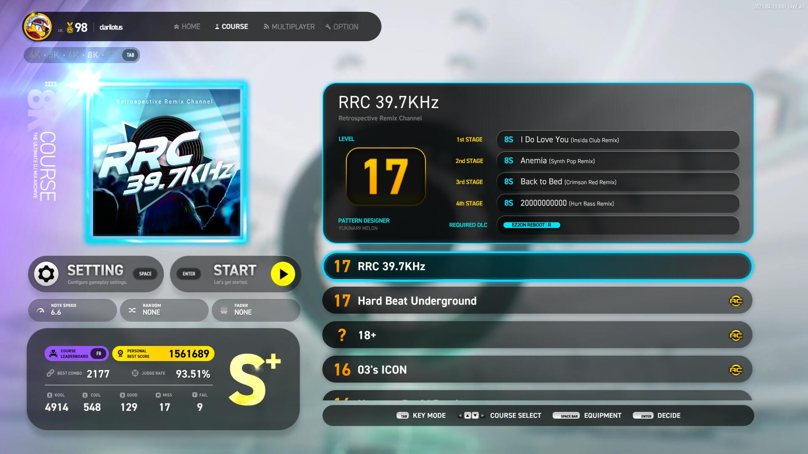

课题组曲 (COURSE) 模式提供一系列不同命题和难度的挑战，每个命题分别包含四首歌曲；

区分 `4键`、`5键`、`6键`、`8键` 以及混合键数或特殊模式的特殊类别 `SP`；

部分 `SP` 类别组曲为独占 `7键` 模式，会强制使用特定的面板和音符等装备；

每个组曲固定有 `4` 首歌曲，通关条件为 `存活即可`，演奏过程中 `不可暂停`；

组曲中的歌曲谱面均为独占，与常规的 EZ、NM、HD、SHD 谱面皆不一样；

切换到下一首歌曲后，能量槽将会恢复满；

包含 `B判定 (BASIC)`、`S判定 (STANDARD)` 以及独占的 `X判定 (EXTREME)`，视不同的组曲而异。

!!! tip "关于组曲模式的得分说明及 **All Combo 挑战**"

    组曲模式的算分标准与 BASIC 和 STANDARD 模式下不一致。

    组曲模式下各种判定级别的准确度如下：

    - KOOL 100%
    
    - COOL 50%
    
    - GOOD 20%
    
    - MISS 和 FAIL 均为 0%

    对于 **不包含 **All Combo 挑战**** 的课题组曲，算分规则如下：

    - KOOL 每个得分为 300

    - COOL 每个得分为 150

    - GOOD 每个得分为 41

    - MISS 和 FAIL 不得分

    对于 **包含 **All Combo 挑战**** 的课题组曲，算分规则如下：

    - KOOL : 在当前连击数 < 1500 时，每个 KOOL 得分范围在 170 ~ 350 中随机决定，当前连击数 >= 1500 后，新打击的 KOOL 得分则统一按最大 350 分

    - COOL : 在当前连击数 < 1500 时，每个 COOL 得分范围在 100 ~ 205 中随机决定，当前连击数 >= 1500 后，新打击的 COOL 得分则统一按最大 205 分

    - GOOD : 在当前连击数 < 1500 时，每个 GOOD 得分范围在 40 ~ 82 中随机决定，当前连击数 >= 1500 后，新打击的 GOOD 得分则统一按最大 82 分

    - MISS 和 FAIL 不得分

    - 当连击数被中断后，将重置为最初的随机分数，直至连击数再次回到 1500 以上

    - 注意连击数影响的只是持有当前连击数状态下击中的下一个音符的得分，对已经获得的总得分不会有任何影响

    - 由于当前连击数 < 1500 时每个音符的得分并非固定值，故无法评定 **All Combo 挑战**组曲的总得分值。

---

## Take One

A new chapter begins

> 出自《NIGHT TRAVELER》，入门级组曲。

=== "4K"

    <table style="display: inline-block; vertical-align: middle; width:900px"><tr>
        <td colspan = "2" rowspan="4">
                                <!-- 封面图 -->                 { width="162" }
        </td><td colspan = "2" width="160" display="inline-block">**等级**</td><td colspan = "3" class="ez2-course-levellable-tr">
                                <!-- 是否有AC挑战 -->           
        </td></tr><tr><td minwidth="160" colspan = "2" rowspan="3" class="ez2-course-levelnum-tr">
                                <!-- 组曲等级 -->               5
        </td><td class="ez-course-stage-td">1st STAGE</td><td class="ez-course-song-title-td">
        <!-- 第一首 模式 --><code class="ez-course-judge-b">    4B
        </code></td><td class="ez-course-songname-td">
                                <!-- 第一首 歌名 -->            2.14
        </td></tr><tr><td>2nd STAGE</td><td class="ez-course-song-title-td">
        <!-- 第二首 模式 --><code class="ez-course-judge-b">    4B
        </code></td><td>        <!-- 第二首 歌名 -->            Clear After Rain
        </td></tr><tr><td>3rd STAGE</td><td class="ez-course-song-title-td">
        <!-- 第三首 模式 --><code class="ez-course-judge-b">    4B
        </code></td><td>        <!-- 第三首 歌名 -->            Spotlight
        </td></tr><tr><td width="90">**总得分**</td><td width="100">
                                <!-- 总得分 -->                 368400
        </td><td>**总物量**</td><td>
                                <!-- 总物量 -->                 1228
        </td><td>4th STAGE</td><td class="ez-course-song-title-td">
        <!-- 第四首 模式 --><code class="ez-course-judge-b">    4B
        </code></td><td>        <!-- 第四首 歌名 -->            The Boy
        </td></tr><tr><td>**谱师**</td><td colspan = "6">
                                <!-- 谱师名 -->                 Jackalope 
        </td></tr><tr><td>**所需 DLC**</td><td colspan = "6">
                                <!-- 所需 DLC -->               /
    </td></tr></table>

=== "5K"

    <table style="display: inline-block; vertical-align: middle; width:900px"><tr>
        <td colspan = "2" rowspan="4">
                                <!-- 封面图 -->                 { width="162" }
        </td><td colspan = "2" width="160" display="inline-block">**等级**</td><td colspan = "3" class="ez2-course-levellable-tr">
                                <!-- 是否有AC挑战 -->           
        </td></tr><tr><td minwidth="160" colspan = "2" rowspan="3" class="ez2-course-levelnum-tr">
                                <!-- 组曲等级 -->               6
        </td><td class="ez-course-stage-td">1st STAGE</td><td class="ez-course-song-title-td">
        <!-- 第一首 模式 --><code class="ez-course-judge-b">    5B
        </code></td><td class="ez-course-songname-td">
                                <!-- 第一首 歌名 -->            2.14
        </td></tr><tr><td>2nd STAGE</td><td class="ez-course-song-title-td">
        <!-- 第二首 模式 --><code class="ez-course-judge-b">    5B
        </code></td><td>        <!-- 第二首 歌名 -->            Clear After Rain
        </td></tr><tr><td>3rd STAGE</td><td class="ez-course-song-title-td">
        <!-- 第三首 模式 --><code class="ez-course-judge-b">    5B
        </code></td><td>        <!-- 第三首 歌名 -->            Spotlight
        </td></tr><tr><td width="90">**总得分**</td><td width="100">
                                <!-- 总得分 -->                 411000
        </td><td>**总物量**</td><td>
                                <!-- 总物量 -->                 1370
        </td><td>4th STAGE</td><td class="ez-course-song-title-td">
        <!-- 第四首 模式 --><code class="ez-course-judge-b">    5B
        </code></td><td>        <!-- 第四首 歌名 -->            The Boy
        </td></tr><tr><td>**谱师**</td><td colspan = "6">
                                <!-- 谱师名 -->                 Sparrow_A-Jae 
        </td></tr><tr><td>**所需 DLC**</td><td colspan = "6">
                                <!-- 所需 DLC -->               /
    </td></tr></table>

=== "6K"

    <table style="display: inline-block; vertical-align: middle; width:900px"><tr>
        <td colspan = "2" rowspan="4">
                                <!-- 封面图 -->                 { width="162" }
        </td><td colspan = "2" width="160" display="inline-block">**等级**</td><td colspan = "3" class="ez2-course-levellable-tr">
                                <!-- 是否有AC挑战 -->           
        </td></tr><tr><td minwidth="160" colspan = "2" rowspan="3" class="ez2-course-levelnum-tr">
                                <!-- 组曲等级 -->               6
        </td><td class="ez-course-stage-td">1st STAGE</td><td class="ez-course-song-title-td">
        <!-- 第一首 模式 --><code class="ez-course-judge-b">    6B
        </code></td><td class="ez-course-songname-td">
                                <!-- 第一首 歌名 -->            2.14
        </td></tr><tr><td>2nd STAGE</td><td class="ez-course-song-title-td">
        <!-- 第二首 模式 --><code class="ez-course-judge-b">    6B
        </code></td><td>        <!-- 第二首 歌名 -->            Clear After Rain
        </td></tr><tr><td>3rd STAGE</td><td class="ez-course-song-title-td">
        <!-- 第三首 模式 --><code class="ez-course-judge-b">    6B
        </code></td><td>        <!-- 第三首 歌名 -->            Spotlight
        </td></tr><tr><td width="90">**总得分**</td><td width="100">
                                <!-- 总得分 -->                 416400
        </td><td>**总物量**</td><td>
                                <!-- 总物量 -->                 1388
        </td><td>4th STAGE</td><td class="ez-course-song-title-td">
        <!-- 第四首 模式 --><code class="ez-course-judge-b">    6B
        </code></td><td>        <!-- 第四首 歌名 -->            The Boy
        </td></tr><tr><td>**谱师**</td><td colspan = "6">
                                <!-- 谱师名 -->                 Sparrow_A-Jae 
        </td></tr><tr><td>**所需 DLC**</td><td colspan = "6">
                                <!-- 所需 DLC -->               /
    </td></tr></table>

=== "8K"

    <table style="display: inline-block; vertical-align: middle; width:900px"><tr>
        <td colspan = "2" rowspan="4">
                                <!-- 封面图 -->                 { width="162" }
        </td><td colspan = "2" width="160" display="inline-block">**等级**</td><td colspan = "3" class="ez2-course-levellable-tr">
                                <!-- 是否有AC挑战 -->           
        </td></tr><tr><td minwidth="160" colspan = "2" rowspan="3" class="ez2-course-levelnum-tr">
                                <!-- 组曲等级 -->               6
        </td><td class="ez-course-stage-td">1st STAGE</td><td class="ez-course-song-title-td">
        <!-- 第一首 模式 --><code class="ez-course-judge-b">    8B
        </code></td><td class="ez-course-songname-td">
                                <!-- 第一首 歌名 -->            2.14
        </td></tr><tr><td>2nd STAGE</td><td class="ez-course-song-title-td">
        <!-- 第二首 模式 --><code class="ez-course-judge-b">    8B
        </code></td><td>        <!-- 第二首 歌名 -->            Clear After Rain
        </td></tr><tr><td>3rd STAGE</td><td class="ez-course-song-title-td">
        <!-- 第三首 模式 --><code class="ez-course-judge-b">    8B
        </code></td><td>        <!-- 第三首 歌名 -->            Spotlight
        </td></tr><tr><td width="90">**总得分**</td><td width="100">
                                <!-- 总得分 -->                 419100
        </td><td>**总物量**</td><td>
                                <!-- 总物量 -->                 1397
        </td><td>4th STAGE</td><td class="ez-course-song-title-td">
        <!-- 第四首 模式 --><code class="ez-course-judge-b">    8B
        </code></td><td>        <!-- 第四首 歌名 -->            The Boy
        </td></tr><tr><td>**谱师**</td><td colspan = "6">
                                <!-- 谱师名 -->                 Sparrow_A-Jae 
        </td></tr><tr><td>**所需 DLC**</td><td colspan = "6">
                                <!-- 所需 DLC -->               /
    </td></tr></table>

---

## KPC 86.9MHz

The most genuine K-pop station on the planet

> 出自《1ST TRACKS SPECIAL EDITION》，K-pop 电台。

=== "4K"

    <table style="display: inline-block; vertical-align: middle; width:900px"><tr>
        <td colspan = "2" rowspan="4">
                                <!-- 封面图 -->                 { width="162" }
        </td><td colspan = "2" width="160" display="inline-block">**等级**</td><td colspan = "3" class="ez2-course-levellable-tr">
                                <!-- 是否有AC挑战 -->           
        </td></tr><tr><td minwidth="160" colspan = "2" rowspan="3" class="ez2-course-levelnum-tr">
                                <!-- 组曲等级 -->               9
        </td><td class="ez-course-stage-td">1st STAGE</td><td class="ez-course-song-title-td">
        <!-- 第一首 模式 --><code class="ez-course-judge-b">    4B
        </code></td><td class="ez-course-songname-td">
                                <!-- 第一首 歌名 -->            Combination
        </td></tr><tr><td>2nd STAGE</td><td class="ez-course-song-title-td">
        <!-- 第二首 模式 --><code class="ez-course-judge-b">    4B
        </code></td><td>        <!-- 第二首 歌名 -->            My Honey
        </td></tr><tr><td>3rd STAGE</td><td class="ez-course-song-title-td">
        <!-- 第三首 模式 --><code class="ez-course-judge-b">    4B
        </code></td><td>        <!-- 第三首 歌名 -->            Love & Extasy
        </td></tr><tr><td width="90">**总得分**</td><td width="100">
                                <!-- 总得分 -->                 711000
        </td><td>**总物量**</td><td>
                                <!-- 总物量 -->                 2370
        </td><td>4th STAGE</td><td class="ez-course-song-title-td">
        <!-- 第四首 模式 --><code class="ez-course-judge-b">    4B
        </code></td><td>        <!-- 第四首 歌名 -->            For 3 Weeks
        </td></tr><tr><td>**谱师**</td><td colspan = "6">
                                <!-- 谱师名 -->                 Jackalope 
        </td></tr><tr><td>**所需 DLC**</td><td colspan = "6">
                                <!-- 所需 DLC -->               /
    </td></tr></table>

=== "5K"

    <table style="display: inline-block; vertical-align: middle; width:900px"><tr>
        <td colspan = "2" rowspan="4">
                                <!-- 封面图 -->                 { width="162" }
        </td><td colspan = "2" width="160" display="inline-block">**等级**</td><td colspan = "3" class="ez2-course-levellable-tr">
                                <!-- 是否有AC挑战 -->           
        </td></tr><tr><td minwidth="160" colspan = "2" rowspan="3" class="ez2-course-levelnum-tr">
                                <!-- 组曲等级 -->               10
        </td><td class="ez-course-stage-td">1st STAGE</td><td class="ez-course-song-title-td">
        <!-- 第一首 模式 --><code class="ez-course-judge-b">    5B
        </code></td><td class="ez-course-songname-td">
                                <!-- 第一首 歌名 -->            Combination
        </td></tr><tr><td>2nd STAGE</td><td class="ez-course-song-title-td">
        <!-- 第二首 模式 --><code class="ez-course-judge-b">    5B
        </code></td><td>        <!-- 第二首 歌名 -->            My Honey
        </td></tr><tr><td>3rd STAGE</td><td class="ez-course-song-title-td">
        <!-- 第三首 模式 --><code class="ez-course-judge-b">    5B
        </code></td><td>        <!-- 第三首 歌名 -->            Love & Extasy
        </td></tr><tr><td width="90">**总得分**</td><td width="100">
                                <!-- 总得分 -->                 809100
        </td><td>**总物量**</td><td>
                                <!-- 总物量 -->                 2697
        </td><td>4th STAGE</td><td class="ez-course-song-title-td">
        <!-- 第四首 模式 --><code class="ez-course-judge-b">    5B
        </code></td><td>        <!-- 第四首 歌名 -->            For 3 Weeks
        </td></tr><tr><td>**谱师**</td><td colspan = "6">
                                <!-- 谱师名 -->                 Sparrow_A-Jae 
        </td></tr><tr><td>**所需 DLC**</td><td colspan = "6">
                                <!-- 所需 DLC -->               /
    </td></tr></table>

=== "6K"

    <table style="display: inline-block; vertical-align: middle; width:900px"><tr>
        <td colspan = "2" rowspan="4">
                                <!-- 封面图 -->                 { width="162" }
        </td><td colspan = "2" width="160" display="inline-block">**等级**</td><td colspan = "3" class="ez2-course-levellable-tr">
                                <!-- 是否有AC挑战 -->           
        </td></tr><tr><td minwidth="160" colspan = "2" rowspan="3" class="ez2-course-levelnum-tr">
                                <!-- 组曲等级 -->               10
        </td><td class="ez-course-stage-td">1st STAGE</td><td class="ez-course-song-title-td">
        <!-- 第一首 模式 --><code class="ez-course-judge-b">    6B
        </code></td><td class="ez-course-songname-td">
                                <!-- 第一首 歌名 -->            Combination
        </td></tr><tr><td>2nd STAGE</td><td class="ez-course-song-title-td">
        <!-- 第二首 模式 --><code class="ez-course-judge-b">    6B
        </code></td><td>        <!-- 第二首 歌名 -->            My Honey
        </td></tr><tr><td>3rd STAGE</td><td class="ez-course-song-title-td">
        <!-- 第三首 模式 --><code class="ez-course-judge-b">    6B
        </code></td><td>        <!-- 第三首 歌名 -->            Love & Extasy
        </td></tr><tr><td width="90">**总得分**</td><td width="100">
                                <!-- 总得分 -->                 855000
        </td><td>**总物量**</td><td>
                                <!-- 总物量 -->                 2850
        </td><td>4th STAGE</td><td class="ez-course-song-title-td">
        <!-- 第四首 模式 --><code class="ez-course-judge-b">    6B
        </code></td><td>        <!-- 第四首 歌名 -->            For 3 Weeks
        </td></tr><tr><td>**谱师**</td><td colspan = "6">
                                <!-- 谱师名 -->                 Sparrow_A-Jae 
        </td></tr><tr><td>**所需 DLC**</td><td colspan = "6">
                                <!-- 所需 DLC -->               /
    </td></tr></table>

=== "8K"

    <table style="display: inline-block; vertical-align: middle; width:900px"><tr>
        <td colspan = "2" rowspan="4">
                                <!-- 封面图 -->                 { width="162" }
        </td><td colspan = "2" width="160" display="inline-block">**等级**</td><td colspan = "3" class="ez2-course-levellable-tr">
                                <!-- 是否有AC挑战 -->           
        </td></tr><tr><td minwidth="160" colspan = "2" rowspan="3" class="ez2-course-levelnum-tr">
                                <!-- 组曲等级 -->               10
        </td><td class="ez-course-stage-td">1st STAGE</td><td class="ez-course-song-title-td">
        <!-- 第一首 模式 --><code class="ez-course-judge-b">    8B
        </code></td><td class="ez-course-songname-td">
                                <!-- 第一首 歌名 -->            Combination
        </td></tr><tr><td>2nd STAGE</td><td class="ez-course-song-title-td">
        <!-- 第二首 模式 --><code class="ez-course-judge-b">    8B
        </code></td><td>        <!-- 第二首 歌名 -->            My Honey
        </td></tr><tr><td>3rd STAGE</td><td class="ez-course-song-title-td">
        <!-- 第三首 模式 --><code class="ez-course-judge-b">    8B
        </code></td><td>        <!-- 第三首 歌名 -->            Love & Extasy
        </td></tr><tr><td width="90">**总得分**</td><td width="100">
                                <!-- 总得分 -->                 914700
        </td><td>**总物量**</td><td>
                                <!-- 总物量 -->                 3049
        </td><td>4th STAGE</td><td class="ez-course-song-title-td">
        <!-- 第四首 模式 --><code class="ez-course-judge-b">    8B
        </code></td><td>        <!-- 第四首 歌名 -->            For 3 Weeks
        </td></tr><tr><td>**谱师**</td><td colspan = "6">
                                <!-- 谱师名 -->                 Sparrow_A-Jae 
        </td></tr><tr><td>**所需 DLC**</td><td colspan = "6">
                                <!-- 所需 DLC -->               /
    </td></tr></table>

---

## DBC 91.4MHz

Partying tonight? We got you covered

> 出自《1ST TRACKS》Dance Beat 频道。

=== "5K"

    <table style="display: inline-block; vertical-align: middle; width:900px"><tr>
        <td colspan = "2" rowspan="4">
                                <!-- 封面图 -->                 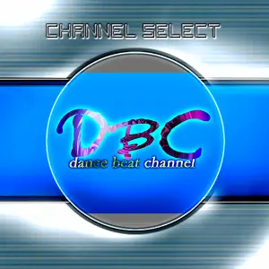{ width="162" }
        </td><td colspan = "2" width="160" display="inline-block">**等级**</td><td colspan = "3" class="ez2-course-levellable-tr">
                                <!-- 是否有AC挑战 -->           
        </td></tr><tr><td minwidth="160" colspan = "2" rowspan="3" class="ez2-course-levelnum-tr">
                                <!-- 组曲等级 -->               14
        </td><td class="ez-course-stage-td">1st STAGE</td><td class="ez-course-song-title-td">
        <!-- 第一首 模式 --><code class="ez-course-judge-s">    5S
        </code></td><td class="ez-course-songname-td">
                                <!-- 第一首 歌名 -->            I've Fallen (Remaster)
        </td></tr><tr><td>2nd STAGE</td><td class="ez-course-song-title-td">
        <!-- 第二首 模式 --><code class="ez-course-judge-s">    5S
        </code></td><td>        <!-- 第二首 歌名 -->            Stay (Remaster)
        </td></tr><tr><td>3rd STAGE</td><td class="ez-course-song-title-td">
        <!-- 第三首 模式 --><code class="ez-course-judge-s">    5S
        </code></td><td>        <!-- 第三首 歌名 -->            The Rhythm (Remaster)
        </td></tr><tr><td width="90">**总得分**</td><td width="100">
                                <!-- 总得分 -->                 1221000
        </td><td>**总物量**</td><td>
                                <!-- 总物量 -->                 4070
        </td><td>4th STAGE</td><td class="ez-course-song-title-td">
        <!-- 第四首 模式 --><code class="ez-course-judge-s">    5S
        </code></td><td>        <!-- 第四首 歌名 -->            Look Out (Remaster)
        </td></tr><tr><td>**谱师**</td><td colspan = "6">
                                <!-- 谱师名 -->                 Aubergine Cookie
        </td></tr><tr><td>**所需 DLC**</td><td colspan = "6">
                                <!-- 所需 DLC -->               /
    </td></tr></table>

=== "6K"

    <table style="display: inline-block; vertical-align: middle; width:900px"><tr>
        <td colspan = "2" rowspan="4">
                                <!-- 封面图 -->                 { width="162" }
        </td><td colspan = "2" width="160" display="inline-block">**等级**</td><td colspan = "3" class="ez2-course-levellable-tr">
                                <!-- 是否有AC挑战 -->           
        </td></tr><tr><td minwidth="160" colspan = "2" rowspan="3" class="ez2-course-levelnum-tr">
                                <!-- 组曲等级 -->               14
        </td><td class="ez-course-stage-td">1st STAGE</td><td class="ez-course-song-title-td">
        <!-- 第一首 模式 --><code class="ez-course-judge-s">    6S
        </code></td><td class="ez-course-songname-td">
                                <!-- 第一首 歌名 -->            I've Fallen (Remaster)
        </td></tr><tr><td>2nd STAGE</td><td class="ez-course-song-title-td">
        <!-- 第二首 模式 --><code class="ez-course-judge-s">    6S
        </code></td><td>        <!-- 第二首 歌名 -->            Stay (Remaster)
        </td></tr><tr><td>3rd STAGE</td><td class="ez-course-song-title-td">
        <!-- 第三首 模式 --><code class="ez-course-judge-s">    6S
        </code></td><td>        <!-- 第三首 歌名 -->            The Rhythm (Remaster)
        </td></tr><tr><td width="90">**总得分**</td><td width="100">
                                <!-- 总得分 -->                 1360200
        </td><td>**总物量**</td><td>
                                <!-- 总物量 -->                 4534
        </td><td>4th STAGE</td><td class="ez-course-song-title-td">
        <!-- 第四首 模式 --><code class="ez-course-judge-s">    6S
        </code></td><td>        <!-- 第四首 歌名 -->            Look Out (Remaster)
        </td></tr><tr><td>**谱师**</td><td colspan = "6">
                                <!-- 谱师名 -->                 YUKINARI! MELON
        </td></tr><tr><td>**所需 DLC**</td><td colspan = "6">
                                <!-- 所需 DLC -->               /
    </td></tr></table>

=== "8K"

    <table style="display: inline-block; vertical-align: middle; width:900px"><tr>
        <td colspan = "2" rowspan="4">
                                <!-- 封面图 -->                 { width="162" }
        </td><td colspan = "2" width="160" display="inline-block">**等级**</td><td colspan = "3" class="ez2-course-levellable-tr">
                                <!-- 是否有AC挑战 -->           
        </td></tr><tr><td minwidth="160" colspan = "2" rowspan="3" class="ez2-course-levelnum-tr">
                                <!-- 组曲等级 -->               14
        </td><td class="ez-course-stage-td">1st STAGE</td><td class="ez-course-song-title-td">
        <!-- 第一首 模式 --><code class="ez-course-judge-s">    8S
        </code></td><td class="ez-course-songname-td">
                                <!-- 第一首 歌名 -->            I've Fallen (Remaster)
        </td></tr><tr><td>2nd STAGE</td><td class="ez-course-song-title-td">
        <!-- 第二首 模式 --><code class="ez-course-judge-s">    8S
        </code></td><td>        <!-- 第二首 歌名 -->            Stay (Remaster)
        </td></tr><tr><td>3rd STAGE</td><td class="ez-course-song-title-td">
        <!-- 第三首 模式 --><code class="ez-course-judge-s">    8S
        </code></td><td>        <!-- 第三首 歌名 -->            The Rhythm (Remaster)
        </td></tr><tr><td width="90">**总得分**</td><td width="100">
                                <!-- 总得分 -->                 1472100
        </td><td>**总物量**</td><td>
                                <!-- 总物量 -->                 4907
        </td><td>4th STAGE</td><td class="ez-course-song-title-td">
        <!-- 第四首 模式 --><code class="ez-course-judge-s">    8S
        </code></td><td>        <!-- 第四首 歌名 -->            Look Out (Remaster)
        </td></tr><tr><td>**谱师**</td><td colspan = "6">
                                <!-- 谱师名 -->                 YUKINARI! MELON
        </td></tr><tr><td>**所需 DLC**</td><td colspan = "6">
                                <!-- 所需 DLC -->               /
    </td></tr></table>

---

## RRC 39.7KHz

Retrospective Remix Channel

> 出自《AZURE EXPRESIION》，由曲师 KIEN 混音的经典曲目。

=== "4K"

    <table style="display: inline-block; vertical-align: middle; width:900px"><tr>
        <td colspan = "2" rowspan="4">
                                <!-- 封面图 -->                 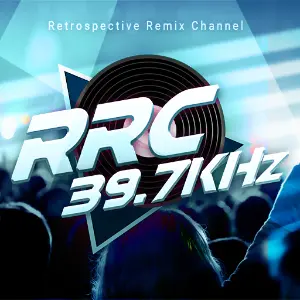{ width="162" }
        </td><td colspan = "2" width="160" display="inline-block">**等级**</td><td colspan = "3" class="ez2-course-levellable-tr">
                                <!-- 是否有AC挑战 -->           
        </td></tr><tr><td minwidth="160" colspan = "2" rowspan="3" class="ez2-course-levelnum-tr">
                                <!-- 组曲等级 -->               15
        </td><td class="ez-course-stage-td">1st STAGE</td><td class="ez-course-song-title-td">
        <!-- 第一首 模式 --><code class="ez-course-judge-s">    4S
        </code></td><td class="ez-course-songname-td">
                                <!-- 第一首 歌名 -->            I Do Love You (Insida Club Remix)
        </td></tr><tr><td>2nd STAGE</td><td class="ez-course-song-title-td">
        <!-- 第二首 模式 --><code class="ez-course-judge-s">    4S
        </code></td><td>        <!-- 第二首 歌名 -->            Anemia (Synth Pop Remix)
        </td></tr><tr><td>3rd STAGE</td><td class="ez-course-song-title-td">
        <!-- 第三首 模式 --><code class="ez-course-judge-s">    4S
        </code></td><td>        <!-- 第三首 歌名 -->            Back to Bed (Crimson Red Remix)
        </td></tr><tr><td width="90">**总得分**</td><td width="100">
                                <!-- 总得分 -->                 1315800
        </td><td>**总物量**</td><td>
                                <!-- 总物量 -->                 4386
        </td><td>4th STAGE</td><td class="ez-course-song-title-td">
        <!-- 第四首 模式 --><code class="ez-course-judge-s">    4S
        </code></td><td>        <!-- 第四首 歌名 -->            20000000000 (Hurt Bass Remix)
        </td></tr><tr><td>**谱师**</td><td colspan = "6">
                                <!-- 谱师名 -->                 Jackalope
        </td></tr><tr><td>**所需 DLC**</td><td colspan = "6">
                                <!-- 所需 DLC -->               /
    </td></tr></table>

=== "6K"

    <table style="display: inline-block; vertical-align: middle; width:900px"><tr>
        <td colspan = "2" rowspan="4">
                                <!-- 封面图 -->                 { width="162" }
        </td><td colspan = "2" width="160" display="inline-block">**等级**</td><td colspan = "3" class="ez2-course-levellable-tr">
                                <!-- 是否有AC挑战 -->           
        </td></tr><tr><td minwidth="160" colspan = "2" rowspan="3" class="ez2-course-levelnum-tr">
                                <!-- 组曲等级 -->               17
        </td><td class="ez-course-stage-td">1st STAGE</td><td class="ez-course-song-title-td">
        <!-- 第一首 模式 --><code class="ez-course-judge-s">    6S
        </code></td><td class="ez-course-songname-td">
                                <!-- 第一首 歌名 -->            I Do Love You (Insida Club Remix)
        </td></tr><tr><td>2nd STAGE</td><td class="ez-course-song-title-td">
        <!-- 第二首 模式 --><code class="ez-course-judge-s">    6S
        </code></td><td>        <!-- 第二首 歌名 -->            Anemia (Synth Pop Remix)
        </td></tr><tr><td>3rd STAGE</td><td class="ez-course-song-title-td">
        <!-- 第三首 模式 --><code class="ez-course-judge-s">    6S
        </code></td><td>        <!-- 第三首 歌名 -->            Back to Bed (Crimson Red Remix)
        </td></tr><tr><td width="90">**总得分**</td><td width="100">
                                <!-- 总得分 -->                 1555200
        </td><td>**总物量**</td><td>
                                <!-- 总物量 -->                 5184
        </td><td>4th STAGE</td><td class="ez-course-song-title-td">
        <!-- 第四首 模式 --><code class="ez-course-judge-s">    6S
        </code></td><td>        <!-- 第四首 歌名 -->            20000000000 (Hurt Bass Remix)
        </td></tr><tr><td>**谱师**</td><td colspan = "6">
                                <!-- 谱师名 -->                 YUKINARI! MELON
        </td></tr><tr><td>**所需 DLC**</td><td colspan = "6">
                                <!-- 所需 DLC -->               /
    </td></tr></table>

=== "8K"

    <table style="display: inline-block; vertical-align: middle; width:900px"><tr>
        <td colspan = "2" rowspan="4">
                                <!-- 封面图 -->                 { width="162" }
        </td><td colspan = "2" width="160" display="inline-block">**等级**</td><td colspan = "3" class="ez2-course-levellable-tr">
                                <!-- 是否有AC挑战 -->           
        </td></tr><tr><td minwidth="160" colspan = "2" rowspan="3" class="ez2-course-levelnum-tr">
                                <!-- 组曲等级 -->               17
        </td><td class="ez-course-stage-td">1st STAGE</td><td class="ez-course-song-title-td">
        <!-- 第一首 模式 --><code class="ez-course-judge-s">    8S
        </code></td><td class="ez-course-songname-td">
                                <!-- 第一首 歌名 -->            I Do Love You (Insida Club Remix)
        </td></tr><tr><td>2nd STAGE</td><td class="ez-course-song-title-td">
        <!-- 第二首 模式 --><code class="ez-course-judge-s">    8S
        </code></td><td>        <!-- 第二首 歌名 -->            Anemia (Synth Pop Remix)
        </td></tr><tr><td>3rd STAGE</td><td class="ez-course-song-title-td">
        <!-- 第三首 模式 --><code class="ez-course-judge-s">    8S
        </code></td><td>        <!-- 第三首 歌名 -->            Back to Bed (Crimson Red Remix)
        </td></tr><tr><td width="90">**总得分**</td><td width="100">
                                <!-- 总得分 -->                 1685100
        </td><td>**总物量**</td><td>
                                <!-- 总物量 -->                 5617
        </td><td>4th STAGE</td><td class="ez-course-song-title-td">
        <!-- 第四首 模式 --><code class="ez-course-judge-s">    8S
        </code></td><td>        <!-- 第四首 歌名 -->            20000000000 (Hurt Bass Remix)
        </td></tr><tr><td>**谱师**</td><td colspan = "6">
                                <!-- 谱师名 -->                 YUKINARI! MELON
        </td></tr><tr><td>**所需 DLC**</td><td colspan = "6">
                                <!-- 所需 DLC -->               /
    </td></tr></table>

---

## Hard Beat Underground

Underground spirit carries on

> 出自街机《PLATINUM》。

=== "4K"

    <table style="display: inline-block; vertical-align: middle; width:900px"><tr>
        <td colspan = "2" rowspan="4">
                                <!-- 封面图 -->                 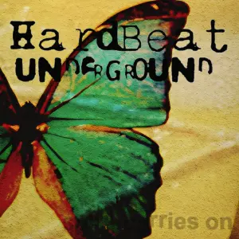{ width="162" }
        </td><td colspan = "2" width="160" display="inline-block">**等级**</td><td colspan = "3" class="ez2-course-levellable-tr">
                                <!-- 是否有AC挑战 -->           **All Combo 挑战**
        </td></tr><tr><td minwidth="160" colspan = "2" rowspan="3" class="ez2-course-levelnum-tr">
                                <!-- 组曲等级 -->               17
        </td><td class="ez-course-stage-td">1st STAGE</td><td class="ez-course-song-title-td">
        <!-- 第一首 模式 --><code class="ez-course-judge-s">    4S
        </code></td><td class="ez-course-songname-td">
                                <!-- 第一首 歌名 -->            R.F.C.
        </td></tr><tr><td>2nd STAGE</td><td class="ez-course-song-title-td">
        <!-- 第二首 模式 --><code class="ez-course-judge-s">    4S
        </code></td><td>        <!-- 第二首 歌名 -->            Riff Guy
        </td></tr><tr><td>3rd STAGE</td><td class="ez-course-song-title-td">
        <!-- 第三首 模式 --><code class="ez-course-judge-s">    4S
        </code></td><td>        <!-- 第三首 歌名 -->            Q Factor
        </td></tr><tr><td width="90">**总得分**</td><td width="100">
                                <!-- 总得分 -->                 /
        </td><td>**总物量**</td><td>
                                <!-- 总物量 -->                 4753
        </td><td>4th STAGE</td><td class="ez-course-song-title-td">
        <!-- 第四首 模式 --><code class="ez-course-judge-s">    4S
        </code></td><td>        <!-- 第四首 歌名 -->            Climax
        </td></tr><tr><td>**谱师**</td><td colspan = "6">
                                <!-- 谱师名 -->                 Jackalope
        </td></tr><tr><td>**所需 DLC**</td><td colspan = "6">
                                <!-- 所需 DLC -->               /
    </td></tr></table>

=== "8K"

    <table style="display: inline-block; vertical-align: middle; width:900px"><tr>
        <td colspan = "2" rowspan="4">
                                <!-- 封面图 -->                 { width="162" }
        </td><td colspan = "2" width="160" display="inline-block">**等级**</td><td colspan = "3" class="ez2-course-levellable-tr">
                                <!-- 是否有AC挑战 -->           **All Combo 挑战**
        </td></tr><tr><td minwidth="160" colspan = "2" rowspan="3" class="ez2-course-levelnum-tr">
                                <!-- 组曲等级 -->               17
        </td><td class="ez-course-stage-td">1st STAGE</td><td class="ez-course-song-title-td">
        <!-- 第一首 模式 --><code class="ez-course-judge-s">    8S
        </code></td><td class="ez-course-songname-td">
                                <!-- 第一首 歌名 -->            R.F.C.
        </td></tr><tr><td>2nd STAGE</td><td class="ez-course-song-title-td">
        <!-- 第二首 模式 --><code class="ez-course-judge-s">    8S
        </code></td><td>        <!-- 第二首 歌名 -->            Riff Guy
        </td></tr><tr><td>3rd STAGE</td><td class="ez-course-song-title-td">
        <!-- 第三首 模式 --><code class="ez-course-judge-s">    8S
        </code></td><td>        <!-- 第三首 歌名 -->            Q Factor
        </td></tr><tr><td width="90">**总得分**</td><td width="100">
                                <!-- 总得分 -->                 /
        </td><td>**总物量**</td><td>
                                <!-- 总物量 -->                 6183
        </td><td>4th STAGE</td><td class="ez-course-song-title-td">
        <!-- 第四首 模式 --><code class="ez-course-judge-s">    8S
        </code></td><td>        <!-- 第四首 歌名 -->            Climax
        </td></tr><tr><td>**谱师**</td><td colspan = "6">
                                <!-- 谱师名 -->                 YUKINARI! MELON
        </td></tr><tr><td>**所需 DLC**</td><td colspan = "6">
                                <!-- 所需 DLC -->               /
    </td></tr></table>
    
---

## Hard Beat Stage
    
OVER STAGE from a memory
    
> 出自街机《4TH OVER LOAD》。

=== "5K"

    <table style="display: inline-block; vertical-align: middle; width:900px"><tr>
        <td colspan = "2" rowspan="4">
                                <!-- 封面图 -->                 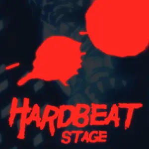{ width="162" }
        </td><td colspan = "2" width="160" display="inline-block">**等级**</td><td colspan = "3" class="ez2-course-levellable-tr">
                                <!-- 是否有AC挑战 -->           **All Combo 挑战**
        </td></tr><tr><td minwidth="160" colspan = "2" rowspan="3" class="ez2-course-levelnum-tr">
                                <!-- 组曲等级 -->               17
        </td><td class="ez-course-stage-td">1st STAGE</td><td class="ez-course-song-title-td">
        <!-- 第一首 模式 --><code class="ez-course-judge-s">    5S
        </code></td><td class="ez-course-songname-td">
                                <!-- 第一首 歌名 -->            Shout
        </td></tr><tr><td>2nd STAGE</td><td class="ez-course-song-title-td">
        <!-- 第二首 模式 --><code class="ez-course-judge-s">    5S
        </code></td><td>        <!-- 第二首 歌名 -->            Go!
        </td></tr><tr><td>3rd STAGE</td><td class="ez-course-song-title-td">
        <!-- 第三首 模式 --><code class="ez-course-judge-s">    5S
        </code></td><td>        <!-- 第三首 歌名 -->            Climax
        </td></tr><tr><td width="90">**总得分**</td><td width="100">
                                <!-- 总得分 -->                 /
        </td><td>**总物量**</td><td>
                                <!-- 总物量 -->                 5763
        </td><td>4th STAGE</td><td class="ez-course-song-title-td">
        <!-- 第四首 模式 --><code class="ez-course-judge-s">    5S
        </code></td><td>        <!-- 第四首 歌名 -->            R.F.C.
        </td></tr><tr><td>**谱师**</td><td colspan = "6">
                                <!-- 谱师名 -->                 Jackalope
        </td></tr><tr><td>**所需 DLC**</td><td colspan = "6">
                                <!-- 所需 DLC -->               /
    </td></tr></table>
    
=== "6K"

    <table style="display: inline-block; vertical-align: middle; width:900px"><tr>
        <td colspan = "2" rowspan="4">
                                <!-- 封面图 -->                 { width="162" }
        </td><td colspan = "2" width="160" display="inline-block">**等级**</td><td colspan = "3" class="ez2-course-levellable-tr">
                                <!-- 是否有AC挑战 -->           **All Combo 挑战**
        </td></tr><tr><td minwidth="160" colspan = "2" rowspan="3" class="ez2-course-levelnum-tr">
                                <!-- 组曲等级 -->               17
        </td><td class="ez-course-stage-td">1st STAGE</td><td class="ez-course-song-title-td">
        <!-- 第一首 模式 --><code class="ez-course-judge-s">    6S
        </code></td><td class="ez-course-songname-td">
                                <!-- 第一首 歌名 -->            Shout
        </td></tr><tr><td>2nd STAGE</td><td class="ez-course-song-title-td">
        <!-- 第二首 模式 --><code class="ez-course-judge-s">    6S
        </code></td><td>        <!-- 第二首 歌名 -->            Go!
        </td></tr><tr><td>3rd STAGE</td><td class="ez-course-song-title-td">
        <!-- 第三首 模式 --><code class="ez-course-judge-s">    6S
        </code></td><td>        <!-- 第三首 歌名 -->            Climax
        </td></tr><tr><td width="90">**总得分**</td><td width="100">
                                <!-- 总得分 -->                 /
        </td><td>**总物量**</td><td>
                                <!-- 总物量 -->                 6561
        </td><td>4th STAGE</td><td class="ez-course-song-title-td">
        <!-- 第四首 模式 --><code class="ez-course-judge-s">    6S
        </code></td><td>        <!-- 第四首 歌名 -->            R.F.C.
        </td></tr><tr><td>**谱师**</td><td colspan = "6">
                                <!-- 谱师名 -->                 YUKINARI! MELON
        </td></tr><tr><td>**所需 DLC**</td><td colspan = "6">
                                <!-- 所需 DLC -->               /
    </td></tr></table>

---

## 18+

The forbidden answer , unleashed.

> 出自《FINAL》对应组曲《12+》。

=== "4K"

    <table style="display: inline-block; vertical-align: middle; width:900px"><tr>
        <td colspan = "2" rowspan="4">
                                <!-- 封面图 -->                 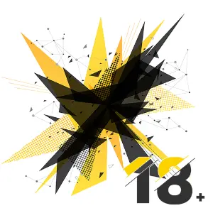{ width="162" }
        </td><td colspan = "2" width="160" display="inline-block">**等级**</td><td colspan = "3" class="ez2-course-levellable-tr">
                                <!-- 是否有AC挑战 -->           **All Combo 挑战**
        </td></tr><tr><td minwidth="160" colspan = "2" rowspan="3" class="ez2-course-levelnum-tr">
                                <!-- 组曲等级 -->               ?
        </td><td class="ez-course-stage-td">1st STAGE</td><td class="ez-course-song-title-td">
        <!-- 第一首 模式 --><code class="ez-course-judge-x">    4X
        </code></td><td class="ez-course-songname-td">
                                <!-- 第一首 歌名 -->            20000000000
        </td></tr><tr><td>2nd STAGE</td><td class="ez-course-song-title-td">
        <!-- 第二首 模式 --><code class="ez-course-judge-x">    4X
        </code></td><td>        <!-- 第二首 歌名 -->            Panic Strike
        </td></tr><tr><td>3rd STAGE</td><td class="ez-course-song-title-td">
        <!-- 第三首 模式 --><code class="ez-course-judge-x">    4X
        </code></td><td>        <!-- 第三首 歌名 -->            Zeroize
        </td></tr><tr><td width="90">**总得分**</td><td width="100">
                                <!-- 总得分 -->                 /
        </td><td>**总物量**</td><td>
                                <!-- 总物量 -->                 5347
        </td><td>4th STAGE</td><td class="ez-course-song-title-td">
        <!-- 第四首 模式 --><code class="ez-course-judge-x">    4X
        </code></td><td>        <!-- 第四首 歌名 -->            Fire Storm
        </td></tr><tr><td>**谱师**</td><td colspan = "6">
                                <!-- 谱师名 -->                 Jackalope
        </td></tr><tr><td>**所需 DLC**</td><td colspan = "6">
                                <!-- 所需 DLC -->               /
    </td></tr></table>

=== "5K"

    <table style="display: inline-block; vertical-align: middle; width:900px"><tr>
        <td colspan = "2" rowspan="4">
                                <!-- 封面图 -->                 { width="162" }
        </td><td colspan = "2" width="160" display="inline-block">**等级**</td><td colspan = "3" class="ez2-course-levellable-tr">
                                <!-- 是否有AC挑战 -->           **All Combo 挑战**
        </td></tr><tr><td minwidth="160" colspan = "2" rowspan="3" class="ez2-course-levelnum-tr">
                                <!-- 组曲等级 -->               ?
        </td><td class="ez-course-stage-td">1st STAGE</td><td class="ez-course-song-title-td">
        <!-- 第一首 模式 --><code class="ez-course-judge-x">    5X
        </code></td><td class="ez-course-songname-td">
                                <!-- 第一首 歌名 -->            20000000000
        </td></tr><tr><td>2nd STAGE</td><td class="ez-course-song-title-td">
        <!-- 第二首 模式 --><code class="ez-course-judge-x">    5X
        </code></td><td>        <!-- 第二首 歌名 -->            Panic Strike
        </td></tr><tr><td>3rd STAGE</td><td class="ez-course-song-title-td">
        <!-- 第三首 模式 --><code class="ez-course-judge-x">    5X
        </code></td><td>        <!-- 第三首 歌名 -->            Zeroize
        </td></tr><tr><td width="90">**总得分**</td><td width="100">
                                <!-- 总得分 -->                 /
        </td><td>**总物量**</td><td>
                                <!-- 总物量 -->                 6173
        </td><td>4th STAGE</td><td class="ez-course-song-title-td">
        <!-- 第四首 模式 --><code class="ez-course-judge-x">    5X
        </code></td><td>        <!-- 第四首 歌名 -->            Fire Storm
        </td></tr><tr><td>**谱师**</td><td colspan = "6">
                                <!-- 谱师名 -->                 YUKINARI! MELON & Jackalope
        </td></tr><tr><td>**所需 DLC**</td><td colspan = "6">
                                <!-- 所需 DLC -->               /
    </td></tr></table>
  
=== "6K"

    <table style="display: inline-block; vertical-align: middle; width:900px"><tr>
        <td colspan = "2" rowspan="4">
                                <!-- 封面图 -->                 { width="162" }
        </td><td colspan = "2" width="160" display="inline-block">**等级**</td><td colspan = "3" class="ez2-course-levellable-tr">
                                <!-- 是否有AC挑战 -->           **All Combo 挑战**
        </td></tr><tr><td minwidth="160" colspan = "2" rowspan="3" class="ez2-course-levelnum-tr">
                                <!-- 组曲等级 -->               ?
        </td><td class="ez-course-stage-td">1st STAGE</td><td class="ez-course-song-title-td">
        <!-- 第一首 模式 --><code class="ez-course-judge-x">    6X
        </code></td><td class="ez-course-songname-td">
                                <!-- 第一首 歌名 -->            20000000000
        </td></tr><tr><td>2nd STAGE</td><td class="ez-course-song-title-td">
        <!-- 第二首 模式 --><code class="ez-course-judge-x">    6X
        </code></td><td>        <!-- 第二首 歌名 -->            Panic Strike
        </td></tr><tr><td>3rd STAGE</td><td class="ez-course-song-title-td">
        <!-- 第三首 模式 --><code class="ez-course-judge-x">    6X
        </code></td><td>        <!-- 第三首 歌名 -->            Zeroize
        </td></tr><tr><td width="90">**总得分**</td><td width="100">
                                <!-- 总得分 -->                 /
        </td><td>**总物量**</td><td>
                                <!-- 总物量 -->                 6448
        </td><td>4th STAGE</td><td class="ez-course-song-title-td">
        <!-- 第四首 模式 --><code class="ez-course-judge-x">    6X
        </code></td><td>        <!-- 第四首 歌名 -->            Fire Storm
        </td></tr><tr><td>**谱师**</td><td colspan = "6">
                                <!-- 谱师名 -->                 YUKINARI! MELON & Jackalope
        </td></tr><tr><td>**所需 DLC**</td><td colspan = "6">
                                <!-- 所需 DLC -->               /
    </td></tr></table>
  
=== "8K"

    <table style="display: inline-block; vertical-align: middle; width:900px"><tr>
        <td colspan = "2" rowspan="4">
                                <!-- 封面图 -->                 { width="162" }
        </td><td colspan = "2" width="160" display="inline-block">**等级**</td><td colspan = "3" class="ez2-course-levellable-tr">
                                <!-- 是否有AC挑战 -->           **All Combo 挑战**
        </td></tr><tr><td minwidth="160" colspan = "2" rowspan="3" class="ez2-course-levelnum-tr">
                                <!-- 组曲等级 -->               ?
        </td><td class="ez-course-stage-td">1st STAGE</td><td class="ez-course-song-title-td">
        <!-- 第一首 模式 --><code class="ez-course-judge-x">    8X
        </code></td><td class="ez-course-songname-td">
                                <!-- 第一首 歌名 -->            20000000000
        </td></tr><tr><td>2nd STAGE</td><td class="ez-course-song-title-td">
        <!-- 第二首 模式 --><code class="ez-course-judge-x">    8X
        </code></td><td>        <!-- 第二首 歌名 -->            Panic Strike
        </td></tr><tr><td>3rd STAGE</td><td class="ez-course-song-title-td">
        <!-- 第三首 模式 --><code class="ez-course-judge-x">    8X
        </code></td><td>        <!-- 第三首 歌名 -->            Zeroize
        </td></tr><tr><td width="90">**总得分**</td><td width="100">
                                <!-- 总得分 -->                 /
        </td><td>**总物量**</td><td>
                                <!-- 总物量 -->                 6373
        </td><td>4th STAGE</td><td class="ez-course-song-title-td">
        <!-- 第四首 模式 --><code class="ez-course-judge-x">    8X
        </code></td><td>        <!-- 第四首 歌名 -->            Fire Storm
        </td></tr><tr><td>**谱师**</td><td colspan = "6">
                                <!-- 谱师名 -->                 YUKINARI! MELON & Jackalope
        </td></tr><tr><td>**所需 DLC**</td><td colspan = "6">
                                <!-- 所需 DLC -->               /
    </td></tr></table>
    
---

## 03's ICON

"Think you're good at this game? Watch and learn."

=== "4K"

    <table style="display: inline-block; vertical-align: middle; width:900px"><tr>
        <td colspan = "2" rowspan="4">
                                <!-- 封面图 -->                 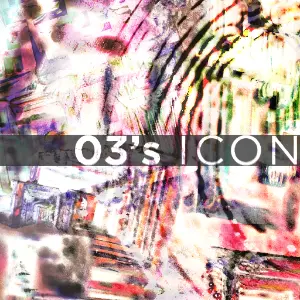{ width="162" }
        </td><td colspan = "2" width="160" display="inline-block">**等级**</td><td colspan = "3" class="ez2-course-levellable-tr">
                                <!-- 是否有AC挑战 -->           **All Combo 挑战**
        </td></tr><tr><td minwidth="160" colspan = "2" rowspan="3" class="ez2-course-levelnum-tr">
                                <!-- 组曲等级 -->               ?
        </td><td class="ez-course-stage-td">1st STAGE</td><td class="ez-course-song-title-td">
        <!-- 第一首 模式 --><code class="ez-course-judge-b">    4B
        </code></td><td class="ez-course-songname-td">
                                <!-- 第一首 歌名 -->            Minus 1 (Space Mix)
        </td></tr><tr><td>2nd STAGE</td><td class="ez-course-song-title-td">
        <!-- 第二首 模式 --><code class="ez-course-judge-b">    4B
        </code></td><td>        <!-- 第二首 歌名 -->            Showdown
        </td></tr><tr><td>3rd STAGE</td><td class="ez-course-song-title-td">
        <!-- 第三首 模式 --><code class="ez-course-judge-b">    4B
        </code></td><td>        <!-- 第三首 歌名 -->            R.F.C.
        </td></tr><tr><td width="90">**总得分**</td><td width="100">
                                <!-- 总得分 -->                 /
        </td><td>**总物量**</td><td>
                                <!-- 总物量 -->                 3736
        </td><td>4th STAGE</td><td class="ez-course-song-title-td">
        <!-- 第四首 模式 --><code class="ez-course-judge-b">    4B
        </code></td><td>        <!-- 第四首 歌名 -->            Sand Storm
        </td></tr><tr><td>**谱师**</td><td colspan = "6">
                                <!-- 谱师名 -->                 Jackalope
        </td></tr><tr><td>**所需 DLC**</td><td colspan = "6">
                                <!-- 所需 DLC -->               /
    </td></tr></table>

=== "5K"

    <table style="display: inline-block; vertical-align: middle; width:900px"><tr>
        <td colspan = "2" rowspan="4">
                                <!-- 封面图 -->                 { width="162" }
        </td><td colspan = "2" width="160" display="inline-block">**等级**</td><td colspan = "3" class="ez2-course-levellable-tr">
                                <!-- 是否有AC挑战 -->           **All Combo 挑战**
        </td></tr><tr><td minwidth="160" colspan = "2" rowspan="3" class="ez2-course-levelnum-tr">
                                <!-- 组曲等级 -->               ?
        </td><td class="ez-course-stage-td">1st STAGE</td><td class="ez-course-song-title-td">
        <!-- 第一首 模式 --><code class="ez-course-judge-b">    5B
        </code></td><td class="ez-course-songname-td">
                                <!-- 第一首 歌名 -->            Minus 1 (Space Mix)
        </td></tr><tr><td>2nd STAGE</td><td class="ez-course-song-title-td">
        <!-- 第二首 模式 --><code class="ez-course-judge-b">    5B
        </code></td><td>        <!-- 第二首 歌名 -->            Showdown
        </td></tr><tr><td>3rd STAGE</td><td class="ez-course-song-title-td">
        <!-- 第三首 模式 --><code class="ez-course-judge-b">    5B
        </code></td><td>        <!-- 第三首 歌名 -->            R.F.C.
        </td></tr><tr><td width="90">**总得分**</td><td width="100">
                                <!-- 总得分 -->                 /
        </td><td>**总物量**</td><td>
                                <!-- 总物量 -->                 4014
        </td><td>4th STAGE</td><td class="ez-course-song-title-td">
        <!-- 第四首 模式 --><code class="ez-course-judge-b">    5B
        </code></td><td>        <!-- 第四首 歌名 -->            Sand Storm
        </td></tr><tr><td>**谱师**</td><td colspan = "6">
                                <!-- 谱师名 -->                 Jackalope
        </td></tr><tr><td>**所需 DLC**</td><td colspan = "6">
                                <!-- 所需 DLC -->               /
    </td></tr></table>

=== "8K"

    <table style="display: inline-block; vertical-align: middle; width:900px"><tr>
        <td colspan = "2" rowspan="4">
                                <!-- 封面图 -->                 { width="162" }
        </td><td colspan = "2" width="160" display="inline-block">**等级**</td><td colspan = "3" class="ez2-course-levellable-tr">
                                <!-- 是否有AC挑战 -->           **All Combo 挑战**
        </td></tr><tr><td minwidth="160" colspan = "2" rowspan="3" class="ez2-course-levelnum-tr">
                                <!-- 组曲等级 -->               ?
        </td><td class="ez-course-stage-td">1st STAGE</td><td class="ez-course-song-title-td">
        <!-- 第一首 模式 --><code class="ez-course-judge-b">    8B
        </code></td><td class="ez-course-songname-td">
                                <!-- 第一首 歌名 -->            Minus 1 (Space Mix)
        </td></tr><tr><td>2nd STAGE</td><td class="ez-course-song-title-td">
        <!-- 第二首 模式 --><code class="ez-course-judge-b">    8B
        </code></td><td>        <!-- 第二首 歌名 -->            Showdown
        </td></tr><tr><td>3rd STAGE</td><td class="ez-course-song-title-td">
        <!-- 第三首 模式 --><code class="ez-course-judge-b">    8B
        </code></td><td>        <!-- 第三首 歌名 -->            R.F.C.
        </td></tr><tr><td width="90">**总得分**</td><td width="100">
                                <!-- 总得分 -->                 /
        </td><td>**总物量**</td><td>
                                <!-- 总物量 -->                 4505
        </td><td>4th STAGE</td><td class="ez-course-song-title-td">
        <!-- 第四首 模式 --><code class="ez-course-judge-b">    8B
        </code></td><td>        <!-- 第四首 歌名 -->            Sand Storm
        </td></tr><tr><td>**谱师**</td><td colspan = "6">
                                <!-- 谱师名 -->                 YUKINARI! MELON
        </td></tr><tr><td>**所需 DLC**</td><td colspan = "6">
                                <!-- 所需 DLC -->               /
    </td></tr></table>

---

## GARAM MASALA

Hearty spice mix with some extra kick

=== "4K"

    <table style="display: inline-block; vertical-align: middle; width:900px"><tr>
        <td colspan = "2" rowspan="4">
                                <!-- 封面图 -->                 { width="162" }
        </td><td colspan = "2" width="160" display="inline-block">**等级**</td><td colspan = "3" class="ez2-course-levellable-tr">
                                <!-- 是否有AC挑战 -->           
        </td></tr><tr><td minwidth="160" colspan = "2" rowspan="3" class="ez2-course-levelnum-tr">
                                <!-- 组曲等级 -->               17
        </td><td class="ez-course-stage-td">1st STAGE</td><td class="ez-course-song-title-td">
        <!-- 第一首 模式 --><code class="ez-course-judge-x">    4X
        </code></td><td class="ez-course-songname-td">
                                <!-- 第一首 歌名 -->            The Formula
        </td></tr><tr><td>2nd STAGE</td><td class="ez-course-song-title-td">
        <!-- 第二首 模式 --><code class="ez-course-judge-x">    4X
        </code></td><td>        <!-- 第二首 歌名 -->            INFINITY
        </td></tr><tr><td>3rd STAGE</td><td class="ez-course-song-title-td">
        <!-- 第三首 模式 --><code class="ez-course-judge-x">    4X
        </code></td><td>        <!-- 第三首 歌名 -->            GOODTEK
        </td></tr><tr><td width="90">**总得分**</td><td width="100">
                                <!-- 总得分 -->                 2004600
        </td><td>**总物量**</td><td>
                                <!-- 总物量 -->                 6682
        </td><td>4th STAGE</td><td class="ez-course-song-title-td">
        <!-- 第四首 模式 --><code class="ez-course-judge-x">    4X
        </code></td><td>        <!-- 第四首 歌名 -->            The Last Page
        </td></tr><tr><td>**谱师**</td><td colspan = "6">
                                <!-- 谱师名 -->                 MIDGAP
        </td></tr><tr><td>**所需 DLC**</td><td colspan = "6">
                                <!-- 所需 DLC -->               /
    </td></tr></table>

=== "5K"

    <table style="display: inline-block; vertical-align: middle; width:900px"><tr>
        <td colspan = "2" rowspan="4">
                                <!-- 封面图 -->                 { width="162" }
        </td><td colspan = "2" width="160" display="inline-block">**等级**</td><td colspan = "3" class="ez2-course-levellable-tr">
                                <!-- 是否有AC挑战 -->           
        </td></tr><tr><td minwidth="160" colspan = "2" rowspan="3" class="ez2-course-levelnum-tr">
                                <!-- 组曲等级 -->               17
        </td><td class="ez-course-stage-td">1st STAGE</td><td class="ez-course-song-title-td">
        <!-- 第一首 模式 --><code class="ez-course-judge-x">    5X
        </code></td><td class="ez-course-songname-td">
                                <!-- 第一首 歌名 -->            The Formula
        </td></tr><tr><td>2nd STAGE</td><td class="ez-course-song-title-td">
        <!-- 第二首 模式 --><code class="ez-course-judge-x">    5X
        </code></td><td>        <!-- 第二首 歌名 -->            INFINITY
        </td></tr><tr><td>3rd STAGE</td><td class="ez-course-song-title-td">
        <!-- 第三首 模式 --><code class="ez-course-judge-x">    5X
        </code></td><td>        <!-- 第三首 歌名 -->            GOODTEK
        </td></tr><tr><td width="90">**总得分**</td><td width="100">
                                <!-- 总得分 -->                 1900800
        </td><td>**总物量**</td><td>
                                <!-- 总物量 -->                 6336
        </td><td>4th STAGE</td><td class="ez-course-song-title-td">
        <!-- 第四首 模式 --><code class="ez-course-judge-x">    5X
        </code></td><td>        <!-- 第四首 歌名 -->            The Last Page
        </td></tr><tr><td>**谱师**</td><td colspan = "6">
                                <!-- 谱师名 -->                 MIDGAP
        </td></tr><tr><td>**所需 DLC**</td><td colspan = "6">
                                <!-- 所需 DLC -->               /
    </td></tr></table>
    
=== "6K"

    <table style="display: inline-block; vertical-align: middle; width:900px"><tr>
        <td colspan = "2" rowspan="4">
                                <!-- 封面图 -->                 { width="162" }
        </td><td colspan = "2" width="160" display="inline-block">**等级**</td><td colspan = "3" class="ez2-course-levellable-tr">
                                <!-- 是否有AC挑战 -->           
        </td></tr><tr><td minwidth="160" colspan = "2" rowspan="3" class="ez2-course-levelnum-tr">
                                <!-- 组曲等级 -->               17
        </td><td class="ez-course-stage-td">1st STAGE</td><td class="ez-course-song-title-td">
        <!-- 第一首 模式 --><code class="ez-course-judge-x">    6X
        </code></td><td class="ez-course-songname-td">
                                <!-- 第一首 歌名 -->            The Formula
        </td></tr><tr><td>2nd STAGE</td><td class="ez-course-song-title-td">
        <!-- 第二首 模式 --><code class="ez-course-judge-x">    6X
        </code></td><td>        <!-- 第二首 歌名 -->            INFINITY
        </td></tr><tr><td>3rd STAGE</td><td class="ez-course-song-title-td">
        <!-- 第三首 模式 --><code class="ez-course-judge-x">    6X
        </code></td><td>        <!-- 第三首 歌名 -->            GOODTEK
        </td></tr><tr><td width="90">**总得分**</td><td width="100">
                                <!-- 总得分 -->                 2259000
        </td><td>**总物量**</td><td>
                                <!-- 总物量 -->                 7530
        </td><td>4th STAGE</td><td class="ez-course-song-title-td">
        <!-- 第四首 模式 --><code class="ez-course-judge-x">    6X
        </code></td><td>        <!-- 第四首 歌名 -->            The Last Page
        </td></tr><tr><td>**谱师**</td><td colspan = "6">
                                <!-- 谱师名 -->                 MIDGAP
        </td></tr><tr><td>**所需 DLC**</td><td colspan = "6">
                                <!-- 所需 DLC -->               /
    </td></tr></table>    

---

## Nonstop Rapid Remix

There is no stop sign

> 出自《EZ2ON 2008》，经典大串烧。

=== "4K"

    <table style="display: inline-block; vertical-align: middle; width:900px"><tr>
        <td colspan = "2" rowspan="4">
                                <!-- 封面图 -->                 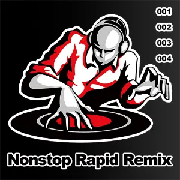{ width="162" }
        </td><td colspan = "2" width="160" display="inline-block">**等级**</td><td colspan = "3" class="ez2-course-levellable-tr">
                                <!-- 是否有AC挑战 -->           
        </td></tr><tr><td minwidth="160" colspan = "2" rowspan="3" class="ez2-course-levelnum-tr">
                                <!-- 组曲等级 -->               13
        </td><td class="ez-course-stage-td">1st STAGE</td><td class="ez-course-song-title-td">
        <!-- 第一首 模式 --><code class="ez-course-judge-s">    4S
        </code></td><td class="ez-course-songname-td">
                                <!-- 第一首 歌名 -->            Nonstop Remix 001
        </td></tr><tr><td>2nd STAGE</td><td class="ez-course-song-title-td">
        <!-- 第二首 模式 --><code class="ez-course-judge-s">    4S
        </code></td><td>        <!-- 第二首 歌名 -->            Nonstop Remix 002
        </td></tr><tr><td>3rd STAGE</td><td class="ez-course-song-title-td">
        <!-- 第三首 模式 --><code class="ez-course-judge-s">    4S
        </code></td><td>        <!-- 第三首 歌名 -->            Nonstop Remix 003
        </td></tr><tr><td width="90">**总得分**</td><td width="100">
                                <!-- 总得分 -->                 949800
        </td><td>**总物量**</td><td>
                                <!-- 总物量 -->                 3166
        </td><td>4th STAGE</td><td class="ez-course-song-title-td">
        <!-- 第四首 模式 --><code class="ez-course-judge-s">    4S
        </code></td><td>        <!-- 第四首 歌名 -->            Nonstop Remix 004
        </td></tr><tr><td>**谱师**</td><td colspan = "6">
                                <!-- 谱师名 -->                 Retro EZ2ON Crew
        </td></tr><tr><td>**所需 DLC**</td><td colspan = "6">
                                <!-- 所需 DLC -->               /
    </td></tr></table>    

=== "5K"

    <table style="display: inline-block; vertical-align: middle; width:900px"><tr>
        <td colspan = "2" rowspan="4">
                                <!-- 封面图 -->                 { width="162" }
        </td><td colspan = "2" width="160" display="inline-block">**等级**</td><td colspan = "3" class="ez2-course-levellable-tr">
                                <!-- 是否有AC挑战 -->           
        </td></tr><tr><td minwidth="160" colspan = "2" rowspan="3" class="ez2-course-levelnum-tr">
                                <!-- 组曲等级 -->               15
        </td><td class="ez-course-stage-td">1st STAGE</td><td class="ez-course-song-title-td">
        <!-- 第一首 模式 --><code class="ez-course-judge-s">    5S
        </code></td><td class="ez-course-songname-td">
                                <!-- 第一首 歌名 -->            Nonstop Remix 001
        </td></tr><tr><td>2nd STAGE</td><td class="ez-course-song-title-td">
        <!-- 第二首 模式 --><code class="ez-course-judge-s">    5S
        </code></td><td>        <!-- 第二首 歌名 -->            Nonstop Remix 002
        </td></tr><tr><td>3rd STAGE</td><td class="ez-course-song-title-td">
        <!-- 第三首 模式 --><code class="ez-course-judge-s">    5S
        </code></td><td>        <!-- 第三首 歌名 -->            Nonstop Remix 003
        </td></tr><tr><td width="90">**总得分**</td><td width="100">
                                <!-- 总得分 -->                 1185900
        </td><td>**总物量**</td><td>
                                <!-- 总物量 -->                 3953
        </td><td>4th STAGE</td><td class="ez-course-song-title-td">
        <!-- 第四首 模式 --><code class="ez-course-judge-s">    5S
        </code></td><td>        <!-- 第四首 歌名 -->            Nonstop Remix 004
        </td></tr><tr><td>**谱师**</td><td colspan = "6">
                                <!-- 谱师名 -->                 Retro EZ2ON Crew
        </td></tr><tr><td>**所需 DLC**</td><td colspan = "6">
                                <!-- 所需 DLC -->               /
    </td></tr></table>

=== "6K"

    <table style="display: inline-block; vertical-align: middle; width:900px"><tr>
        <td colspan = "2" rowspan="4">
                                <!-- 封面图 -->                 { width="162" }
        </td><td colspan = "2" width="160" display="inline-block">**等级**</td><td colspan = "3" class="ez2-course-levellable-tr">
                                <!-- 是否有AC挑战 -->           
        </td></tr><tr><td minwidth="160" colspan = "2" rowspan="3" class="ez2-course-levelnum-tr">
                                <!-- 组曲等级 -->               15
        </td><td class="ez-course-stage-td">1st STAGE</td><td class="ez-course-song-title-td">
        <!-- 第一首 模式 --><code class="ez-course-judge-s">    6S
        </code></td><td class="ez-course-songname-td">
                                <!-- 第一首 歌名 -->            Nonstop Remix 001
        </td></tr><tr><td>2nd STAGE</td><td class="ez-course-song-title-td">
        <!-- 第二首 模式 --><code class="ez-course-judge-s">    6S
        </code></td><td>        <!-- 第二首 歌名 -->            Nonstop Remix 002
        </td></tr><tr><td>3rd STAGE</td><td class="ez-course-song-title-td">
        <!-- 第三首 模式 --><code class="ez-course-judge-s">    6S
        </code></td><td>        <!-- 第三首 歌名 -->            Nonstop Remix 003
        </td></tr><tr><td width="90">**总得分**</td><td width="100">
                                <!-- 总得分 -->                 1191600
        </td><td>**总物量**</td><td>
                                <!-- 总物量 -->                 3972
        </td><td>4th STAGE</td><td class="ez-course-song-title-td">
        <!-- 第四首 模式 --><code class="ez-course-judge-s">    6S
        </code></td><td>        <!-- 第四首 歌名 -->            Nonstop Remix 004
        </td></tr><tr><td>**谱师**</td><td colspan = "6">
                                <!-- 谱师名 -->                 Retro EZ2ON Crew
        </td></tr><tr><td>**所需 DLC**</td><td colspan = "6">
                                <!-- 所需 DLC -->               /
    </td></tr></table>

=== "8K"

    <table style="display: inline-block; vertical-align: middle; width:900px"><tr>
        <td colspan = "2" rowspan="4">
                                <!-- 封面图 -->                 { width="162" }
        </td><td colspan = "2" width="160" display="inline-block">**等级**</td><td colspan = "3" class="ez2-course-levellable-tr">
                                <!-- 是否有AC挑战 -->           
        </td></tr><tr><td minwidth="160" colspan = "2" rowspan="3" class="ez2-course-levelnum-tr">
                                <!-- 组曲等级 -->               16
        </td><td class="ez-course-stage-td">1st STAGE</td><td class="ez-course-song-title-td">
        <!-- 第一首 模式 --><code class="ez-course-judge-s">    8S
        </code></td><td class="ez-course-songname-td">
                                <!-- 第一首 歌名 -->            Nonstop Remix 001
        </td></tr><tr><td>2nd STAGE</td><td class="ez-course-song-title-td">
        <!-- 第二首 模式 --><code class="ez-course-judge-s">    8S
        </code></td><td>        <!-- 第二首 歌名 -->            Nonstop Remix 002
        </td></tr><tr><td>3rd STAGE</td><td class="ez-course-song-title-td">
        <!-- 第三首 模式 --><code class="ez-course-judge-s">    8S
        </code></td><td>        <!-- 第三首 歌名 -->            Nonstop Remix 003
        </td></tr><tr><td width="90">**总得分**</td><td width="100">
                                <!-- 总得分 -->                 1278900
        </td><td>**总物量**</td><td>
                                <!-- 总物量 -->                 4263
        </td><td>4th STAGE</td><td class="ez-course-song-title-td">
        <!-- 第四首 模式 --><code class="ez-course-judge-s">    8S
        </code></td><td>        <!-- 第四首 歌名 -->            Nonstop Remix 004
        </td></tr><tr><td>**谱师**</td><td colspan = "6">
                                <!-- 谱师名 -->                 Retro EZ2ON Crew
        </td></tr><tr><td>**所需 DLC**</td><td colspan = "6">
                                <!-- 所需 DLC -->               /
    </td></tr></table>

---

## Disco Wonderland

The night that you will never forget

> 出自《EZ2ON REBOOT 2013》。

=== "4K"

    <table style="display: inline-block; vertical-align: middle; width:900px"><tr>
        <td colspan = "2" rowspan="4">
                                <!-- 封面图 -->                 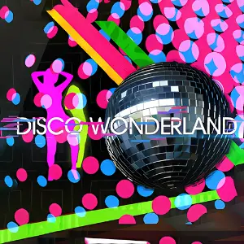{ width="162" }
        </td><td colspan = "2" width="160" display="inline-block">**等级**</td><td colspan = "3" class="ez2-course-levellable-tr">
                                <!-- 是否有AC挑战 -->           
        </td></tr><tr><td minwidth="160" colspan = "2" rowspan="3" class="ez2-course-levelnum-tr">
                                <!-- 组曲等级 -->               15
        </td><td class="ez-course-stage-td">1st STAGE</td><td class="ez-course-song-title-td">
        <!-- 第一首 模式 --><code class="ez-course-judge-s">    4S
        </code></td><td class="ez-course-songname-td">
                                <!-- 第一首 歌名 -->            Seize The Day
        </td></tr><tr><td>2nd STAGE</td><td class="ez-course-song-title-td">
        <!-- 第二首 模式 --><code class="ez-course-judge-s">    4S
        </code></td><td>        <!-- 第二首 歌名 -->            Give it 2 Me
        </td></tr><tr><td>3rd STAGE</td><td class="ez-course-song-title-td">
        <!-- 第三首 模式 --><code class="ez-course-judge-s">    4S
        </code></td><td>        <!-- 第三首 歌名 -->            I've Fallen (Hot Dog Boogie Groove Mix)
        </td></tr><tr><td width="90">**总得分**</td><td width="100">
                                <!-- 总得分 -->                 1005000
        </td><td>**总物量**</td><td>
                                <!-- 总物量 -->                 3350
        </td><td>4th STAGE</td><td class="ez-course-song-title-td">
        <!-- 第四首 模式 --><code class="ez-course-judge-s">    4S
        </code></td><td>        <!-- 第四首 歌名 -->            J.M.J (DFC Space Gear Re-formation)
        </td></tr><tr><td>**谱师**</td><td colspan = "6">
                                <!-- 谱师名 -->                 ALTiTUNE
        </td></tr><tr><td>**所需 DLC**</td><td colspan = "6">
                                <!-- 所需 DLC -->               /
    </td></tr></table>

=== "5K"

    <table style="display: inline-block; vertical-align: middle; width:900px"><tr>
        <td colspan = "2" rowspan="4">
                                <!-- 封面图 -->                 { width="162" }
        </td><td colspan = "2" width="160" display="inline-block">**等级**</td><td colspan = "3" class="ez2-course-levellable-tr">
                                <!-- 是否有AC挑战 -->           
        </td></tr><tr><td minwidth="160" colspan = "2" rowspan="3" class="ez2-course-levelnum-tr">
                                <!-- 组曲等级 -->               15
        </td><td class="ez-course-stage-td">1st STAGE</td><td class="ez-course-song-title-td">
        <!-- 第一首 模式 --><code class="ez-course-judge-s">    5S
        </code></td><td class="ez-course-songname-td">
                                <!-- 第一首 歌名 -->            Seize The Day
        </td></tr><tr><td>2nd STAGE</td><td class="ez-course-song-title-td">
        <!-- 第二首 模式 --><code class="ez-course-judge-s">    5S
        </code></td><td>        <!-- 第二首 歌名 -->            Give it 2 Me
        </td></tr><tr><td>3rd STAGE</td><td class="ez-course-song-title-td">
        <!-- 第三首 模式 --><code class="ez-course-judge-s">    5S
        </code></td><td>        <!-- 第三首 歌名 -->            I've Fallen (Hot Dog Boogie Groove Mix)
        </td></tr><tr><td width="90">**总得分**</td><td width="100">
                                <!-- 总得分 -->                 1087500
        </td><td>**总物量**</td><td>
                                <!-- 总物量 -->                 3625
        </td><td>4th STAGE</td><td class="ez-course-song-title-td">
        <!-- 第四首 模式 --><code class="ez-course-judge-s">    5S
        </code></td><td>        <!-- 第四首 歌名 -->            J.M.J (DFC Space Gear Re-formation)
        </td></tr><tr><td>**谱师**</td><td colspan = "6">
                                <!-- 谱师名 -->                 ALTiTUNE
        </td></tr><tr><td>**所需 DLC**</td><td colspan = "6">
                                <!-- 所需 DLC -->               /
    </td></tr></table>

=== "6K"

    <table style="display: inline-block; vertical-align: middle; width:900px"><tr>
        <td colspan = "2" rowspan="4">
                                <!-- 封面图 -->                 { width="162" }
        </td><td colspan = "2" width="160" display="inline-block">**等级**</td><td colspan = "3" class="ez2-course-levellable-tr">
                                <!-- 是否有AC挑战 -->           
        </td></tr><tr><td minwidth="160" colspan = "2" rowspan="3" class="ez2-course-levelnum-tr">
                                <!-- 组曲等级 -->               15
        </td><td class="ez-course-stage-td">1st STAGE</td><td class="ez-course-song-title-td">
        <!-- 第一首 模式 --><code class="ez-course-judge-s">    6S
        </code></td><td class="ez-course-songname-td">
                                <!-- 第一首 歌名 -->            Seize The Day
        </td></tr><tr><td>2nd STAGE</td><td class="ez-course-song-title-td">
        <!-- 第二首 模式 --><code class="ez-course-judge-s">    6S
        </code></td><td>        <!-- 第二首 歌名 -->            Give it 2 Me
        </td></tr><tr><td>3rd STAGE</td><td class="ez-course-song-title-td">
        <!-- 第三首 模式 --><code class="ez-course-judge-s">    6S
        </code></td><td>        <!-- 第三首 歌名 -->            I've Fallen (Hot Dog Boogie Groove Mix)
        </td></tr><tr><td width="90">**总得分**</td><td width="100">
                                <!-- 总得分 -->                 1139100
        </td><td>**总物量**</td><td>
                                <!-- 总物量 -->                 3797
        </td><td>4th STAGE</td><td class="ez-course-song-title-td">
        <!-- 第四首 模式 --><code class="ez-course-judge-s">    6S
        </code></td><td>        <!-- 第四首 歌名 -->            J.M.J (DFC Space Gear Re-formation)
        </td></tr><tr><td>**谱师**</td><td colspan = "6">
                                <!-- 谱师名 -->                 ALTiTUNE
        </td></tr><tr><td>**所需 DLC**</td><td colspan = "6">
                                <!-- 所需 DLC -->               /
    </td></tr></table>

=== "8K"

    <table style="display: inline-block; vertical-align: middle; width:900px"><tr>
        <td colspan = "2" rowspan="4">
                                <!-- 封面图 -->                 { width="162" }
        </td><td colspan = "2" width="160" display="inline-block">**等级**</td><td colspan = "3" class="ez2-course-levellable-tr">
                                <!-- 是否有AC挑战 -->           
        </td></tr><tr><td minwidth="160" colspan = "2" rowspan="3" class="ez2-course-levelnum-tr">
                                <!-- 组曲等级 -->               15
        </td><td class="ez-course-stage-td">1st STAGE</td><td class="ez-course-song-title-td">
        <!-- 第一首 模式 --><code class="ez-course-judge-s">    8S
        </code></td><td class="ez-course-songname-td">
                                <!-- 第一首 歌名 -->            Seize The Day
        </td></tr><tr><td>2nd STAGE</td><td class="ez-course-song-title-td">
        <!-- 第二首 模式 --><code class="ez-course-judge-s">    8S
        </code></td><td>        <!-- 第二首 歌名 -->            Give it 2 Me
        </td></tr><tr><td>3rd STAGE</td><td class="ez-course-song-title-td">
        <!-- 第三首 模式 --><code class="ez-course-judge-s">    8S
        </code></td><td>        <!-- 第三首 歌名 -->            I've Fallen (Hot Dog Boogie Groove Mix)
        </td></tr><tr><td width="90">**总得分**</td><td width="100">
                                <!-- 总得分 -->                 1172100
        </td><td>**总物量**</td><td>
                                <!-- 总物量 -->                 3907
        </td><td>4th STAGE</td><td class="ez-course-song-title-td">
        <!-- 第四首 模式 --><code class="ez-course-judge-s">    8S
        </code></td><td>        <!-- 第四首 歌名 -->            J.M.J (DFC Space Gear Re-formation)
        </td></tr><tr><td>**谱师**</td><td colspan = "6">
                                <!-- 谱师名 -->                 ALTiTUNE
        </td></tr><tr><td>**所需 DLC**</td><td colspan = "6">
                                <!-- 所需 DLC -->               /
    </td></tr></table>

---

## Violet

The commander of class R

> 《CODENAME VIOLET》同款魔王组曲，开始演奏前会出现【正在进入 Violet 系统】的过场画面。

=== "4K"

    <table style="display: inline-block; vertical-align: middle; width:900px"><tr>
        <td colspan = "2" rowspan="4">
                                <!-- 封面图 -->                 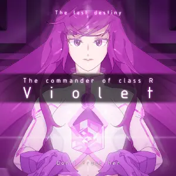{ width="162" }
        </td><td colspan = "2" width="160" display="inline-block">**等级**</td><td colspan = "3" class="ez2-course-levellable-tr">
                                <!-- 是否有AC挑战 -->           **All Combo 挑战**
        </td></tr><tr><td minwidth="160" colspan = "2" rowspan="3" class="ez2-course-levelnum-tr">
                                <!-- 组曲等级 -->               ?
        </td><td class="ez-course-stage-td">1st STAGE</td><td class="ez-course-song-title-td">
        <!-- 第一首 模式 --><code class="ez-course-judge-x">    4X
        </code></td><td class="ez-course-songname-td">
                                <!-- 第一首 歌名 -->            Tempus Praeterita
        </td></tr><tr><td>2nd STAGE</td><td class="ez-course-song-title-td">
        <!-- 第二首 模式 --><code class="ez-course-judge-x">    4X
        </code></td><td>        <!-- 第二首 歌名 -->            Blood Castle (Remix)
        </td></tr><tr><td>3rd STAGE</td><td class="ez-course-song-title-td">
        <!-- 第三首 模式 --><code class="ez-course-judge-x">    4X
        </code></td><td>        <!-- 第三首 歌名 -->            Eraser Rain For GAIA
        </td></tr><tr><td width="90">**总得分**</td><td width="100">
                                <!-- 总得分 -->                 /
        </td><td>**总物量**</td><td>
                                <!-- 总物量 -->                 7000
        </td><td>4th STAGE</td><td class="ez-course-song-title-td">
        <!-- 第四首 模式 --><code class="ez-course-judge-x">    4X
        </code></td><td>        <!-- 第四首 歌名 -->            Kamui (神威)
        </td></tr><tr><td>**谱师**</td><td colspan = "6">
                                <!-- 谱师名 -->                 VNQS~4.cnv
        </td></tr><tr><td>**所需 DLC**</td><td colspan = "6">
                                <!-- 所需 DLC -->               `CODENAME VIOLET`
    </td></tr></table>

=== "5K"

    <table style="display: inline-block; vertical-align: middle; width:900px"><tr>
        <td colspan = "2" rowspan="4">
                                <!-- 封面图 -->                 { width="162" }
        </td><td colspan = "2" width="160" display="inline-block">**等级**</td><td colspan = "3" class="ez2-course-levellable-tr">
                                <!-- 是否有AC挑战 -->           **All Combo 挑战**
        </td></tr><tr><td minwidth="160" colspan = "2" rowspan="3" class="ez2-course-levelnum-tr">
                                <!-- 组曲等级 -->               ?
        </td><td class="ez-course-stage-td">1st STAGE</td><td class="ez-course-song-title-td">
        <!-- 第一首 模式 --><code class="ez-course-judge-x">    5X
        </code></td><td class="ez-course-songname-td">
                                <!-- 第一首 歌名 -->            Tempus Praeterita
        </td></tr><tr><td>2nd STAGE</td><td class="ez-course-song-title-td">
        <!-- 第二首 模式 --><code class="ez-course-judge-x">    5X
        </code></td><td>        <!-- 第二首 歌名 -->            Blood Castle (Remix)
        </td></tr><tr><td>3rd STAGE</td><td class="ez-course-song-title-td">
        <!-- 第三首 模式 --><code class="ez-course-judge-x">    5X
        </code></td><td>        <!-- 第三首 歌名 -->            Eraser Rain For GAIA
        </td></tr><tr><td width="90">**总得分**</td><td width="100">
                                <!-- 总得分 -->                 /
        </td><td>**总物量**</td><td>
                                <!-- 总物量 -->                 7664
        </td><td>4th STAGE</td><td class="ez-course-song-title-td">
        <!-- 第四首 模式 --><code class="ez-course-judge-x">    5X
        </code></td><td>        <!-- 第四首 歌名 -->            Kamui (神威)
        </td></tr><tr><td>**谱师**</td><td colspan = "6">
                                <!-- 谱师名 -->                 VNQS~5.cnv
        </td></tr><tr><td>**所需 DLC**</td><td colspan = "6">
                                <!-- 所需 DLC -->               `CODENAME VIOLET`
    </td></tr></table>

=== "6K"

    <table style="display: inline-block; vertical-align: middle; width:900px"><tr>
        <td colspan = "2" rowspan="4">
                                <!-- 封面图 -->                 { width="162" }
        </td><td colspan = "2" width="160" display="inline-block">**等级**</td><td colspan = "3" class="ez2-course-levellable-tr">
                                <!-- 是否有AC挑战 -->           **All Combo 挑战**
        </td></tr><tr><td minwidth="160" colspan = "2" rowspan="3" class="ez2-course-levelnum-tr">
                                <!-- 组曲等级 -->               ?
        </td><td class="ez-course-stage-td">1st STAGE</td><td class="ez-course-song-title-td">
        <!-- 第一首 模式 --><code class="ez-course-judge-x">    6X
        </code></td><td class="ez-course-songname-td">
                                <!-- 第一首 歌名 -->            Tempus Praeterita
        </td></tr><tr><td>2nd STAGE</td><td class="ez-course-song-title-td">
        <!-- 第二首 模式 --><code class="ez-course-judge-x">    6X
        </code></td><td>        <!-- 第二首 歌名 -->            Blood Castle (Remix)
        </td></tr><tr><td>3rd STAGE</td><td class="ez-course-song-title-td">
        <!-- 第三首 模式 --><code class="ez-course-judge-x">    6X
        </code></td><td>        <!-- 第三首 歌名 -->            Eraser Rain For GAIA
        </td></tr><tr><td width="90">**总得分**</td><td width="100">
                                <!-- 总得分 -->                 /
        </td><td>**总物量**</td><td>
                                <!-- 总物量 -->                 9027
        </td><td>4th STAGE</td><td class="ez-course-song-title-td">
        <!-- 第四首 模式 --><code class="ez-course-judge-x">    6X
        </code></td><td>        <!-- 第四首 歌名 -->            Kamui (神威)
        </td></tr><tr><td>**谱师**</td><td colspan = "6">
                                <!-- 谱师名 -->                 VNQS~6.cnv
        </td></tr><tr><td>**所需 DLC**</td><td colspan = "6">
                                <!-- 所需 DLC -->               `CODENAME VIOLET`
    </td></tr></table>

=== "8K"

    <table style="display: inline-block; vertical-align: middle; width:900px"><tr>
        <td colspan = "2" rowspan="4">
                                <!-- 封面图 -->                 { width="162" }
        </td><td colspan = "2" width="160" display="inline-block">**等级**</td><td colspan = "3" class="ez2-course-levellable-tr">
                                <!-- 是否有AC挑战 -->           **All Combo 挑战**
        </td></tr><tr><td minwidth="160" colspan = "2" rowspan="3" class="ez2-course-levelnum-tr">
                                <!-- 组曲等级 -->               ?
        </td><td class="ez-course-stage-td">1st STAGE</td><td class="ez-course-song-title-td">
        <!-- 第一首 模式 --><code class="ez-course-judge-x">    8X
        </code></td><td class="ez-course-songname-td">
                                <!-- 第一首 歌名 -->            Tempus Praeterita
        </td></tr><tr><td>2nd STAGE</td><td class="ez-course-song-title-td">
        <!-- 第二首 模式 --><code class="ez-course-judge-x">    8X
        </code></td><td>        <!-- 第二首 歌名 -->            Blood Castle (Remix)
        </td></tr><tr><td>3rd STAGE</td><td class="ez-course-song-title-td">
        <!-- 第三首 模式 --><code class="ez-course-judge-x">    8X
        </code></td><td>        <!-- 第三首 歌名 -->            Eraser Rain For GAIA
        </td></tr><tr><td width="90">**总得分**</td><td width="100">
                                <!-- 总得分 -->                 /
        </td><td>**总物量**</td><td>
                                <!-- 总物量 -->                 9239
        </td><td>4th STAGE</td><td class="ez-course-song-title-td">
        <!-- 第四首 模式 --><code class="ez-course-judge-x">    8X
        </code></td><td>        <!-- 第四首 歌名 -->            Kamui (神威)
        </td></tr><tr><td>**谱师**</td><td colspan = "6">
                                <!-- 谱师名 -->                 VNQS~8.cnv
        </td></tr><tr><td>**所需 DLC**</td><td colspan = "6">
                                <!-- 所需 DLC -->               `CODENAME VIOLET`
    </td></tr></table>

---

## AM 3:34 - Daily Dairy Store

Bitter and Sweet

> 《PRESTIGE PASS》DLC 专属课题组曲，午夜时分的便利店主题。

=== "4K"

    <table style="display: inline-block; vertical-align: middle; width:900px"><tr>
        <td colspan = "2" rowspan="4">
                                <!-- 封面图 -->                 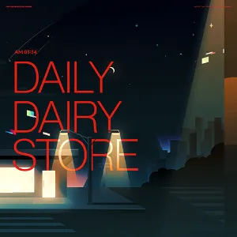{ width="162" }
        </td><td colspan = "2" width="160" display="inline-block">**等级**</td><td colspan = "3" class="ez2-course-levellable-tr">
                                <!-- 是否有AC挑战 -->           
        </td></tr><tr><td minwidth="160" colspan = "2" rowspan="3" class="ez2-course-levelnum-tr">
                                <!-- 组曲等级 -->               17
        </td><td class="ez-course-stage-td">1st STAGE</td><td class="ez-course-song-title-td">
        <!-- 第一首 模式 --><code class="ez-course-judge-s">    4S
        </code></td><td class="ez-course-songname-td">
                                <!-- 第一首 歌名 -->            個人的なメモ (KENPO SAITO)
        </td></tr><tr><td>2nd STAGE</td><td class="ez-course-song-title-td">
        <!-- 第二首 模式 --><code class="ez-course-judge-s">    4S
        </code></td><td>        <!-- 第二首 歌名 -->            TROMA
        </td></tr><tr><td>3rd STAGE</td><td class="ez-course-song-title-td">
        <!-- 第三首 模式 --><code class="ez-course-judge-s">    4S
        </code></td><td>        <!-- 第三首 歌名 -->            Faker
        </td></tr><tr><td width="90">**总得分**</td><td width="100">
                                <!-- 总得分 -->                 2024400
        </td><td>**总物量**</td><td>
                                <!-- 总物量 -->                 6748
        </td><td>4th STAGE</td><td class="ez-course-song-title-td">
        <!-- 第四首 模式 --><code class="ez-course-judge-s">    4S
        </code></td><td>        <!-- 第四首 歌名 -->            felys -final remix-
        </td></tr><tr><td>**谱师**</td><td colspan = "6">
                                <!-- 谱师名 -->                 CLOCKWORK
        </td></tr><tr><td>**所需 DLC**</td><td colspan = "6">
                                <!-- 所需 DLC -->               `PRESTIGE PASS`
    </td></tr></table>

=== "5K"

    <table style="display: inline-block; vertical-align: middle; width:900px"><tr>
        <td colspan = "2" rowspan="4">
                                <!-- 封面图 -->                 { width="162" }
        </td><td colspan = "2" width="160" display="inline-block">**等级**</td><td colspan = "3" class="ez2-course-levellable-tr">
                                <!-- 是否有AC挑战 -->           
        </td></tr><tr><td minwidth="160" colspan = "2" rowspan="3" class="ez2-course-levelnum-tr">
                                <!-- 组曲等级 -->               17
        </td><td class="ez-course-stage-td">1st STAGE</td><td class="ez-course-song-title-td">
        <!-- 第一首 模式 --><code class="ez-course-judge-s">    5S
        </code></td><td class="ez-course-songname-td">
                                <!-- 第一首 歌名 -->            個人的なメモ (KENPO SAITO)
        </td></tr><tr><td>2nd STAGE</td><td class="ez-course-song-title-td">
        <!-- 第二首 模式 --><code class="ez-course-judge-s">    5S
        </code></td><td>        <!-- 第二首 歌名 -->            TROMA
        </td></tr><tr><td>3rd STAGE</td><td class="ez-course-song-title-td">
        <!-- 第三首 模式 --><code class="ez-course-judge-s">    5S
        </code></td><td>        <!-- 第三首 歌名 -->            Faker
        </td></tr><tr><td width="90">**总得分**</td><td width="100">
                                <!-- 总得分 -->                 2133000
        </td><td>**总物量**</td><td>
                                <!-- 总物量 -->                 7110
        </td><td>4th STAGE</td><td class="ez-course-song-title-td">
        <!-- 第四首 模式 --><code class="ez-course-judge-s">    5S
        </code></td><td>        <!-- 第四首 歌名 -->            felys -final remix-
        </td></tr><tr><td>**谱师**</td><td colspan = "6">
                                <!-- 谱师名 -->                 Jackalope
        </td></tr><tr><td>**所需 DLC**</td><td colspan = "6">
                                <!-- 所需 DLC -->               `PRESTIGE PASS`
    </td></tr></table>

=== "6K"

    <table style="display: inline-block; vertical-align: middle; width:900px"><tr>
        <td colspan = "2" rowspan="4">
                                <!-- 封面图 -->                 { width="162" }
        </td><td colspan = "2" width="160" display="inline-block">**等级**</td><td colspan = "3" class="ez2-course-levellable-tr">
                                <!-- 是否有AC挑战 -->           
        </td></tr><tr><td minwidth="160" colspan = "2" rowspan="3" class="ez2-course-levelnum-tr">
                                <!-- 组曲等级 -->               17
        </td><td class="ez-course-stage-td">1st STAGE</td><td class="ez-course-song-title-td">
        <!-- 第一首 模式 --><code class="ez-course-judge-s">    6S
        </code></td><td class="ez-course-songname-td">
                                <!-- 第一首 歌名 -->            個人的なメモ (KENPO SAITO)
        </td></tr><tr><td>2nd STAGE</td><td class="ez-course-song-title-td">
        <!-- 第二首 模式 --><code class="ez-course-judge-s">    6S
        </code></td><td>        <!-- 第二首 歌名 -->            TROMA
        </td></tr><tr><td>3rd STAGE</td><td class="ez-course-song-title-td">
        <!-- 第三首 模式 --><code class="ez-course-judge-s">    6S
        </code></td><td>        <!-- 第三首 歌名 -->            Faker
        </td></tr><tr><td width="90">**总得分**</td><td width="100">
                                <!-- 总得分 -->                 2267700
        </td><td>**总物量**</td><td>
                                <!-- 总物量 -->                 7559
        </td><td>4th STAGE</td><td class="ez-course-song-title-td">
        <!-- 第四首 模式 --><code class="ez-course-judge-s">    6S
        </code></td><td>        <!-- 第四首 歌名 -->            felys -final remix-
        </td></tr><tr><td>**谱师**</td><td colspan = "6">
                                <!-- 谱师名 -->                 Jackalope
        </td></tr><tr><td>**所需 DLC**</td><td colspan = "6">
                                <!-- 所需 DLC -->               `PRESTIGE PASS`
    </td></tr></table>

=== "8K"

    <table style="display: inline-block; vertical-align: middle; width:900px"><tr>
        <td colspan = "2" rowspan="4">
                                <!-- 封面图 -->                 { width="162" }
        </td><td colspan = "2" width="160" display="inline-block">**等级**</td><td colspan = "3" class="ez2-course-levellable-tr">
                                <!-- 是否有AC挑战 -->           
        </td></tr><tr><td minwidth="160" colspan = "2" rowspan="3" class="ez2-course-levelnum-tr">
                                <!-- 组曲等级 -->               18
        </td><td class="ez-course-stage-td">1st STAGE</td><td class="ez-course-song-title-td">
        <!-- 第一首 模式 --><code class="ez-course-judge-s">    8S
        </code></td><td class="ez-course-songname-td">
                                <!-- 第一首 歌名 -->            個人的なメモ (KENPO SAITO)
        </td></tr><tr><td>2nd STAGE</td><td class="ez-course-song-title-td">
        <!-- 第二首 模式 --><code class="ez-course-judge-s">    8S
        </code></td><td>        <!-- 第二首 歌名 -->            TROMA
        </td></tr><tr><td>3rd STAGE</td><td class="ez-course-song-title-td">
        <!-- 第三首 模式 --><code class="ez-course-judge-s">    8S
        </code></td><td>        <!-- 第三首 歌名 -->            Faker
        </td></tr><tr><td width="90">**总得分**</td><td width="100">
                                <!-- 总得分 -->                 2560200
        </td><td>**总物量**</td><td>
                                <!-- 总物量 -->                 8534
        </td><td>4th STAGE</td><td class="ez-course-song-title-td">
        <!-- 第四首 模式 --><code class="ez-course-judge-s">    8S
        </code></td><td>        <!-- 第四首 歌名 -->            felys -final remix-
        </td></tr><tr><td>**谱师**</td><td colspan = "6">
                                <!-- 谱师名 -->                 YUKINARI! MELON
        </td></tr><tr><td>**所需 DLC**</td><td colspan = "6">
                                <!-- 所需 DLC -->               `PRESTIGE PASS`
    </td></tr></table>

---

## PM 7:41 - MarinaFort 1F Patio

Wising on a better tomorrow

> 《PRESTIGE PASS》DLC 专属课题组曲，夜间的江景酒吧主题。

=== "4K"

    <table style="display: inline-block; vertical-align: middle; width:900px"><tr>
        <td colspan = "2" rowspan="4">
                                <!-- 封面图 -->                 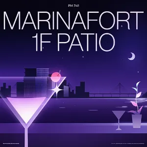{ width="162" }
        </td><td colspan = "2" width="160" display="inline-block">**等级**</td><td colspan = "3" class="ez2-course-levellable-tr">
                                <!-- 是否有AC挑战 -->           
        </td></tr><tr><td minwidth="160" colspan = "2" rowspan="3" class="ez2-course-levelnum-tr">
                                <!-- 组曲等级 -->               15
        </td><td class="ez-course-stage-td">1st STAGE</td><td class="ez-course-song-title-td">
        <!-- 第一首 模式 --><code class="ez-course-judge-s">    4S
        </code></td><td class="ez-course-songname-td">
                                <!-- 第一首 歌名 -->            Stella
        </td></tr><tr><td>2nd STAGE</td><td class="ez-course-song-title-td">
        <!-- 第二首 模式 --><code class="ez-course-judge-s">    4S
        </code></td><td>        <!-- 第二首 歌名 -->            Almost There
        </td></tr><tr><td>3rd STAGE</td><td class="ez-course-song-title-td">
        <!-- 第三首 模式 --><code class="ez-course-judge-s">    4S
        </code></td><td>        <!-- 第三首 歌名 -->            Various Ways
        </td></tr><tr><td width="90">**总得分**</td><td width="100">
                                <!-- 总得分 -->                 1712700
        </td><td>**总物量**</td><td>
                                <!-- 总物量 -->                 5709
        </td><td>4th STAGE</td><td class="ez-course-song-title-td">
        <!-- 第四首 模式 --><code class="ez-course-judge-s">    4S
        </code></td><td>        <!-- 第四首 歌名 -->            2038 (2022 Version)
        </td></tr><tr><td>**谱师**</td><td colspan = "6">
                                <!-- 谱师名 -->                 CLOCKWORK & Jackalope
        </td></tr><tr><td>**所需 DLC**</td><td colspan = "6">
                                <!-- 所需 DLC -->               `PRESTIGE PASS`
    </td></tr></table>

=== "5K"

    <table style="display: inline-block; vertical-align: middle; width:900px"><tr>
        <td colspan = "2" rowspan="4">
                                <!-- 封面图 -->                 { width="162" }
        </td><td colspan = "2" width="160" display="inline-block">**等级**</td><td colspan = "3" class="ez2-course-levellable-tr">
                                <!-- 是否有AC挑战 -->           
        </td></tr><tr><td minwidth="160" colspan = "2" rowspan="3" class="ez2-course-levelnum-tr">
                                <!-- 组曲等级 -->               16
        </td><td class="ez-course-stage-td">1st STAGE</td><td class="ez-course-song-title-td">
        <!-- 第一首 模式 --><code class="ez-course-judge-s">    5S
        </code></td><td class="ez-course-songname-td">
                                <!-- 第一首 歌名 -->            Stella
        </td></tr><tr><td>2nd STAGE</td><td class="ez-course-song-title-td">
        <!-- 第二首 模式 --><code class="ez-course-judge-s">    5S
        </code></td><td>        <!-- 第二首 歌名 -->            Almost There
        </td></tr><tr><td>3rd STAGE</td><td class="ez-course-song-title-td">
        <!-- 第三首 模式 --><code class="ez-course-judge-s">    5S
        </code></td><td>        <!-- 第三首 歌名 -->            Various Ways
        </td></tr><tr><td width="90">**总得分**</td><td width="100">
                                <!-- 总得分 -->                 2114100
        </td><td>**总物量**</td><td>
                                <!-- 总物量 -->                 7047
        </td><td>4th STAGE</td><td class="ez-course-song-title-td">
        <!-- 第四首 模式 --><code class="ez-course-judge-s">    5S
        </code></td><td>        <!-- 第四首 歌名 -->            2038 (2022 Version)
        </td></tr><tr><td>**谱师**</td><td colspan = "6">
                                <!-- 谱师名 -->                 YUKINARI! MELON & Jackalope
        </td></tr><tr><td>**所需 DLC**</td><td colspan = "6">
                                <!-- 所需 DLC -->               `PRESTIGE PASS`
    </td></tr></table>

=== "6K"

    <table style="display: inline-block; vertical-align: middle; width:900px"><tr>
        <td colspan = "2" rowspan="4">
                                <!-- 封面图 -->                 { width="162" }
        </td><td colspan = "2" width="160" display="inline-block">**等级**</td><td colspan = "3" class="ez2-course-levellable-tr">
                                <!-- 是否有AC挑战 -->           
        </td></tr><tr><td minwidth="160" colspan = "2" rowspan="3" class="ez2-course-levelnum-tr">
                                <!-- 组曲等级 -->               16
        </td><td class="ez-course-stage-td">1st STAGE</td><td class="ez-course-song-title-td">
        <!-- 第一首 模式 --><code class="ez-course-judge-s">    6S
        </code></td><td class="ez-course-songname-td">
                                <!-- 第一首 歌名 -->            Stella
        </td></tr><tr><td>2nd STAGE</td><td class="ez-course-song-title-td">
        <!-- 第二首 模式 --><code class="ez-course-judge-s">    6S
        </code></td><td>        <!-- 第二首 歌名 -->            Almost There
        </td></tr><tr><td>3rd STAGE</td><td class="ez-course-song-title-td">
        <!-- 第三首 模式 --><code class="ez-course-judge-s">    6S
        </code></td><td>        <!-- 第三首 歌名 -->            Various Ways
        </td></tr><tr><td width="90">**总得分**</td><td width="100">
                                <!-- 总得分 -->                 2329800
        </td><td>**总物量**</td><td>
                                <!-- 总物量 -->                 7766
        </td><td>4th STAGE</td><td class="ez-course-song-title-td">
        <!-- 第四首 模式 --><code class="ez-course-judge-s">    6S
        </code></td><td>        <!-- 第四首 歌名 -->            2038 (2022 Version)
        </td></tr><tr><td>**谱师**</td><td colspan = "6">
                                <!-- 谱师名 -->                 YUKINARI! MELON
        </td></tr><tr><td>**所需 DLC**</td><td colspan = "6">
                                <!-- 所需 DLC -->               `PRESTIGE PASS`
    </td></tr></table>

=== "8K"

    <table style="display: inline-block; vertical-align: middle; width:900px"><tr>
        <td colspan = "2" rowspan="4">
                                <!-- 封面图 -->                 { width="162" }
        </td><td colspan = "2" width="160" display="inline-block">**等级**</td><td colspan = "3" class="ez2-course-levellable-tr">
                                <!-- 是否有AC挑战 -->           
        </td></tr><tr><td minwidth="160" colspan = "2" rowspan="3" class="ez2-course-levelnum-tr">
                                <!-- 组曲等级 -->               16
        </td><td class="ez-course-stage-td">1st STAGE</td><td class="ez-course-song-title-td">
        <!-- 第一首 模式 --><code class="ez-course-judge-s">    8S
        </code></td><td class="ez-course-songname-td">
                                <!-- 第一首 歌名 -->            Stella
        </td></tr><tr><td>2nd STAGE</td><td class="ez-course-song-title-td">
        <!-- 第二首 模式 --><code class="ez-course-judge-s">    8S
        </code></td><td>        <!-- 第二首 歌名 -->            Almost There
        </td></tr><tr><td>3rd STAGE</td><td class="ez-course-song-title-td">
        <!-- 第三首 模式 --><code class="ez-course-judge-s">    8S
        </code></td><td>        <!-- 第三首 歌名 -->            Various Ways
        </td></tr><tr><td width="90">**总得分**</td><td width="100">
                                <!-- 总得分 -->                 2340900
        </td><td>**总物量**</td><td>
                                <!-- 总物量 -->                 7803
        </td><td>4th STAGE</td><td class="ez-course-song-title-td">
        <!-- 第四首 模式 --><code class="ez-course-judge-s">    8S
        </code></td><td>        <!-- 第四首 歌名 -->            2038 (2022 Version)
        </td></tr><tr><td>**谱师**</td><td colspan = "6">
                                <!-- 谱师名 -->                 YUKINARI! MELON & CLOCKWORK
        </td></tr><tr><td>**所需 DLC**</td><td colspan = "6">
                                <!-- 所需 DLC -->               `PRESTIGE PASS`
    </td></tr></table>

---

## PP Maglev Central Line

EXTRA RAPID SERVICE

> 《PRESTIGE PASS》DLC 专属课题组曲，Standard 判定。

=== "4K"

    <table style="display: inline-block; vertical-align: middle; width:900px"><tr>
        <td colspan = "2" rowspan="4">
                                <!-- 封面图 -->                 { width="162" }
        </td><td colspan = "2" width="160" display="inline-block">**等级**</td><td colspan = "3" class="ez2-course-levellable-tr">
                                <!-- 是否有AC挑战 -->           
        </td></tr><tr><td minwidth="160" colspan = "2" rowspan="3" class="ez2-course-levelnum-tr">
                                <!-- 组曲等级 -->               19
        </td><td class="ez-course-stage-td">1st STAGE</td><td class="ez-course-song-title-td">
        <!-- 第一首 模式 --><code class="ez-course-judge-s">    4S
        </code></td><td class="ez-course-songname-td">
                                <!-- 第一首 歌名 -->            FiND A WAY
        </td></tr><tr><td>2nd STAGE</td><td class="ez-course-song-title-td">
        <!-- 第二首 模式 --><code class="ez-course-judge-s">    4S
        </code></td><td>        <!-- 第二首 歌名 -->            Unleashed Emotions
        </td></tr><tr><td>3rd STAGE</td><td class="ez-course-song-title-td">
        <!-- 第三首 模式 --><code class="ez-course-judge-s">    4S
        </code></td><td>        <!-- 第三首 歌名 -->            Start Me Up
        </td></tr><tr><td width="90">**总得分**</td><td width="100">
                                <!-- 总得分 -->                 2665500
        </td><td>**总物量**</td><td>
                                <!-- 总物量 -->                 8885
        </td><td>4th STAGE</td><td class="ez-course-song-title-td">
        <!-- 第四首 模式 --><code class="ez-course-judge-s">    4S
        </code></td><td>        <!-- 第四首 歌名 -->            ?
        </td></tr><tr><td>**谱师**</td><td colspan = "6">
                                <!-- 谱师名 -->                 Jackalope
        </td></tr><tr><td>**所需 DLC**</td><td colspan = "6">
                                <!-- 所需 DLC -->               `PRESTIGE PASS`
    </td></tr></table>

=== "5K"

    <table style="display: inline-block; vertical-align: middle; width:900px"><tr>
        <td colspan = "2" rowspan="4">
                                <!-- 封面图 -->                 { width="162" }
        </td><td colspan = "2" width="160" display="inline-block">**等级**</td><td colspan = "3" class="ez2-course-levellable-tr">
                                <!-- 是否有AC挑战 -->           
        </td></tr><tr><td minwidth="160" colspan = "2" rowspan="3" class="ez2-course-levelnum-tr">
                                <!-- 组曲等级 -->               20
        </td><td class="ez-course-stage-td">1st STAGE</td><td class="ez-course-song-title-td">
        <!-- 第一首 模式 --><code class="ez-course-judge-s">    5S
        </code></td><td class="ez-course-songname-td">
                                <!-- 第一首 歌名 -->            FiND A WAY
        </td></tr><tr><td>2nd STAGE</td><td class="ez-course-song-title-td">
        <!-- 第二首 模式 --><code class="ez-course-judge-s">    5S
        </code></td><td>        <!-- 第二首 歌名 -->            Unleashed Emotions
        </td></tr><tr><td>3rd STAGE</td><td class="ez-course-song-title-td">
        <!-- 第三首 模式 --><code class="ez-course-judge-s">    5S
        </code></td><td>        <!-- 第三首 歌名 -->            Start Me Up
        </td></tr><tr><td width="90">**总得分**</td><td width="100">
                                <!-- 总得分 -->                 3255900
        </td><td>**总物量**</td><td>
                                <!-- 总物量 -->                 10853
        </td><td>4th STAGE</td><td class="ez-course-song-title-td">
        <!-- 第四首 模式 --><code class="ez-course-judge-s">    5S
        </code></td><td>        <!-- 第四首 歌名 -->            ?
        </td></tr><tr><td>**谱师**</td><td colspan = "6">
                                <!-- 谱师名 -->                 YUKINARI! MELON & Jackalope
        </td></tr><tr><td>**所需 DLC**</td><td colspan = "6">
                                <!-- 所需 DLC -->               `PRESTIGE PASS`
    </td></tr></table>

=== "6K"

    <table style="display: inline-block; vertical-align: middle; width:900px"><tr>
        <td colspan = "2" rowspan="4">
                                <!-- 封面图 -->                 { width="162" }
        </td><td colspan = "2" width="160" display="inline-block">**等级**</td><td colspan = "3" class="ez2-course-levellable-tr">
                                <!-- 是否有AC挑战 -->           
        </td></tr><tr><td minwidth="160" colspan = "2" rowspan="3" class="ez2-course-levelnum-tr">
                                <!-- 组曲等级 -->               20
        </td><td class="ez-course-stage-td">1st STAGE</td><td class="ez-course-song-title-td">
        <!-- 第一首 模式 --><code class="ez-course-judge-s">    6S
        </code></td><td class="ez-course-songname-td">
                                <!-- 第一首 歌名 -->            FiND A WAY
        </td></tr><tr><td>2nd STAGE</td><td class="ez-course-song-title-td">
        <!-- 第二首 模式 --><code class="ez-course-judge-s">    6S
        </code></td><td>        <!-- 第二首 歌名 -->            Unleashed Emotions
        </td></tr><tr><td>3rd STAGE</td><td class="ez-course-song-title-td">
        <!-- 第三首 模式 --><code class="ez-course-judge-s">    6S
        </code></td><td>        <!-- 第三首 歌名 -->            Start Me Up
        </td></tr><tr><td width="90">**总得分**</td><td width="100">
                                <!-- 总得分 -->                 3648000
        </td><td>**总物量**</td><td>
                                <!-- 总物量 -->                 12160
        </td><td>4th STAGE</td><td class="ez-course-song-title-td">
        <!-- 第四首 模式 --><code class="ez-course-judge-s">    6S
        </code></td><td>        <!-- 第四首 歌名 -->            ?
        </td></tr><tr><td>**谱师**</td><td colspan = "6">
                                <!-- 谱师名 -->                 YUKINARI! MELON
        </td></tr><tr><td>**所需 DLC**</td><td colspan = "6">
                                <!-- 所需 DLC -->               `PRESTIGE PASS`
    </td></tr></table>

=== "8K"

    <table style="display: inline-block; vertical-align: middle; width:900px"><tr>
        <td colspan = "2" rowspan="4">
                                <!-- 封面图 -->                 { width="162" }
        </td><td colspan = "2" width="160" display="inline-block">**等级**</td><td colspan = "3" class="ez2-course-levellable-tr">
                                <!-- 是否有AC挑战 -->           
        </td></tr><tr><td minwidth="160" colspan = "2" rowspan="3" class="ez2-course-levelnum-tr">
                                <!-- 组曲等级 -->               20
        </td><td class="ez-course-stage-td">1st STAGE</td><td class="ez-course-song-title-td">
        <!-- 第一首 模式 --><code class="ez-course-judge-s">    8S
        </code></td><td class="ez-course-songname-td">
                                <!-- 第一首 歌名 -->            FiND A WAY
        </td></tr><tr><td>2nd STAGE</td><td class="ez-course-song-title-td">
        <!-- 第二首 模式 --><code class="ez-course-judge-s">    8S
        </code></td><td>        <!-- 第二首 歌名 -->            Unleashed Emotions
        </td></tr><tr><td>3rd STAGE</td><td class="ez-course-song-title-td">
        <!-- 第三首 模式 --><code class="ez-course-judge-s">    8S
        </code></td><td>        <!-- 第三首 歌名 -->            Start Me Up
        </td></tr><tr><td width="90">**总得分**</td><td width="100">
                                <!-- 总得分 -->                 3673800
        </td><td>**总物量**</td><td>
                                <!-- 总物量 -->                 12246
        </td><td>4th STAGE</td><td class="ez-course-song-title-td">
        <!-- 第四首 模式 --><code class="ez-course-judge-s">    8S
        </code></td><td>        <!-- 第四首 歌名 -->            ?
        </td></tr><tr><td>**谱师**</td><td colspan = "6">
                                <!-- 谱师名 -->                 YUKINARI! MELON
        </td></tr><tr><td>**所需 DLC**</td><td colspan = "6">
                                <!-- 所需 DLC -->               `PRESTIGE PASS`
    </td></tr></table>

!!! tip "提示"

    第四首为 《MAX 301》，且注意能量槽扣除幅度很低但不会恢复！

---

## PP Maglev Central Line -RH-

EXTRA RAPID SERVICE

> 《PRESTIGE PASS》DLC 专属课题组曲的 RUSH HOUR 亚种，判定更换为 X 判定，歌单和谱面均不变。

=== "4K"

    <table style="display: inline-block; vertical-align: middle; width:900px"><tr>
        <td colspan = "2" rowspan="4">
                                <!-- 封面图 -->                 { width="162" }
        </td><td colspan = "2" width="160" display="inline-block">**等级**</td><td colspan = "3" class="ez2-course-levellable-tr">
                                <!-- 是否有AC挑战 -->           
        </td></tr><tr><td minwidth="160" colspan = "2" rowspan="3" class="ez2-course-levelnum-tr">
                                <!-- 组曲等级 -->               19
        </td><td class="ez-course-stage-td">1st STAGE</td><td class="ez-course-song-title-td">
        <!-- 第一首 模式 --><code class="ez-course-judge-x">    4X
        </code></td><td class="ez-course-songname-td">
                                <!-- 第一首 歌名 -->            FiND A WAY
        </td></tr><tr><td>2nd STAGE</td><td class="ez-course-song-title-td">
        <!-- 第二首 模式 --><code class="ez-course-judge-x">    4X
        </code></td><td>        <!-- 第二首 歌名 -->            Unleashed Emotions
        </td></tr><tr><td>3rd STAGE</td><td class="ez-course-song-title-td">
        <!-- 第三首 模式 --><code class="ez-course-judge-x">    4X
        </code></td><td>        <!-- 第三首 歌名 -->            Start Me Up
        </td></tr><tr><td width="90">**总得分**</td><td width="100">
                                <!-- 总得分 -->                 2665500
        </td><td>**总物量**</td><td>
                                <!-- 总物量 -->                 8885
        </td><td>4th STAGE</td><td class="ez-course-song-title-td">
        <!-- 第四首 模式 --><code class="ez-course-judge-x">    4X
        </code></td><td>        <!-- 第四首 歌名 -->            ?
        </td></tr><tr><td>**谱师**</td><td colspan = "6">
                                <!-- 谱师名 -->                 Jackalope
        </td></tr><tr><td>**所需 DLC**</td><td colspan = "6">
                                <!-- 所需 DLC -->               `PRESTIGE PASS`
    </td></tr></table>

=== "5K"

    <table style="display: inline-block; vertical-align: middle; width:900px"><tr>
        <td colspan = "2" rowspan="4">
                                <!-- 封面图 -->                 { width="162" }
        </td><td colspan = "2" width="160" display="inline-block">**等级**</td><td colspan = "3" class="ez2-course-levellable-tr">
                                <!-- 是否有AC挑战 -->           
        </td></tr><tr><td minwidth="160" colspan = "2" rowspan="3" class="ez2-course-levelnum-tr">
                                <!-- 组曲等级 -->               20
        </td><td class="ez-course-stage-td">1st STAGE</td><td class="ez-course-song-title-td">
        <!-- 第一首 模式 --><code class="ez-course-judge-x">    5X
        </code></td><td class="ez-course-songname-td">
                                <!-- 第一首 歌名 -->            FiND A WAY
        </td></tr><tr><td>2nd STAGE</td><td class="ez-course-song-title-td">
        <!-- 第二首 模式 --><code class="ez-course-judge-x">    5X
        </code></td><td>        <!-- 第二首 歌名 -->            Unleashed Emotions
        </td></tr><tr><td>3rd STAGE</td><td class="ez-course-song-title-td">
        <!-- 第三首 模式 --><code class="ez-course-judge-x">    5X
        </code></td><td>        <!-- 第三首 歌名 -->            Start Me Up
        </td></tr><tr><td width="90">**总得分**</td><td width="100">
                                <!-- 总得分 -->                 3255900
        </td><td>**总物量**</td><td>
                                <!-- 总物量 -->                 10853
        </td><td>4th STAGE</td><td class="ez-course-song-title-td">
        <!-- 第四首 模式 --><code class="ez-course-judge-x">    5X
        </code></td><td>        <!-- 第四首 歌名 -->            ?
        </td></tr><tr><td>**谱师**</td><td colspan = "6">
                                <!-- 谱师名 -->                 YUKINARI! MELON & Jackalope
        </td></tr><tr><td>**所需 DLC**</td><td colspan = "6">
                                <!-- 所需 DLC -->               `PRESTIGE PASS`
    </td></tr></table>

=== "6K"

    <table style="display: inline-block; vertical-align: middle; width:900px"><tr>
        <td colspan = "2" rowspan="4">
                                <!-- 封面图 -->                 { width="162" }
        </td><td colspan = "2" width="160" display="inline-block">**等级**</td><td colspan = "3" class="ez2-course-levellable-tr">
                                <!-- 是否有AC挑战 -->           
        </td></tr><tr><td minwidth="160" colspan = "2" rowspan="3" class="ez2-course-levelnum-tr">
                                <!-- 组曲等级 -->               20
        </td><td class="ez-course-stage-td">1st STAGE</td><td class="ez-course-song-title-td">
        <!-- 第一首 模式 --><code class="ez-course-judge-x">    6X
        </code></td><td class="ez-course-songname-td">
                                <!-- 第一首 歌名 -->            FiND A WAY
        </td></tr><tr><td>2nd STAGE</td><td class="ez-course-song-title-td">
        <!-- 第二首 模式 --><code class="ez-course-judge-x">    6X
        </code></td><td>        <!-- 第二首 歌名 -->            Unleashed Emotions
        </td></tr><tr><td>3rd STAGE</td><td class="ez-course-song-title-td">
        <!-- 第三首 模式 --><code class="ez-course-judge-x">    6X
        </code></td><td>        <!-- 第三首 歌名 -->            Start Me Up
        </td></tr><tr><td width="90">**总得分**</td><td width="100">
                                <!-- 总得分 -->                 3648000
        </td><td>**总物量**</td><td>
                                <!-- 总物量 -->                 12160
        </td><td>4th STAGE</td><td class="ez-course-song-title-td">
        <!-- 第四首 模式 --><code class="ez-course-judge-x">    6X
        </code></td><td>        <!-- 第四首 歌名 -->            ?
        </td></tr><tr><td>**谱师**</td><td colspan = "6">
                                <!-- 谱师名 -->                 YUKINARI! MELON
        </td></tr><tr><td>**所需 DLC**</td><td colspan = "6">
                                <!-- 所需 DLC -->               `PRESTIGE PASS`
    </td></tr></table>

=== "8K"

    <table style="display: inline-block; vertical-align: middle; width:900px"><tr>
        <td colspan = "2" rowspan="4">
                                <!-- 封面图 -->                 { width="162" }
        </td><td colspan = "2" width="160" display="inline-block">**等级**</td><td colspan = "3" class="ez2-course-levellable-tr">
                                <!-- 是否有AC挑战 -->           
        </td></tr><tr><td minwidth="160" colspan = "2" rowspan="3" class="ez2-course-levelnum-tr">
                                <!-- 组曲等级 -->               20
        </td><td class="ez-course-stage-td">1st STAGE</td><td class="ez-course-song-title-td">
        <!-- 第一首 模式 --><code class="ez-course-judge-x">    8X
        </code></td><td class="ez-course-songname-td">
                                <!-- 第一首 歌名 -->            FiND A WAY
        </td></tr><tr><td>2nd STAGE</td><td class="ez-course-song-title-td">
        <!-- 第二首 模式 --><code class="ez-course-judge-x">    8X
        </code></td><td>        <!-- 第二首 歌名 -->            Unleashed Emotions
        </td></tr><tr><td>3rd STAGE</td><td class="ez-course-song-title-td">
        <!-- 第三首 模式 --><code class="ez-course-judge-x">    8X
        </code></td><td>        <!-- 第三首 歌名 -->            Start Me Up
        </td></tr><tr><td width="90">**总得分**</td><td width="100">
                                <!-- 总得分 -->                 3673800
        </td><td>**总物量**</td><td>
                                <!-- 总物量 -->                 12246
        </td><td>4th STAGE</td><td class="ez-course-song-title-td">
        <!-- 第四首 模式 --><code class="ez-course-judge-x">    8X
        </code></td><td>        <!-- 第四首 歌名 -->            ?
        </td></tr><tr><td>**谱师**</td><td colspan = "6">
                                <!-- 谱师名 -->                 YUKINARI! MELON
        </td></tr><tr><td>**所需 DLC**</td><td colspan = "6">
                                <!-- 所需 DLC -->               `PRESTIGE PASS`
    </td></tr></table>

!!! tip "提示"

    第四首为 《MAX 301》，且注意能量槽扣除幅度很低但不会恢复！

---

## TIME PARADOX

Resolve the contradiction

> 出自《FINAL》，为《TIME TRAVELER》DLC 专属课题组曲，其中 8K 歌单与 4~6K 稍有不同（4~6K 与街机 5K COURSE 的歌单一致，8K 则是与 14K COUSE 的歌单一致）。

=== "4K"

    <table style="display: inline-block; vertical-align: middle; width:900px"><tr>
        <td colspan = "2" rowspan="4">
                                <!-- 封面图 -->                 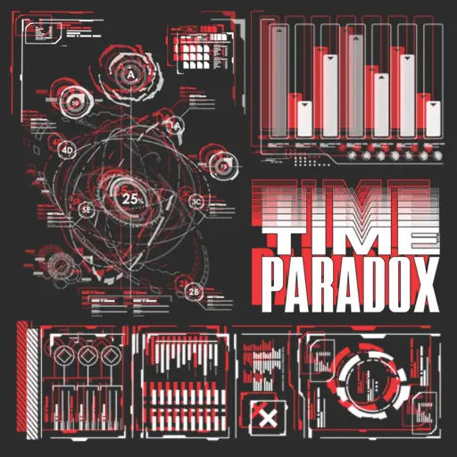{ width="162" }
        </td><td colspan = "2" width="160" display="inline-block">**等级**</td><td colspan = "3" class="ez2-course-levellable-tr">
                                <!-- 是否有AC挑战 -->           
        </td></tr><tr><td minwidth="160" colspan = "2" rowspan="3" class="ez2-course-levelnum-tr">
                                <!-- 组曲等级 -->               ?
        </td><td class="ez-course-stage-td">1st STAGE</td><td class="ez-course-song-title-td">
        <!-- 第一首 模式 --><code class="ez-course-judge-x">    4X
        </code></td><td class="ez-course-songname-td">
                                <!-- 第一首 歌名 -->            Black sour Ruby
        </td></tr><tr><td>2nd STAGE</td><td class="ez-course-song-title-td">
        <!-- 第二首 模式 --><code class="ez-course-judge-x">    4X
        </code></td><td>        <!-- 第二首 歌名 -->            Guardian
        </td></tr><tr><td>3rd STAGE</td><td class="ez-course-song-title-td">
        <!-- 第三首 模式 --><code class="ez-course-judge-x">    4X
        </code></td><td>        <!-- 第三首 歌名 -->            Encounter on orbit
        </td></tr><tr><td width="90">**总得分**</td><td width="100">
                                <!-- 总得分 -->                 2331300
        </td><td>**总物量**</td><td>
                                <!-- 总物量 -->                 7771
        </td><td>4th STAGE</td><td class="ez-course-song-title-td">
        <!-- 第四首 模式 --><code class="ez-course-judge-x">    4X
        </code></td><td>        <!-- 第四首 歌名 -->            Last Flight
        </td></tr><tr><td>**谱师**</td><td colspan = "6">
                                <!-- 谱师名 -->                 Jackalope
        </td></tr><tr><td>**所需 DLC**</td><td colspan = "6">
                                <!-- 所需 DLC -->               `TIME TRAVELER`
    </td></tr></table>

=== "5K"

    <table style="display: inline-block; vertical-align: middle; width:900px"><tr>
        <td colspan = "2" rowspan="4">
                                <!-- 封面图 -->                 { width="162" }
        </td><td colspan = "2" width="160" display="inline-block">**等级**</td><td colspan = "3" class="ez2-course-levellable-tr">
                                <!-- 是否有AC挑战 -->           
        </td></tr><tr><td minwidth="160" colspan = "2" rowspan="3" class="ez2-course-levelnum-tr">
                                <!-- 组曲等级 -->               ?
        </td><td class="ez-course-stage-td">1st STAGE</td><td class="ez-course-song-title-td">
        <!-- 第一首 模式 --><code class="ez-course-judge-x">    5X
        </code></td><td class="ez-course-songname-td">
                                <!-- 第一首 歌名 -->            Black sour Ruby
        </td></tr><tr><td>2nd STAGE</td><td class="ez-course-song-title-td">
        <!-- 第二首 模式 --><code class="ez-course-judge-x">    5X
        </code></td><td>        <!-- 第二首 歌名 -->            Guardian
        </td></tr><tr><td>3rd STAGE</td><td class="ez-course-song-title-td">
        <!-- 第三首 模式 --><code class="ez-course-judge-x">    5X
        </code></td><td>        <!-- 第三首 歌名 -->            Encounter on orbit
        </td></tr><tr><td width="90">**总得分**</td><td width="100">
                                <!-- 总得分 -->                 2683200
        </td><td>**总物量**</td><td>
                                <!-- 总物量 -->                 8944
        </td><td>4th STAGE</td><td class="ez-course-song-title-td">
        <!-- 第四首 模式 --><code class="ez-course-judge-x">    5X
        </code></td><td>        <!-- 第四首 歌名 -->            Last Flight
        </td></tr><tr><td>**谱师**</td><td colspan = "6">
                                <!-- 谱师名 -->                 E2O Pattern Team
        </td></tr><tr><td>**所需 DLC**</td><td colspan = "6">
                                <!-- 所需 DLC -->               `TIME TRAVELER`
    </td></tr></table>

=== "6K"

    <table style="display: inline-block; vertical-align: middle; width:900px"><tr>
        <td colspan = "2" rowspan="4">
                                <!-- 封面图 -->                 { width="162" }
        </td><td colspan = "2" width="160" display="inline-block">**等级**</td><td colspan = "3" class="ez2-course-levellable-tr">
                                <!-- 是否有AC挑战 -->           
        </td></tr><tr><td minwidth="160" colspan = "2" rowspan="3" class="ez2-course-levelnum-tr">
                                <!-- 组曲等级 -->               ?
        </td><td class="ez-course-stage-td">1st STAGE</td><td class="ez-course-song-title-td">
        <!-- 第一首 模式 --><code class="ez-course-judge-x">    6X
        </code></td><td class="ez-course-songname-td">
                                <!-- 第一首 歌名 -->            Black sour Ruby
        </td></tr><tr><td>2nd STAGE</td><td class="ez-course-song-title-td">
        <!-- 第二首 模式 --><code class="ez-course-judge-x">    6X
        </code></td><td>        <!-- 第二首 歌名 -->            Guardian
        </td></tr><tr><td>3rd STAGE</td><td class="ez-course-song-title-td">
        <!-- 第三首 模式 --><code class="ez-course-judge-x">    6X
        </code></td><td>        <!-- 第三首 歌名 -->            Encounter on orbit
        </td></tr><tr><td width="90">**总得分**</td><td width="100">
                                <!-- 总得分 -->                 2999700
        </td><td>**总物量**</td><td>
                                <!-- 总物量 -->                 9999
        </td><td>4th STAGE</td><td class="ez-course-song-title-td">
        <!-- 第四首 模式 --><code class="ez-course-judge-x">    6X
        </code></td><td>        <!-- 第四首 歌名 -->            Last Flight
        </td></tr><tr><td>**谱师**</td><td colspan = "6">
                                <!-- 谱师名 -->                 YUKINARI! MELON
        </td></tr><tr><td>**所需 DLC**</td><td colspan = "6">
                                <!-- 所需 DLC -->               `TIME TRAVELER`
    </td></tr></table>

=== "8K"

    <table style="display: inline-block; vertical-align: middle; width:900px"><tr>
        <td colspan = "2" rowspan="4">
                                <!-- 封面图 -->                 { width="162" }
        </td><td colspan = "2" width="160" display="inline-block">**等级**</td><td colspan = "3" class="ez2-course-levellable-tr">
                                <!-- 是否有AC挑战 -->           
        </td></tr><tr><td minwidth="160" colspan = "2" rowspan="3" class="ez2-course-levelnum-tr">
                                <!-- 组曲等级 -->               ?
        </td><td class="ez-course-stage-td">1st STAGE</td><td class="ez-course-song-title-td">
        <!-- 第一首 模式 --><code class="ez-course-judge-x">    8X
        </code></td><td class="ez-course-songname-td">
                                <!-- 第一首 歌名 -->            Black sour Ruby
        </td></tr><tr><td>2nd STAGE</td><td class="ez-course-song-title-td">
        <!-- 第二首 模式 --><code class="ez-course-judge-x">    8X
        </code></td><td>        <!-- 第二首 歌名 -->            Encounter on orbit
        </td></tr><tr><td>3rd STAGE</td><td class="ez-course-song-title-td">
        <!-- 第三首 模式 --><code class="ez-course-judge-x">    8X
        </code></td><td>        <!-- 第三首 歌名 -->            Last Knot
        </td></tr><tr><td width="90">**总得分**</td><td width="100">
                                <!-- 总得分 -->                 3398400
        </td><td>**总物量**</td><td>
                                <!-- 总物量 -->                 11328
        </td><td>4th STAGE</td><td class="ez-course-song-title-td">
        <!-- 第四首 模式 --><code class="ez-course-judge-x">    8X
        </code></td><td>        <!-- 第四首 歌名 -->            Last Flight
        </td></tr><tr><td>**谱师**</td><td colspan = "6">
                                <!-- 谱师名 -->                 YUKINARI! MELON
        </td></tr><tr><td>**所需 DLC**</td><td colspan = "6">
                                <!-- 所需 DLC -->               `TIME TRAVELER`
    </td></tr></table>

---

## Groove Park Extreme4 Pass

the cold snap season, enjoy the BIG 4, only stronger.

> 《GROOVE COASTER》 联动组曲，谱面难度非常高。

=== "4K"

    <table style="display: inline-block; vertical-align: middle; width:900px"><tr>
        <td colspan = "2" rowspan="4">
                                <!-- 封面图 -->                 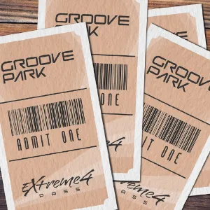{ width="162" }
        </td><td colspan = "2" width="160" display="inline-block">**等级**</td><td colspan = "3" class="ez2-course-levellable-tr">
                                <!-- 是否有AC挑战 -->           
        </td></tr><tr><td minwidth="160" colspan = "2" rowspan="3" class="ez2-course-levelnum-tr">
                                <!-- 组曲等级 -->               ?
        </td><td class="ez-course-stage-td">1st STAGE</td><td class="ez-course-song-title-td">
        <!-- 第一首 模式 --><code class="ez-course-judge-s">    4S
        </code></td><td class="ez-course-songname-td">
                                <!-- 第一首 歌名 -->            FUJIN Rumble
        </td></tr><tr><td>2nd STAGE</td><td class="ez-course-song-title-td">
        <!-- 第二首 模式 --><code class="ez-course-judge-s">    4S
        </code></td><td>        <!-- 第二首 歌名 -->            ouroboros -twin stroke of the end-
        </td></tr><tr><td>3rd STAGE</td><td class="ez-course-song-title-td">
        <!-- 第三首 模式 --><code class="ez-course-judge-s">    4S
        </code></td><td>        <!-- 第三首 歌名 -->            Omega Ax
        </td></tr><tr><td width="90">**总得分**</td><td width="100">
                                <!-- 总得分 -->                 2763300
        </td><td>**总物量**</td><td>
                                <!-- 总物量 -->                 9211
        </td><td>4th STAGE</td><td class="ez-course-song-title-td">
        <!-- 第四首 模式 --><code class="ez-course-judge-s">    4S
        </code></td><td>        <!-- 第四首 歌名 -->            Per Aspera Ad Astra
        </td></tr><tr><td>**谱师**</td><td colspan = "6">
                                <!-- 谱师名 -->                 EZ2ON Pattern Team
        </td></tr><tr><td>**所需 DLC**</td><td colspan = "6">
                                <!-- 所需 DLC -->               `GROOVE COASTER`
    </td></tr></table>

=== "5K"

    <table style="display: inline-block; vertical-align: middle; width:900px"><tr>
        <td colspan = "2" rowspan="4">
                                <!-- 封面图 -->                 { width="162" }
        </td><td colspan = "2" width="160" display="inline-block">**等级**</td><td colspan = "3" class="ez2-course-levellable-tr">
                                <!-- 是否有AC挑战 -->           
        </td></tr><tr><td minwidth="160" colspan = "2" rowspan="3" class="ez2-course-levelnum-tr">
                                <!-- 组曲等级 -->               ?
        </td><td class="ez-course-stage-td">1st STAGE</td><td class="ez-course-song-title-td">
        <!-- 第一首 模式 --><code class="ez-course-judge-s">    5S
        </code></td><td class="ez-course-songname-td">
                                <!-- 第一首 歌名 -->            FUJIN Rumble
        </td></tr><tr><td>2nd STAGE</td><td class="ez-course-song-title-td">
        <!-- 第二首 模式 --><code class="ez-course-judge-s">    5S
        </code></td><td>        <!-- 第二首 歌名 -->            ouroboros -twin stroke of the end-
        </td></tr><tr><td>3rd STAGE</td><td class="ez-course-song-title-td">
        <!-- 第三首 模式 --><code class="ez-course-judge-s">    5S
        </code></td><td>        <!-- 第三首 歌名 -->            Omega Ax
        </td></tr><tr><td width="90">**总得分**</td><td width="100">
                                <!-- 总得分 -->                 3252300
        </td><td>**总物量**</td><td>
                                <!-- 总物量 -->                 10841
        </td><td>4th STAGE</td><td class="ez-course-song-title-td">
        <!-- 第四首 模式 --><code class="ez-course-judge-s">    5S
        </code></td><td>        <!-- 第四首 歌名 -->            Per Aspera Ad Astra
        </td></tr><tr><td>**谱师**</td><td colspan = "6">
                                <!-- 谱师名 -->                 EZ2ON Pattern Team
        </td></tr><tr><td>**所需 DLC**</td><td colspan = "6">
                                <!-- 所需 DLC -->               `GROOVE COASTER`
    </td></tr></table>

=== "6K"

    <table style="display: inline-block; vertical-align: middle; width:900px"><tr>
        <td colspan = "2" rowspan="4">
                                <!-- 封面图 -->                 { width="162" }
        </td><td colspan = "2" width="160" display="inline-block">**等级**</td><td colspan = "3" class="ez2-course-levellable-tr">
                                <!-- 是否有AC挑战 -->           
        </td></tr><tr><td minwidth="160" colspan = "2" rowspan="3" class="ez2-course-levelnum-tr">
                                <!-- 组曲等级 -->               ?
        </td><td class="ez-course-stage-td">1st STAGE</td><td class="ez-course-song-title-td">
        <!-- 第一首 模式 --><code class="ez-course-judge-s">    6S
        </code></td><td class="ez-course-songname-td">
                                <!-- 第一首 歌名 -->            FUJIN Rumble
        </td></tr><tr><td>2nd STAGE</td><td class="ez-course-song-title-td">
        <!-- 第二首 模式 --><code class="ez-course-judge-s">    6S
        </code></td><td>        <!-- 第二首 歌名 -->            ouroboros -twin stroke of the end-
        </td></tr><tr><td>3rd STAGE</td><td class="ez-course-song-title-td">
        <!-- 第三首 模式 --><code class="ez-course-judge-s">    6S
        </code></td><td>        <!-- 第三首 歌名 -->            Omega Ax
        </td></tr><tr><td width="90">**总得分**</td><td width="100">
                                <!-- 总得分 -->                 3585600
        </td><td>**总物量**</td><td>
                                <!-- 总物量 -->                 11952
        </td><td>4th STAGE</td><td class="ez-course-song-title-td">
        <!-- 第四首 模式 --><code class="ez-course-judge-s">    6S
        </code></td><td>        <!-- 第四首 歌名 -->            Per Aspera Ad Astra
        </td></tr><tr><td>**谱师**</td><td colspan = "6">
                                <!-- 谱师名 -->                 EZ2ON Pattern Team
        </td></tr><tr><td>**所需 DLC**</td><td colspan = "6">
                                <!-- 所需 DLC -->               `GROOVE COASTER`
    </td></tr></table>
  
=== "8K"

    <table style="display: inline-block; vertical-align: middle; width:900px"><tr>
        <td colspan = "2" rowspan="4">
                                <!-- 封面图 -->                 { width="162" }
        </td><td colspan = "2" width="160" display="inline-block">**等级**</td><td colspan = "3" class="ez2-course-levellable-tr">
                                <!-- 是否有AC挑战 -->           
        </td></tr><tr><td minwidth="160" colspan = "2" rowspan="3" class="ez2-course-levelnum-tr">
                                <!-- 组曲等级 -->               ?
        </td><td class="ez-course-stage-td">1st STAGE</td><td class="ez-course-song-title-td">
        <!-- 第一首 模式 --><code class="ez-course-judge-s">    8S
        </code></td><td class="ez-course-songname-td">
                                <!-- 第一首 歌名 -->            FUJIN Rumble
        </td></tr><tr><td>2nd STAGE</td><td class="ez-course-song-title-td">
        <!-- 第二首 模式 --><code class="ez-course-judge-s">    8S
        </code></td><td>        <!-- 第二首 歌名 -->            ouroboros -twin stroke of the end-
        </td></tr><tr><td>3rd STAGE</td><td class="ez-course-song-title-td">
        <!-- 第三首 模式 --><code class="ez-course-judge-s">    8S
        </code></td><td>        <!-- 第三首 歌名 -->            Omega Ax
        </td></tr><tr><td width="90">**总得分**</td><td width="100">
                                <!-- 总得分 -->                 3692400
        </td><td>**总物量**</td><td>
                                <!-- 总物量 -->                 12308
        </td><td>4th STAGE</td><td class="ez-course-song-title-td">
        <!-- 第四首 模式 --><code class="ez-course-judge-s">    8S
        </code></td><td>        <!-- 第四首 歌名 -->            Per Aspera Ad Astra
        </td></tr><tr><td>**谱师**</td><td colspan = "6">
                                <!-- 谱师名 -->                 EZ2ON Pattern Team
        </td></tr><tr><td>**所需 DLC**</td><td colspan = "6">
                                <!-- 所需 DLC -->               `GROOVE COASTER`
    </td></tr></table>  
---

## Ouroboros \~Challenge\~

Serpent of Destruction

> 街机《ENDLESS CIRCULATION》 同款 BOSS 试炼，极限生存挑战，能量槽扣除幅度非常大，面向顶级玩家。

=== "4K"

    <table style="display: inline-block; vertical-align: middle; width:900px"><tr>
        <td colspan = "2" rowspan="4">
                                <!-- 封面图 -->                 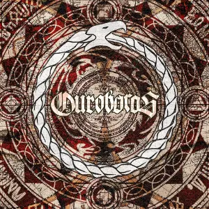{ width="162" }
        </td><td colspan = "2" width="160" display="inline-block">**等级**</td><td colspan = "3" class="ez2-course-levellable-tr">
                                <!-- 是否有AC挑战 -->           :material-crown: Clear 挑战
        </td></tr><tr><td minwidth="160" colspan = "2" rowspan="3" class="ez2-course-levelnum-tr">
                                <!-- 组曲等级 -->               ∞
        </td><td class="ez-course-stage-td">1st STAGE</td><td class="ez-course-song-title-td">
        <!-- 第一首 模式 --><code class="ez-course-judge-x">    4X
        </code></td><td class="ez-course-songname-td">
                                <!-- 第一首 歌名 -->            Dream Walker
        </td></tr><tr><td>2nd STAGE</td><td class="ez-course-song-title-td">
        <!-- 第二首 模式 --><code class="ez-course-judge-x">    4X
        </code></td><td>        <!-- 第二首 歌名 -->            Starlight Factory
        </td></tr><tr><td>3rd STAGE</td><td class="ez-course-song-title-td">
        <!-- 第三首 模式 --><code class="ez-course-judge-x">    4X
        </code></td><td>        <!-- 第三首 歌名 -->            Legend
        </td></tr><tr><td width="90">**总得分**</td><td width="100">
                                <!-- 总得分 -->                 ???????
        </td><td>**总物量**</td><td>
                                <!-- 总物量 -->                 7578
        </td><td>4th STAGE</td><td class="ez-course-song-title-td">
        <!-- 第四首 模式 --><code class="ez-course-judge-x">    4X
        </code></td><td>        <!-- 第四首 歌名 -->            A Site De La Rue
        </td></tr><tr><td>**谱师**</td><td colspan = "6">
                                <!-- 谱师名 -->                 CLOCKWORK & Jackalope
        </td></tr><tr><td>**所需 DLC**</td><td colspan = "6">
                                <!-- 所需 DLC -->               `ENDLESS CIRCULATION`
    </td></tr></table>

=== "5K"

    <table style="display: inline-block; vertical-align: middle; width:900px"><tr>
        <td colspan = "2" rowspan="4">
                                <!-- 封面图 -->                 { width="162" }
        </td><td colspan = "2" width="160" display="inline-block">**等级**</td><td colspan = "3" class="ez2-course-levellable-tr">
                                <!-- 是否有AC挑战 -->           :material-crown: Clear 挑战
        </td></tr><tr><td minwidth="160" colspan = "2" rowspan="3" class="ez2-course-levelnum-tr">
                                <!-- 组曲等级 -->               ∞
        </td><td class="ez-course-stage-td">1st STAGE</td><td class="ez-course-song-title-td">
        <!-- 第一首 模式 --><code class="ez-course-judge-x">    5X
        </code></td><td class="ez-course-songname-td">
                                <!-- 第一首 歌名 -->            Dream Walker
        </td></tr><tr><td>2nd STAGE</td><td class="ez-course-song-title-td">
        <!-- 第二首 模式 --><code class="ez-course-judge-x">    5X
        </code></td><td>        <!-- 第二首 歌名 -->            Starlight Factory
        </td></tr><tr><td>3rd STAGE</td><td class="ez-course-song-title-td">
        <!-- 第三首 模式 --><code class="ez-course-judge-x">    5X
        </code></td><td>        <!-- 第三首 歌名 -->            Legend
        </td></tr><tr><td width="90">**总得分**</td><td width="100">
                                <!-- 总得分 -->                 ???????
        </td><td>**总物量**</td><td>
                                <!-- 总物量 -->                 9017
        </td><td>4th STAGE</td><td class="ez-course-song-title-td">
        <!-- 第四首 模式 --><code class="ez-course-judge-x">    5X
        </code></td><td>        <!-- 第四首 歌名 -->            A Site De La Rue
        </td></tr><tr><td>**谱师**</td><td colspan = "6">
                                <!-- 谱师名 -->                 YUKINARI! MELON & CLOCKWORK
        </td></tr><tr><td>**所需 DLC**</td><td colspan = "6">
                                <!-- 所需 DLC -->               `ENDLESS CIRCULATION`
    </td></tr></table>

=== "6K"

    <table style="display: inline-block; vertical-align: middle; width:900px"><tr>
        <td colspan = "2" rowspan="4">
                                <!-- 封面图 -->                 { width="162" }
        </td><td colspan = "2" width="160" display="inline-block">**等级**</td><td colspan = "3" class="ez2-course-levellable-tr">
                                <!-- 是否有AC挑战 -->           :material-crown: Clear 挑战
        </td></tr><tr><td minwidth="160" colspan = "2" rowspan="3" class="ez2-course-levelnum-tr">
                                <!-- 组曲等级 -->               ∞
        </td><td class="ez-course-stage-td">1st STAGE</td><td class="ez-course-song-title-td">
        <!-- 第一首 模式 --><code class="ez-course-judge-x">    6X
        </code></td><td class="ez-course-songname-td">
                                <!-- 第一首 歌名 -->            Dream Walker
        </td></tr><tr><td>2nd STAGE</td><td class="ez-course-song-title-td">
        <!-- 第二首 模式 --><code class="ez-course-judge-x">    6X
        </code></td><td>        <!-- 第二首 歌名 -->            Starlight Factory
        </td></tr><tr><td>3rd STAGE</td><td class="ez-course-song-title-td">
        <!-- 第三首 模式 --><code class="ez-course-judge-x">    6X
        </code></td><td>        <!-- 第三首 歌名 -->            Legend
        </td></tr><tr><td width="90">**总得分**</td><td width="100">
                                <!-- 总得分 -->                 ???????
        </td><td>**总物量**</td><td>
                                <!-- 总物量 -->                 10384
        </td><td>4th STAGE</td><td class="ez-course-song-title-td">
        <!-- 第四首 模式 --><code class="ez-course-judge-x">    6X
        </code></td><td>        <!-- 第四首 歌名 -->            A Site De La Rue
        </td></tr><tr><td>**谱师**</td><td colspan = "6">
                                <!-- 谱师名 -->                 YUKINARI! MELON 
        </td></tr><tr><td>**所需 DLC**</td><td colspan = "6">
                                <!-- 所需 DLC -->               `ENDLESS CIRCULATION`
    </td></tr></table>

=== "8K"

    <table style="display: inline-block; vertical-align: middle; width:900px"><tr>
        <td colspan = "2" rowspan="4">
                                <!-- 封面图 -->                 { width="162" }
        </td><td colspan = "2" width="160" display="inline-block">**等级**</td><td colspan = "3" class="ez2-course-levellable-tr">
                                <!-- 是否有AC挑战 -->           :material-crown: Clear 挑战
        </td></tr><tr><td minwidth="160" colspan = "2" rowspan="3" class="ez2-course-levelnum-tr">
                                <!-- 组曲等级 -->               ∞
        </td><td class="ez-course-stage-td">1st STAGE</td><td class="ez-course-song-title-td">
        <!-- 第一首 模式 --><code class="ez-course-judge-x">    8X
        </code></td><td class="ez-course-songname-td">
                                <!-- 第一首 歌名 -->            Dream Walker
        </td></tr><tr><td>2nd STAGE</td><td class="ez-course-song-title-td">
        <!-- 第二首 模式 --><code class="ez-course-judge-x">    8X
        </code></td><td>        <!-- 第二首 歌名 -->            Starlight Factory
        </td></tr><tr><td>3rd STAGE</td><td class="ez-course-song-title-td">
        <!-- 第三首 模式 --><code class="ez-course-judge-x">    8X
        </code></td><td>        <!-- 第三首 歌名 -->            Legend
        </td></tr><tr><td width="90">**总得分**</td><td width="100">
                                <!-- 总得分 -->                 ???????
        </td><td>**总物量**</td><td>
                                <!-- 总物量 -->                 9999
        </td><td>4th STAGE</td><td class="ez-course-song-title-td">
        <!-- 第四首 模式 --><code class="ez-course-judge-x">    8X
        </code></td><td>        <!-- 第四首 歌名 -->            A Site De La Rue
        </td></tr><tr><td>**谱师**</td><td colspan = "6">
                                <!-- 谱师名 -->                 Jackalope & YUKINARI! MELON 
        </td></tr><tr><td>**所需 DLC**</td><td colspan = "6">
                                <!-- 所需 DLC -->               `ENDLESS CIRCULATION`
    </td></tr></table>

---

## Ouroboros

Serpent of Destruction

> 街机《ENDLESS CIRCULATION》 同款 BOSS 试炼。

=== "4K"

    <table style="display: inline-block; vertical-align: middle; width:900px"><tr>
        <td colspan = "2" rowspan="4">
                                <!-- 封面图 -->                 { width="162" }
        </td><td colspan = "2" width="160" display="inline-block">**等级**</td><td colspan = "3" class="ez2-course-levellable-tr">
                                <!-- 是否有AC挑战 -->           **All Combo 挑战**
        </td></tr><tr><td minwidth="160" colspan = "2" rowspan="3" class="ez2-course-levelnum-tr">
                                <!-- 组曲等级 -->               ∞
        </td><td class="ez-course-stage-td">1st STAGE</td><td class="ez-course-song-title-td">
        <!-- 第一首 模式 --><code class="ez-course-judge-x">    4X
        </code></td><td class="ez-course-songname-td">
                                <!-- 第一首 歌名 -->            Dream Walker
        </td></tr><tr><td>2nd STAGE</td><td class="ez-course-song-title-td">
        <!-- 第二首 模式 --><code class="ez-course-judge-x">    4X
        </code></td><td>        <!-- 第二首 歌名 -->            Starlight Factory
        </td></tr><tr><td>3rd STAGE</td><td class="ez-course-song-title-td">
        <!-- 第三首 模式 --><code class="ez-course-judge-x">    4X
        </code></td><td>        <!-- 第三首 歌名 -->            Legend
        </td></tr><tr><td width="90">**总得分**</td><td width="100">
                                <!-- 总得分 -->                 /
        </td><td>**总物量**</td><td>
                                <!-- 总物量 -->                 7578
        </td><td>4th STAGE</td><td class="ez-course-song-title-td">
        <!-- 第四首 模式 --><code class="ez-course-judge-x">    4X
        </code></td><td>        <!-- 第四首 歌名 -->            A Site De La Rue
        </td></tr><tr><td>**谱师**</td><td colspan = "6">
                                <!-- 谱师名 -->                 CLOCKWORK & Jackalope
        </td></tr><tr><td>**所需 DLC**</td><td colspan = "6">
                                <!-- 所需 DLC -->               `ENDLESS CIRCULATION`
    </td></tr></table>

=== "5K"

    <table style="display: inline-block; vertical-align: middle; width:900px"><tr>
        <td colspan = "2" rowspan="4">
                                <!-- 封面图 -->                 { width="162" }
        </td><td colspan = "2" width="160" display="inline-block">**等级**</td><td colspan = "3" class="ez2-course-levellable-tr">
                                <!-- 是否有AC挑战 -->           **All Combo 挑战**
        </td></tr><tr><td minwidth="160" colspan = "2" rowspan="3" class="ez2-course-levelnum-tr">
                                <!-- 组曲等级 -->               ∞
        </td><td class="ez-course-stage-td">1st STAGE</td><td class="ez-course-song-title-td">
        <!-- 第一首 模式 --><code class="ez-course-judge-x">    5X
        </code></td><td class="ez-course-songname-td">
                                <!-- 第一首 歌名 -->            Dream Walker
        </td></tr><tr><td>2nd STAGE</td><td class="ez-course-song-title-td">
        <!-- 第二首 模式 --><code class="ez-course-judge-x">    5X
        </code></td><td>        <!-- 第二首 歌名 -->            Starlight Factory
        </td></tr><tr><td>3rd STAGE</td><td class="ez-course-song-title-td">
        <!-- 第三首 模式 --><code class="ez-course-judge-x">    5X
        </code></td><td>        <!-- 第三首 歌名 -->            Legend
        </td></tr><tr><td width="90">**总得分**</td><td width="100">
                                <!-- 总得分 -->                 /
        </td><td>**总物量**</td><td>
                                <!-- 总物量 -->                 9017
        </td><td>4th STAGE</td><td class="ez-course-song-title-td">
        <!-- 第四首 模式 --><code class="ez-course-judge-x">    5X
        </code></td><td>        <!-- 第四首 歌名 -->            A Site De La Rue
        </td></tr><tr><td>**谱师**</td><td colspan = "6">
                                <!-- 谱师名 -->                 YUKINARI! MELON & CLOCKWORK
        </td></tr><tr><td>**所需 DLC**</td><td colspan = "6">
                                <!-- 所需 DLC -->               `ENDLESS CIRCULATION`
    </td></tr></table>

=== "6K"

    <table style="display: inline-block; vertical-align: middle; width:900px"><tr>
        <td colspan = "2" rowspan="4">
                                <!-- 封面图 -->                 { width="162" }
        </td><td colspan = "2" width="160" display="inline-block">**等级**</td><td colspan = "3" class="ez2-course-levellable-tr">
                                <!-- 是否有AC挑战 -->           **All Combo 挑战**
        </td></tr><tr><td minwidth="160" colspan = "2" rowspan="3" class="ez2-course-levelnum-tr">
                                <!-- 组曲等级 -->               ∞
        </td><td class="ez-course-stage-td">1st STAGE</td><td class="ez-course-song-title-td">
        <!-- 第一首 模式 --><code class="ez-course-judge-x">    6X
        </code></td><td class="ez-course-songname-td">
                                <!-- 第一首 歌名 -->            Dream Walker
        </td></tr><tr><td>2nd STAGE</td><td class="ez-course-song-title-td">
        <!-- 第二首 模式 --><code class="ez-course-judge-x">    6X
        </code></td><td>        <!-- 第二首 歌名 -->            Starlight Factory
        </td></tr><tr><td>3rd STAGE</td><td class="ez-course-song-title-td">
        <!-- 第三首 模式 --><code class="ez-course-judge-x">    6X
        </code></td><td>        <!-- 第三首 歌名 -->            Legend
        </td></tr><tr><td width="90">**总得分**</td><td width="100">
                                <!-- 总得分 -->                 /
        </td><td>**总物量**</td><td>
                                <!-- 总物量 -->                 10384
        </td><td>4th STAGE</td><td class="ez-course-song-title-td">
        <!-- 第四首 模式 --><code class="ez-course-judge-x">    6X
        </code></td><td>        <!-- 第四首 歌名 -->            A Site De La Rue
        </td></tr><tr><td>**谱师**</td><td colspan = "6">
                                <!-- 谱师名 -->                 YUKINARI! MELON 
        </td></tr><tr><td>**所需 DLC**</td><td colspan = "6">
                                <!-- 所需 DLC -->               `ENDLESS CIRCULATION`
    </td></tr></table>

=== "8K"

    <table style="display: inline-block; vertical-align: middle; width:900px"><tr>
        <td colspan = "2" rowspan="4">
                                <!-- 封面图 -->                 { width="162" }
        </td><td colspan = "2" width="160" display="inline-block">**等级**</td><td colspan = "3" class="ez2-course-levellable-tr">
                                <!-- 是否有AC挑战 -->           **All Combo 挑战**
        </td></tr><tr><td minwidth="160" colspan = "2" rowspan="3" class="ez2-course-levelnum-tr">
                                <!-- 组曲等级 -->               ∞
        </td><td class="ez-course-stage-td">1st STAGE</td><td class="ez-course-song-title-td">
        <!-- 第一首 模式 --><code class="ez-course-judge-x">    8X
        </code></td><td class="ez-course-songname-td">
                                <!-- 第一首 歌名 -->            Dream Walker
        </td></tr><tr><td>2nd STAGE</td><td class="ez-course-song-title-td">
        <!-- 第二首 模式 --><code class="ez-course-judge-x">    8X
        </code></td><td>        <!-- 第二首 歌名 -->            Starlight Factory
        </td></tr><tr><td>3rd STAGE</td><td class="ez-course-song-title-td">
        <!-- 第三首 模式 --><code class="ez-course-judge-x">    8X
        </code></td><td>        <!-- 第三首 歌名 -->            Legend
        </td></tr><tr><td width="90">**总得分**</td><td width="100">
                                <!-- 总得分 -->                 /
        </td><td>**总物量**</td><td>
                                <!-- 总物量 -->                 9999
        </td><td>4th STAGE</td><td class="ez-course-song-title-td">
        <!-- 第四首 模式 --><code class="ez-course-judge-x">    8X
        </code></td><td>        <!-- 第四首 歌名 -->            A Site De La Rue
        </td></tr><tr><td>**谱师**</td><td colspan = "6">
                                <!-- 谱师名 -->                 Jackalope & YUKINARI! MELON 
        </td></tr><tr><td>**所需 DLC**</td><td colspan = "6">
                                <!-- 所需 DLC -->               `ENDLESS CIRCULATION`
    </td></tr></table>

---

## O2PLANET

The deserted planet waits

> 致敬《劲乐团》，谱面与原《劲乐团》7K HD 基本一致，并采用 Basic 判定以仿真《劲乐团》的宽松判定。

=== "SP"

    <table style="display: inline-block; vertical-align: middle; width:900px"><tr>
        <td colspan = "2" rowspan="4">
                                <!-- 封面图 -->                 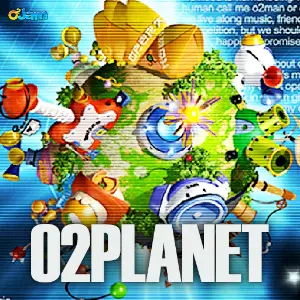{ width="162" }
        </td><td colspan = "2" width="160" display="inline-block">**等级**</td><td colspan = "3" class="ez2-course-levellable-tr">
                                <!-- 是否有AC挑战 -->           
        </td></tr><tr><td minwidth="160" colspan = "2" rowspan="3" class="ez2-course-levelnum-tr">
                                <!-- 组曲等级 -->               ?
        </td><td class="ez-course-stage-td">1st STAGE</td><td class="ez-course-song-title-td">
        <!-- 第一首 模式 --><code class="ez-course-judge-b">    7B
        </code></td><td class="ez-course-songname-td">
                                <!-- 第一首 歌名 -->            Go Hell
        </td></tr><tr><td>2nd STAGE</td><td class="ez-course-song-title-td">
        <!-- 第二首 模式 --><code class="ez-course-judge-b">    7B
        </code></td><td>        <!-- 第二首 歌名 -->            Visual Dream !!
        </td></tr><tr><td>3rd STAGE</td><td class="ez-course-song-title-td">
        <!-- 第三首 模式 --><code class="ez-course-judge-b">    7B
        </code></td><td>        <!-- 第三首 歌名 -->            Beautiful Day
        </td></tr><tr><td width="90">**总得分**</td><td width="100">
                                <!-- 总得分 -->                 1881300
        </td><td>**总物量**</td><td>
                                <!-- 总物量 -->                 6271
        </td><td>4th STAGE</td><td class="ez-course-song-title-td">
        <!-- 第四首 模式 --><code class="ez-course-judge-b">    7B
        </code></td><td>        <!-- 第四首 歌名 -->            Feel The O2JAM
        </td></tr><tr><td>**谱师**</td><td colspan = "6">
                                <!-- 谱师名 -->                 O2Jam
        </td></tr><tr><td>**所需 DLC**</td><td colspan = "6">
                                <!-- 所需 DLC -->               `O2JAM COLLAB`
    </td></tr></table>

!!! warning "注意"

    该组曲的独占 `7K BASIC` 模式演奏面板、音符、判定及连击字体样式均强制使用 O2Jam 经典搭配。

---

## Brain Stretch

A set of perceptual-cognitive traning exercises

> 致敬《劲乐团》，谱面与原《劲乐团》7K HD 基本一致（其中《贵族 II》进行了一定的削弱），并采用 Basic 判定以仿真《劲乐团》的宽松判定。

=== "SP"

    <table style="display: inline-block; vertical-align: middle; width:900px"><tr>
        <td colspan = "2" rowspan="4">
                                <!-- 封面图 -->                 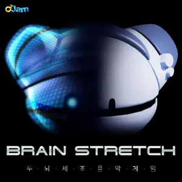{ width="162" }
        </td><td colspan = "2" width="160" display="inline-block">**等级**</td><td colspan = "3" class="ez2-course-levellable-tr">
                                <!-- 是否有AC挑战 -->           
        </td></tr><tr><td minwidth="160" colspan = "2" rowspan="3" class="ez2-course-levelnum-tr">
                                <!-- 组曲等级 -->               ?
        </td><td class="ez-course-stage-td">1st STAGE</td><td class="ez-course-song-title-td">
        <!-- 第一首 模式 --><code class="ez-course-judge-b">    7B
        </code></td><td class="ez-course-songname-td">
                                <!-- 第一首 歌名 -->            Move it on (DJ HD Mix)
        </td></tr><tr><td>2nd STAGE</td><td class="ez-course-song-title-td">
        <!-- 第二首 模式 --><code class="ez-course-judge-b">    7B
        </code></td><td>        <!-- 第二首 歌名 -->            Cross Time !!
        </td></tr><tr><td>3rd STAGE</td><td class="ez-course-song-title-td">
        <!-- 第三首 模式 --><code class="ez-course-judge-b">    7B
        </code></td><td>        <!-- 第三首 歌名 -->            Identity part 2
        </td></tr><tr><td width="90">**总得分**</td><td width="100">
                                <!-- 总得分 -->                 3135900
        </td><td>**总物量**</td><td>
                                <!-- 总物量 -->                 10453
        </td><td>4th STAGE</td><td class="ez-course-song-title-td">
        <!-- 第四首 模式 --><code class="ez-course-judge-b">    7B
        </code></td><td>        <!-- 第四首 歌名 -->            End of Fight
        </td></tr><tr><td>**谱师**</td><td colspan = "6">
                                <!-- 谱师名 -->                 O2Jam
        </td></tr><tr><td>**所需 DLC**</td><td colspan = "6">
                                <!-- 所需 DLC -->               `O2JAM COLLAB`
    </td></tr></table>

!!! warning "注意"

    该组曲的独占 `7K BASIC` 模式演奏面板、音符、判定及连击字体样式均强制使用 O2Jam 经典搭配。

---

## Trickster

The hand is quicker than the eye

> 出自《ENDLESS CIRCULATION》，经典变速组曲，~~对玩家智力的直接评估~~。

=== "SP"

    <table style="display: inline-block; vertical-align: middle; width:900px"><tr>
        <td colspan = "2" rowspan="4">
                                <!-- 封面图 -->                 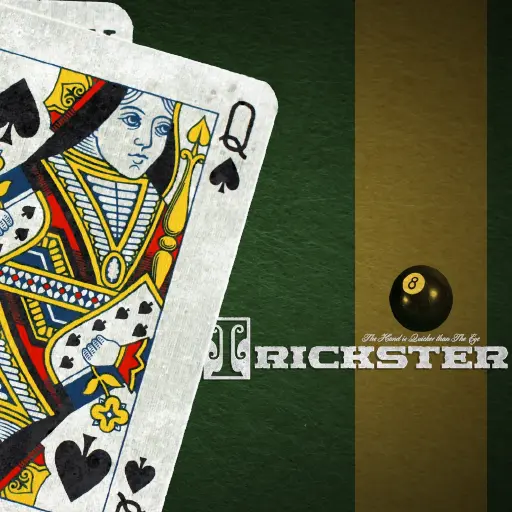{ width="162" }
        </td><td colspan = "2" width="160" display="inline-block">**等级**</td><td colspan = "3" class="ez2-course-levellable-tr">
                                <!-- 是否有AC挑战 -->           **All Combo 挑战**
        </td></tr><tr><td minwidth="160" colspan = "2" rowspan="3" class="ez2-course-levelnum-tr">
                                <!-- 组曲等级 -->               !?
        </td><td class="ez-course-stage-td">1st STAGE</td><td class="ez-course-song-title-td">
        <!-- 第一首 模式 --><code class="ez-course-judge-s">    5S
        </code></td><td class="ez-course-songname-td">
                                <!-- 第一首 歌名 -->            You love the life you live (Remix)
        </td></tr><tr><td>2nd STAGE</td><td class="ez-course-song-title-td">
        <!-- 第二首 模式 --><code class="ez-course-judge-b">    8B
        </code></td><td>        <!-- 第二首 歌名 -->            Red Ocean
        </td></tr><tr><td>3rd STAGE</td><td class="ez-course-song-title-td">
        <!-- 第三首 模式 --><code class="ez-course-judge-s">    4S
        </code></td><td>        <!-- 第三首 歌名 -->            Mystic Dream 9903 (Horror Mix)
        </td></tr><tr><td width="90">**总得分**</td><td width="100">
                                <!-- 总得分 -->                 /
        </td><td>**总物量**</td><td>
                                <!-- 总物量 -->                 2524
        </td><td>4th STAGE</td><td class="ez-course-song-title-td">
        <!-- 第四首 模式 --><code class="ez-course-judge-s">    6S
        </code></td><td>        <!-- 第四首 歌名 -->            Be Mine
        </td></tr><tr><td>**谱师**</td><td colspan = "6">
                                <!-- 谱师名 -->                 X-seq.TraX
        </td></tr><tr><td>**所需 DLC**</td><td colspan = "6">
                                <!-- 所需 DLC -->               /
    </td></tr></table>

---

## AUTUMNAL EQUINOX 2023 SPECIAL

> 2023 秋分节日特别庆祝组曲。

=== "4K"

    The holidays are time for connection

    <table style="display: inline-block; vertical-align: middle; width:900px"><tr>
        <td colspan = "2" rowspan="4">
                                <!-- 封面图 -->                 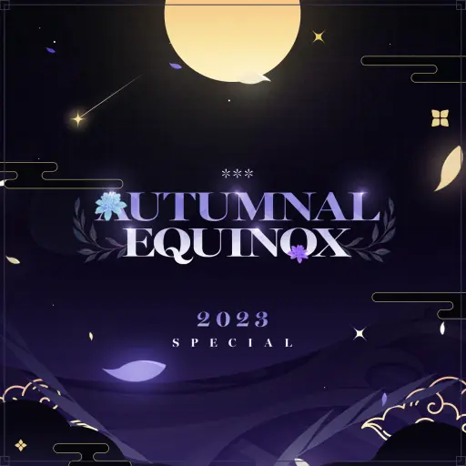{ width="162" }
        </td><td colspan = "2" width="160" display="inline-block">**等级**</td><td colspan = "3" class="ez2-course-levellable-tr">
                                <!-- 是否有AC挑战 -->           
        </td></tr><tr><td minwidth="160" colspan = "2" rowspan="3" class="ez2-course-levelnum-tr">
                                <!-- 组曲等级 -->               15
        </td><td class="ez-course-stage-td">1st STAGE</td><td class="ez-course-song-title-td">
        <!-- 第一首 模式 --><code class="ez-course-judge-s">    4S
        </code></td><td class="ez-course-songname-td">
                                <!-- 第一首 歌名 -->            Wings of the Wind
        </td></tr><tr><td>2nd STAGE</td><td class="ez-course-song-title-td">
        <!-- 第二首 模式 --><code class="ez-course-judge-s">    4S
        </code></td><td>        <!-- 第二首 歌名 -->            Stellar
        </td></tr><tr><td>3rd STAGE</td><td class="ez-course-song-title-td">
        <!-- 第三首 模式 --><code class="ez-course-judge-s">    4S
        </code></td><td>        <!-- 第三首 歌名 -->            Go Back
        </td></tr><tr><td width="90">**总得分**</td><td width="100">
                                <!-- 总得分 -->                 1890000
        </td><td>**总物量**</td><td>
                                <!-- 总物量 -->                 6300
        </td><td>4th STAGE</td><td class="ez-course-song-title-td">
        <!-- 第四首 模式 --><code class="ez-course-judge-s">    4S
        </code></td><td>        <!-- 第四首 歌名 -->            Monochrome
        </td></tr><tr><td>**谱师**</td><td colspan = "6">
                                <!-- 谱师名 -->                 Jackalope 
        </td></tr><tr><td>**所需 DLC**</td><td colspan = "6">
                                <!-- 所需 DLC -->               `PRESTIGE PASS`、`O2JAM COLLAB`
    </td></tr></table>

=== "5K"

    in EZ2 folklore, the flow was something like this

    <table style="display: inline-block; vertical-align: middle; width:900px"><tr>
        <td colspan = "2" rowspan="4">
                                <!-- 封面图 -->                 { width="162" }
        </td><td colspan = "2" width="160" display="inline-block">**等级**</td><td colspan = "3" class="ez2-course-levellable-tr">
                                <!-- 是否有AC挑战 -->           
        </td></tr><tr><td minwidth="160" colspan = "2" rowspan="3" class="ez2-course-levelnum-tr">
                                <!-- 组曲等级 -->               20
        </td><td class="ez-course-stage-td">1st STAGE</td><td class="ez-course-song-title-td">
        <!-- 第一首 模式 --><code class="ez-course-judge-s">    5S
        </code></td><td class="ez-course-songname-td">
                                <!-- 第一首 歌名 -->            Sand Storm
        </td></tr><tr><td>2nd STAGE</td><td class="ez-course-song-title-td">
        <!-- 第二首 模式 --><code class="ez-course-judge-s">    5S
        </code></td><td>        <!-- 第二首 歌名 -->            ApolloN
        </td></tr><tr><td>3rd STAGE</td><td class="ez-course-song-title-td">
        <!-- 第三首 模式 --><code class="ez-course-judge-s">    5S
        </code></td><td>        <!-- 第三首 歌名 -->            Messier 333
        </td></tr><tr><td width="90">**总得分**</td><td width="100">
                                <!-- 总得分 -->                 2331000
        </td><td>**总物量**</td><td>
                                <!-- 总物量 -->                 7770
        </td><td>4th STAGE</td><td class="ez-course-song-title-td">
        <!-- 第四首 模式 --><code class="ez-course-judge-s">    5S
        </code></td><td>        <!-- 第四首 歌名 -->            Lucid
        </td></tr><tr><td>**谱师**</td><td colspan = "6">
                                <!-- 谱师名 -->                 Original by PatternGACHA 
        </td></tr><tr><td>**所需 DLC**</td><td colspan = "6">
                                <!-- 所需 DLC -->               `CODENAME VIOLET`
    </td></tr></table>

=== "6K"

    The Ethnic Cuisine ~ Controller Friendly

    <table style="display: inline-block; vertical-align: middle; width:900px"><tr>
        <td colspan = "2" rowspan="4">
                                <!-- 封面图 -->                 { width="162" }
        </td><td colspan = "2" width="160" display="inline-block">**等级**</td><td colspan = "3" class="ez2-course-levellable-tr">
                                <!-- 是否有AC挑战 -->           
        </td></tr><tr><td minwidth="160" colspan = "2" rowspan="3" class="ez2-course-levelnum-tr">
                                <!-- 组曲等级 -->               13
        </td><td class="ez-course-stage-td">1st STAGE</td><td class="ez-course-song-title-td">
        <!-- 第一首 模式 --><code class="ez-course-judge-b">    6B
        </code></td><td class="ez-course-songname-td">
                                <!-- 第一首 歌名 -->            Kings
        </td></tr><tr><td>2nd STAGE</td><td class="ez-course-song-title-td">
        <!-- 第二首 模式 --><code class="ez-course-judge-b">    6B
        </code></td><td>        <!-- 第二首 歌名 -->            Unleashed Emotions
        </td></tr><tr><td>3rd STAGE</td><td class="ez-course-song-title-td">
        <!-- 第三首 模式 --><code class="ez-course-judge-b">    6B
        </code></td><td>        <!-- 第三首 歌名 -->            Diabolic Swing
        </td></tr><tr><td width="90">**总得分**</td><td width="100">
                                <!-- 总得分 -->                 1887600
        </td><td>**总物量**</td><td>
                                <!-- 总物量 -->                 6292
        </td><td>4th STAGE</td><td class="ez-course-song-title-td">
        <!-- 第四首 模式 --><code class="ez-course-judge-b">    6B
        </code></td><td>        <!-- 第四首 歌名 -->            Good Bye
        </td></tr><tr><td>**谱师**</td><td colspan = "6">
                                <!-- 谱师名 -->                 Cozy Haus 
        </td></tr><tr><td>**所需 DLC**</td><td colspan = "6">
                                <!-- 所需 DLC -->               `PRESTIGE PASS`、`DJMAX`
    </td></tr></table>
    
=== "8K"

    Tips for Eating Local Food When You Travel: Equip TYPE E

    <table style="display: inline-block; vertical-align: middle; width:900px"><tr>
        <td colspan = "2" rowspan="4">
                                <!-- 封面图 -->                 { width="162" }
        </td><td colspan = "2" width="160" display="inline-block">**等级**</td><td colspan = "3" class="ez2-course-levellable-tr">
                                <!-- 是否有AC挑战 -->           
        </td></tr><tr><td minwidth="160" colspan = "2" rowspan="3" class="ez2-course-levelnum-tr">
                                <!-- 组曲等级 -->               19
        </td><td class="ez-course-stage-td">1st STAGE</td><td class="ez-course-song-title-td">
        <!-- 第一首 模式 --><code class="ez-course-judge-s">    8S
        </code></td><td class="ez-course-songname-td">
                                <!-- 第一首 歌名 -->            R.F.C
        </td></tr><tr><td>2nd STAGE</td><td class="ez-course-song-title-td">
        <!-- 第二首 模式 --><code class="ez-course-judge-s">    8S
        </code></td><td>        <!-- 第二首 歌名 -->            Soul Destructor
        </td></tr><tr><td>3rd STAGE</td><td class="ez-course-song-title-td">
        <!-- 第三首 模式 --><code class="ez-course-judge-s">    8S
        </code></td><td>        <!-- 第三首 歌名 -->            Lucid
        </td></tr><tr><td width="90">**总得分**</td><td width="100">
                                <!-- 总得分 -->                 2718600
        </td><td>**总物量**</td><td>
                                <!-- 总物量 -->                 9062
        </td><td>4th STAGE</td><td class="ez-course-song-title-td">
        <!-- 第四首 模式 --><code class="ez-course-judge-s">    8S
        </code></td><td>        <!-- 第四首 歌名 -->            ROD7 -Regions Of Desolation-
        </td></tr><tr><td>**谱师**</td><td colspan = "6">
                                <!-- 谱师名 -->                 Forbidden Chateau 
        </td></tr><tr><td>**所需 DLC**</td><td colspan = "6">
                                <!-- 所需 DLC -->               `PRESTIGE PASS`
    </td></tr></table>

=== "SP"

    Curiosity is key to success

    <table style="display: inline-block; vertical-align: middle; width:900px"><tr>
        <td colspan = "2" rowspan="4">
                                <!-- 封面图 -->                 { width="162" }
        </td><td colspan = "2" width="160" display="inline-block">**等级**</td><td colspan = "3" class="ez2-course-levellable-tr">
                                <!-- 是否有AC挑战 -->           
        </td></tr><tr><td minwidth="160" colspan = "2" rowspan="3" class="ez2-course-levelnum-tr">
                                <!-- 组曲等级 -->               ?
        </td><td class="ez-course-stage-td">1st STAGE</td><td class="ez-course-song-title-td">
        <!-- 第一首 模式 --><code class="ez-course-judge-s">    7S
        </code></td><td class="ez-course-songname-td">
                                <!-- 第一首 歌名 -->            Kings
        </td></tr><tr><td>2nd STAGE</td><td class="ez-course-song-title-td">
        <!-- 第二首 模式 --><code class="ez-course-judge-s">    7S
        </code></td><td>        <!-- 第二首 歌名 -->            LIGHTYEAR
        </td></tr><tr><td>3rd STAGE</td><td class="ez-course-song-title-td">
        <!-- 第三首 模式 --><code class="ez-course-judge-s">    7S
        </code></td><td>        <!-- 第三首 歌名 -->            ROD7 -Regions Of Desolation-
        </td></tr><tr><td width="90">**总得分**</td><td width="100">
                                <!-- 总得分 -->                 2828100
        </td><td>**总物量**</td><td>
                                <!-- 总物量 -->                 9427
        </td><td>4th STAGE</td><td class="ez-course-song-title-td">
        <!-- 第四首 模式 --><code class="ez-course-judge-s">    7S
        </code></td><td>        <!-- 第四首 歌名 -->            picking
        </td></tr><tr><td>**谱师**</td><td colspan = "6">
                                <!-- 谱师名 -->                 EZ2ON Pattern Team 
        </td></tr><tr><td>**所需 DLC**</td><td colspan = "6">
                                <!-- 所需 DLC -->               `PRESTIGE PASS`
    </td></tr></table>

!!! warning "注意"

    该组曲 SP 的独占 `7K STANDARD` 模式演奏面板、面板背景、判定及连击字体样式均强制使用 NIGHTFALL 搭配，音符强制使用 PRESTIGE INGOT。
    
---

## FROST'S DESCENT 2023 SPECIAL

> 2023 冬季特别组曲。

=== "4K"

    Moonflower blooms in the dark

    <table style="display: inline-block; vertical-align: middle; width:900px"><tr>
        <td colspan = "2" rowspan="4">
                                <!-- 封面图 -->                 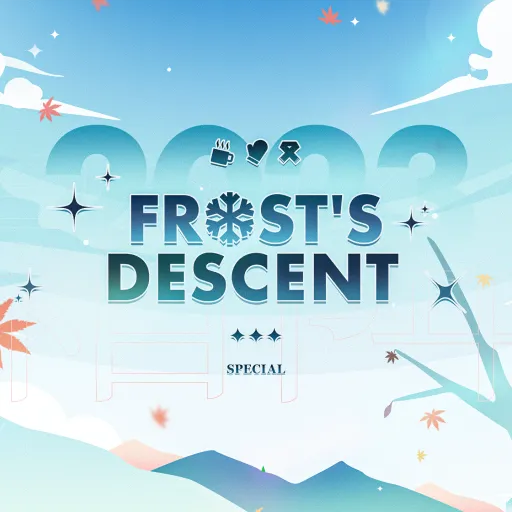{ width="162" }
        </td><td colspan = "2" width="160" display="inline-block">**等级**</td><td colspan = "3" class="ez2-course-levellable-tr">
                                <!-- 是否有AC挑战 -->           
        </td></tr><tr><td minwidth="160" colspan = "2" rowspan="3" class="ez2-course-levelnum-tr">
                                <!-- 组曲等级 -->               18
        </td><td class="ez-course-stage-td">1st STAGE</td><td class="ez-course-song-title-td">
        <!-- 第一首 模式 --><code class="ez-course-judge-b">    4B
        </code></td><td class="ez-course-songname-td">
                                <!-- 第一首 歌名 -->            kthnox
        </td></tr><tr><td>2nd STAGE</td><td class="ez-course-song-title-td">
        <!-- 第二首 模式 --><code class="ez-course-judge-s">    4S
        </code></td><td>        <!-- 第二首 歌名 -->            Glacial Alice
        </td></tr><tr><td>3rd STAGE</td><td class="ez-course-song-title-td">
        <!-- 第三首 模式 --><code class="ez-course-judge-s">    4S
        </code></td><td>        <!-- 第三首 歌名 -->            Round 3
        </td></tr><tr><td width="90">**总得分**</td><td width="100">
                                <!-- 总得分 -->                 2350500
        </td><td>**总物量**</td><td>
                                <!-- 总物量 -->                 7835
        </td><td>4th STAGE</td><td class="ez-course-song-title-td">
        <!-- 第四首 模式 --><code class="ez-course-judge-s">    4S
        </code></td><td>        <!-- 第四首 歌名 -->            End Of Fight
        </td></tr><tr><td>**谱师**</td><td colspan = "6">
                                <!-- 谱师名 -->                 CLOCKWORK & Jackalope 
        </td></tr><tr><td>**所需 DLC**</td><td colspan = "6">
                                <!-- 所需 DLC -->               `PRESTIGE PASS`、`O2JAM COLLAB`
    </td></tr></table>

=== "5K"

    with recollections graven inside

    <table style="display: inline-block; vertical-align: middle; width:900px"><tr>
        <td colspan = "2" rowspan="4">
                                <!-- 封面图 -->                 { width="162" }
        </td><td colspan = "2" width="160" display="inline-block">**等级**</td><td colspan = "3" class="ez2-course-levellable-tr">
                                <!-- 是否有AC挑战 -->           
        </td></tr><tr><td minwidth="160" colspan = "2" rowspan="3" class="ez2-course-levelnum-tr">
                                <!-- 组曲等级 -->               20
        </td><td class="ez-course-stage-td">1st STAGE</td><td class="ez-course-song-title-td">
        <!-- 第一首 模式 --><code class="ez-course-judge-s">    5S
        </code></td><td class="ez-course-songname-td">
                                <!-- 第一首 歌名 -->            Welcome To Skull's Hell (yusi. Remix)
        </td></tr><tr><td>2nd STAGE</td><td class="ez-course-song-title-td">
        <!-- 第二首 模式 --><code class="ez-course-judge-s">    5S
        </code></td><td>        <!-- 第二首 歌名 -->            Unison System
        </td></tr><tr><td>3rd STAGE</td><td class="ez-course-song-title-td">
        <!-- 第三首 模式 --><code class="ez-course-judge-s">    5S
        </code></td><td>        <!-- 第三首 歌名 -->            Panzer Schock (Culture Shock - ATAS Remix)
        </td></tr><tr><td width="90">**总得分**</td><td width="100">
                                <!-- 总得分 -->                 2875500
        </td><td>**总物量**</td><td>
                                <!-- 总物量 -->                 9585
        </td><td>4th STAGE</td><td class="ez-course-song-title-td">
        <!-- 第四首 模式 --><code class="ez-course-judge-s">    5S
        </code></td><td>        <!-- 第四首 歌名 -->            Black Dragon
        </td></tr><tr><td>**谱师**</td><td colspan = "6">
                                <!-- 谱师名 -->                 EZ2ON Pattern Team 
        </td></tr><tr><td>**所需 DLC**</td><td colspan = "6">
                                <!-- 所需 DLC -->               `O2JAM COLLAB`、`FORTRESS`
    </td></tr></table>
    
=== "6K"

    and recreate its memories into something anew

    <table style="display: inline-block; vertical-align: middle; width:900px"><tr>
        <td colspan = "2" rowspan="4">
                                <!-- 封面图 -->                 { width="162" }
        </td><td colspan = "2" width="160" display="inline-block">**等级**</td><td colspan = "3" class="ez2-course-levellable-tr">
                                <!-- 是否有AC挑战 -->           
        </td></tr><tr><td minwidth="160" colspan = "2" rowspan="3" class="ez2-course-levelnum-tr">
                                <!-- 组曲等级 -->               20
        </td><td class="ez-course-stage-td">1st STAGE</td><td class="ez-course-song-title-td">
        <!-- 第一首 模式 --><code class="ez-course-judge-s">    6S
        </code></td><td class="ez-course-songname-td">
                                <!-- 第一首 歌名 -->            Miyang Fortress -VIA GUPO REMIX-
        </td></tr><tr><td>2nd STAGE</td><td class="ez-course-song-title-td">
        <!-- 第二首 模式 --><code class="ez-course-judge-s">    6S
        </code></td><td>        <!-- 第二首 歌名 -->            End Of Fight
        </td></tr><tr><td>3rd STAGE</td><td class="ez-course-song-title-td">
        <!-- 第三首 模式 --><code class="ez-course-judge-s">    6S
        </code></td><td>        <!-- 第三首 歌名 -->            Fortress 2 Blue GM05 (NieN Metal Remix)
        </td></tr><tr><td width="90">**总得分**</td><td width="100">
                                <!-- 总得分 -->                 4084800
        </td><td>**总物量**</td><td>
                                <!-- 总物量 -->                 13616
        </td><td>4th STAGE</td><td class="ez-course-song-title-td">
        <!-- 第四首 模式 --><code class="ez-course-judge-s">    6S
        </code></td><td>        <!-- 第四首 歌名 -->            Identity part 2
        </td></tr><tr><td>**谱师**</td><td colspan = "6">
                                <!-- 谱师名 -->                 EZ2ON Pattern Team 
        </td></tr><tr><td>**所需 DLC**</td><td colspan = "6">
                                <!-- 所需 DLC -->               `O2JAM COLLAB`、`FORTRESS`
    </td></tr></table>    

=== "8K"

    In the harmonious tune of warmth and coldness

    <table style="display: inline-block; vertical-align: middle; width:900px"><tr>
        <td colspan = "2" rowspan="4">
                                <!-- 封面图 -->                 { width="162" }
        </td><td colspan = "2" width="160" display="inline-block">**等级**</td><td colspan = "3" class="ez2-course-levellable-tr">
                                <!-- 是否有AC挑战 -->           
        </td></tr><tr><td minwidth="160" colspan = "2" rowspan="3" class="ez2-course-levelnum-tr">
                                <!-- 组曲等级 -->               18
        </td><td class="ez-course-stage-td">1st STAGE</td><td class="ez-course-song-title-td">
        <!-- 第一首 模式 --><code class="ez-course-judge-s">    8S
        </code></td><td class="ez-course-songname-td">
                                <!-- 第一首 歌名 -->            Absolute Death
        </td></tr><tr><td>2nd STAGE</td><td class="ez-course-song-title-td">
        <!-- 第二首 模式 --><code class="ez-course-judge-s">    8S
        </code></td><td>        <!-- 第二首 歌名 -->            METATRON
        </td></tr><tr><td>3rd STAGE</td><td class="ez-course-song-title-td">
        <!-- 第三首 模式 --><code class="ez-course-judge-s">    8S
        </code></td><td>        <!-- 第三首 歌名 -->            Unison System
        </td></tr><tr><td width="90">**总得分**</td><td width="100">
                                <!-- 总得分 -->                 263820
        </td><td>**总物量**</td><td>
                                <!-- 总物量 -->                 8794
        </td><td>4th STAGE</td><td class="ez-course-song-title-td">
        <!-- 第四首 模式 --><code class="ez-course-judge-s">    8S
        </code></td><td>        <!-- 第四首 歌名 -->            TRPNO
        </td></tr><tr><td>**谱师**</td><td colspan = "6">
                                <!-- 谱师名 -->                 YUKINARI! MELON & CLOCKWORK & Quinta
        </td></tr><tr><td>**所需 DLC**</td><td colspan = "6">
                                <!-- 所需 DLC -->               `PRESTIGE PASS`、`O2JAM COLLAB`
    </td></tr></table>    

=== "SP"

    the Universe becomes vibrant with life

    <table style="display: inline-block; vertical-align: middle; width:900px"><tr>
        <td colspan = "2" rowspan="4">
                                <!-- 封面图 -->                 { width="162" }
        </td><td colspan = "2" width="160" display="inline-block">**等级**</td><td colspan = "3" class="ez2-course-levellable-tr">
                                <!-- 是否有AC挑战 -->           **All Combo 挑战**
        </td></tr><tr><td minwidth="160" colspan = "2" rowspan="3" class="ez2-course-levelnum-tr">
                                <!-- 组曲等级 -->               !?
        </td><td class="ez-course-stage-td">1st STAGE</td><td class="ez-course-song-title-td">
        <!-- 第一首 模式 --><code class="ez-course-judge-s">    5S
        </code></td><td class="ez-course-songname-td">
                                <!-- 第一首 歌名 -->            Blood Castle (Remix)
        </td></tr><tr><td>2nd STAGE</td><td class="ez-course-song-title-td">
        <!-- 第二首 模式 --><code class="ez-course-judge-s">    4S
        </code></td><td>        <!-- 第二首 歌名 -->            Iron Cloud
        </td></tr><tr><td>3rd STAGE</td><td class="ez-course-song-title-td">
        <!-- 第三首 模式 --><code class="ez-course-judge-s">    6S
        </code></td><td>        <!-- 第三首 歌名 -->            個人的なメモ (KENPO SAITO)
        </td></tr><tr><td width="90">**总得分**</td><td width="100">
                                <!-- 总得分 -->                 /
        </td><td>**总物量**</td><td>
                                <!-- 总物量 -->                 5220
        </td><td>4th STAGE</td><td class="ez-course-song-title-td">
        <!-- 第四首 模式 --><code class="ez-course-judge-b">    8B
        </code></td><td>        <!-- 第四首 歌名 -->            Digital Labyrinth
        </td></tr><tr><td>**谱师**</td><td colspan = "6">
                                <!-- 谱师名 -->                 Jackalope
        </td></tr><tr><td>**所需 DLC**</td><td colspan = "6">
                                <!-- 所需 DLC -->               `CODENAME VIOLET`、`PRESTIGE PASS`
    </td></tr></table>    

---
    
## BLUE DRAGON'S BLESSINGS 2024 SPECIAL

> 2024 农历春节特别组曲。

=== "4K"

    Manage tension to Darkness

    <table style="display: inline-block; vertical-align: middle; width:900px"><tr>
        <td colspan = "2" rowspan="4">
                                <!-- 封面图 -->                 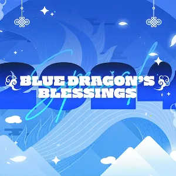{ width="162" }
        </td><td colspan = "2" width="160" display="inline-block">**等级**</td><td colspan = "3" class="ez2-course-levellable-tr">
                                <!-- 是否有AC挑战 -->           
        </td></tr><tr><td minwidth="160" colspan = "2" rowspan="3" class="ez2-course-levelnum-tr">
                                <!-- 组曲等级 -->               17
        </td><td class="ez-course-stage-td">1st STAGE</td><td class="ez-course-song-title-td">
        <!-- 第一首 模式 --><code class="ez-course-judge-s">    4S
        </code></td><td class="ez-course-songname-td">
                                <!-- 第一首 歌名 -->            The World is One's Oyster
        </td></tr><tr><td>2nd STAGE</td><td class="ez-course-song-title-td">
        <!-- 第二首 模式 --><code class="ez-course-judge-s">    4S
        </code></td><td>        <!-- 第二首 歌名 -->            The Prince of Darkness
        </td></tr><tr><td>3rd STAGE</td><td class="ez-course-song-title-td">
        <!-- 第三首 模式 --><code class="ez-course-judge-s">    4S
        </code></td><td>        <!-- 第三首 歌名 -->            Diabolic Swing
        </td></tr><tr><td width="90">**总得分**</td><td width="100">
                                <!-- 总得分 -->                 1903800
        </td><td>**总物量**</td><td>
                                <!-- 总物量 -->                 6346
        </td><td>4th STAGE</td><td class="ez-course-song-title-td">
        <!-- 第四首 模式 --><code class="ez-course-judge-s">    4S
        </code></td><td>        <!-- 第四首 歌名 -->            Le Grand Bleu
        </td></tr><tr><td>**谱师**</td><td colspan = "6">
                                <!-- 谱师名 -->                 CLOCKWORK & Jackalope 
        </td></tr><tr><td>**所需 DLC**</td><td colspan = "6">
                                <!-- 所需 DLC -->               `CODENAME VIOLET`、`PRESTIGE PASS`
    </td></tr></table>

=== "5K"

    Take off to fulfill your purpose

    <table style="display: inline-block; vertical-align: middle; width:900px"><tr>
        <td colspan = "2" rowspan="4">
                                <!-- 封面图 -->                 { width="162" }
        </td><td colspan = "2" width="160" display="inline-block">**等级**</td><td colspan = "3" class="ez2-course-levellable-tr">
                                <!-- 是否有AC挑战 -->           
        </td></tr><tr><td minwidth="160" colspan = "2" rowspan="3" class="ez2-course-levelnum-tr">
                                <!-- 组曲等级 -->               18
        </td><td class="ez-course-stage-td">1st STAGE</td><td class="ez-course-song-title-td">
        <!-- 第一首 模式 --><code class="ez-course-judge-s">    5S
        </code></td><td class="ez-course-songname-td">
                                <!-- 第一首 歌名 -->            Dreamy Flight
        </td></tr><tr><td>2nd STAGE</td><td class="ez-course-song-title-td">
        <!-- 第二首 模式 --><code class="ez-course-judge-s">    5S
        </code></td><td>        <!-- 第二首 歌名 -->            comet
        </td></tr><tr><td>3rd STAGE</td><td class="ez-course-song-title-td">
        <!-- 第三首 模式 --><code class="ez-course-judge-s">    5S
        </code></td><td>        <!-- 第三首 歌名 -->            Start Me Up
        </td></tr><tr><td width="90">**总得分**</td><td width="100">
                                <!-- 总得分 -->                 2604300
        </td><td>**总物量**</td><td>
                                <!-- 总物量 -->                 8681
        </td><td>4th STAGE</td><td class="ez-course-song-title-td">
        <!-- 第四首 模式 --><code class="ez-course-judge-s">    5S
        </code></td><td>        <!-- 第四首 歌名 -->            Wings on my Back
        </td></tr><tr><td>**谱师**</td><td colspan = "6">
                                <!-- 谱师名 -->                 Jackalope & Aubergine Cookie
        </td></tr><tr><td>**所需 DLC**</td><td colspan = "6">
                                <!-- 所需 DLC -->               `PRESTIGE PASS`、`ENDLESS CIRCULATION`
    </td></tr></table>

=== "6K"

    Realized they weren't the same person at all anymore

    <table style="display: inline-block; vertical-align: middle; width:900px"><tr>
        <td colspan = "2" rowspan="4">
                                <!-- 封面图 -->                 { width="162" }
        </td><td colspan = "2" width="160" display="inline-block">**等级**</td><td colspan = "3" class="ez2-course-levellable-tr">
                                <!-- 是否有AC挑战 -->           
        </td></tr><tr><td minwidth="160" colspan = "2" rowspan="3" class="ez2-course-levelnum-tr">
                                <!-- 组曲等级 -->               19
        </td><td class="ez-course-stage-td">1st STAGE</td><td class="ez-course-song-title-td">
        <!-- 第一首 模式 --><code class="ez-course-judge-s">    6S
        </code></td><td class="ez-course-songname-td">
                                <!-- 第一首 歌名 -->            BEATRICE
        </td></tr><tr><td>2nd STAGE</td><td class="ez-course-song-title-td">
        <!-- 第二首 模式 --><code class="ez-course-judge-s">    6S
        </code></td><td>        <!-- 第二首 歌名 -->            INSTANT Vampire†StartKit™
        </td></tr><tr><td>3rd STAGE</td><td class="ez-course-song-title-td">
        <!-- 第三首 模式 --><code class="ez-course-judge-s">    6S
        </code></td><td>        <!-- 第三首 歌名 -->            FiND A WAY
        </td></tr><tr><td width="90">**总得分**</td><td width="100">
                                <!-- 总得分 -->                 2893800
        </td><td>**总物量**</td><td>
                                <!-- 总物量 -->                 9646
        </td><td>4th STAGE</td><td class="ez-course-song-title-td">
        <!-- 第四首 模式 --><code class="ez-course-judge-s">    6S
        </code></td><td>        <!-- 第四首 歌名 -->            ApolloN
        </td></tr><tr><td>**谱师**</td><td colspan = "6">
                                <!-- 谱师名 -->                 CLOCKWORK & Jackalope
        </td></tr><tr><td>**所需 DLC**</td><td colspan = "6">
                                <!-- 所需 DLC -->               `CODENAME VIOLET`、`PRESTIGE PASS`、`ENDLESS CIRCULATION`
    </td></tr></table>

=== "8K"

    Prepare the new year with a blue heart

    <table style="display: inline-block; vertical-align: middle; width:900px"><tr>
        <td colspan = "2" rowspan="4">
                                <!-- 封面图 -->                 { width="162" }
        </td><td colspan = "2" width="160" display="inline-block">**等级**</td><td colspan = "3" class="ez2-course-levellable-tr">
                                <!-- 是否有AC挑战 -->           
        </td></tr><tr><td minwidth="160" colspan = "2" rowspan="3" class="ez2-course-levelnum-tr">
                                <!-- 组曲等级 -->               18
        </td><td class="ez-course-stage-td">1st STAGE</td><td class="ez-course-song-title-td">
        <!-- 第一首 模式 --><code class="ez-course-judge-s">    8S
        </code></td><td class="ez-course-songname-td">
                                <!-- 第一首 歌名 -->            Enter the Beginning
        </td></tr><tr><td>2nd STAGE</td><td class="ez-course-song-title-td">
        <!-- 第二首 模式 --><code class="ez-course-judge-s">    8S
        </code></td><td>        <!-- 第二首 歌名 -->            CLear After Rain
        </td></tr><tr><td>3rd STAGE</td><td class="ez-course-song-title-td">
        <!-- 第三首 模式 --><code class="ez-course-judge-s">    8S
        </code></td><td>        <!-- 第三首 歌名 -->            LIGHTYEAR
        </td></tr><tr><td width="90">**总得分**</td><td width="100">
                                <!-- 总得分 -->                 2772600
        </td><td>**总物量**</td><td>
                                <!-- 总物量 -->                 9242
        </td><td>4th STAGE</td><td class="ez-course-song-title-td">
        <!-- 第四首 模式 --><code class="ez-course-judge-s">    8S
        </code></td><td>        <!-- 第四首 歌名 -->            Almost There
        </td></tr><tr><td>**谱师**</td><td colspan = "6">
                                <!-- 谱师名 -->                 YUKINARI! MELON
        </td></tr><tr><td>**所需 DLC**</td><td colspan = "6">
                                <!-- 所需 DLC -->               `PRESTIGE PASS`、`ENDLESS CIRCULATION`
    </td></tr></table>
    
=== "SP"

    WARM hospitality and the family-like atmosphere

    <table style="display: inline-block; vertical-align: middle; width:900px"><tr>
        <td colspan = "2" rowspan="4">
                                <!-- 封面图 -->                 { width="162" }
        </td><td colspan = "2" width="160" display="inline-block">**等级**</td><td colspan = "3" class="ez2-course-levellable-tr">
                                <!-- 是否有AC挑战 -->           
        </td></tr><tr><td minwidth="160" colspan = "2" rowspan="3" class="ez2-course-levelnum-tr">
                                <!-- 组曲等级 -->               ?
        </td><td class="ez-course-stage-td">1st STAGE</td><td class="ez-course-song-title-td">
        <!-- 第一首 模式 --><code class="ez-course-judge-s">    7S
        </code></td><td class="ez-course-songname-td">
                                <!-- 第一首 歌名 -->            Y-Gate
        </td></tr><tr><td>2nd STAGE</td><td class="ez-course-song-title-td">
        <!-- 第二首 模式 --><code class="ez-course-judge-s">    7S
        </code></td><td>        <!-- 第二首 歌名 -->            Minus 2
        </td></tr><tr><td>3rd STAGE</td><td class="ez-course-song-title-td">
        <!-- 第三首 模式 --><code class="ez-course-judge-s">    7S
        </code></td><td>        <!-- 第三首 歌名 -->            Sand Storm
        </td></tr><tr><td width="90">**总得分**</td><td width="100">
                                <!-- 总得分 -->                 1635300
        </td><td>**总物量**</td><td>
                                <!-- 总物量 -->                 5451
        </td><td>4th STAGE</td><td class="ez-course-song-title-td">
        <!-- 第四首 模式 --><code class="ez-course-judge-s">    7S
        </code></td><td>        <!-- 第四首 歌名 -->            R.F.C.
        </td></tr><tr><td>**谱师**</td><td colspan = "6">
                                <!-- 谱师名 -->                 EZ2ON Pattern Team
        </td></tr><tr><td>**所需 DLC**</td><td colspan = "6">
                                <!-- 所需 DLC -->               /
    </td></tr></table>

!!! warning "注意"

    该组曲 SP 的独占 `7K STANDARD` 模式演奏面板、判定及连击字体样式均强制使用 3RD 搭配，音符强制使用 Classic。
    
---
    
## APRIL SHOWER 2024 SPECIAL

> 2024 谷雨特别组曲。

=== "4K"

    a breeze, blows away the clouds

    <table style="display: inline-block; vertical-align: middle; width:900px"><tr>
        <td colspan = "2" rowspan="4">
                                <!-- 封面图 -->                 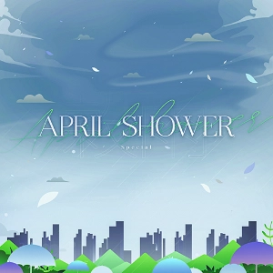{ width="162" }
        </td><td colspan = "2" width="160" display="inline-block">**等级**</td><td colspan = "3" class="ez2-course-levellable-tr">
                                <!-- 是否有AC挑战 -->           
        </td></tr><tr><td minwidth="160" colspan = "2" rowspan="3" class="ez2-course-levelnum-tr">
                                <!-- 组曲等级 -->               16
        </td><td class="ez-course-stage-td">1st STAGE</td><td class="ez-course-song-title-td">
        <!-- 第一首 模式 --><code class="ez-course-judge-s">    4S
        </code></td><td class="ez-course-songname-td">
                                <!-- 第一首 歌名 -->            Ask to Wind
        </td></tr><tr><td>2nd STAGE</td><td class="ez-course-song-title-td">
        <!-- 第二首 模式 --><code class="ez-course-judge-s">    4S
        </code></td><td>        <!-- 第二首 歌名 -->            Clear After Rain
        </td></tr><tr><td>3rd STAGE</td><td class="ez-course-song-title-td">
        <!-- 第三首 模式 --><code class="ez-course-judge-s">    4S
        </code></td><td>        <!-- 第三首 歌名 -->            WE ALIVE
        </td></tr><tr><td width="90">**总得分**</td><td width="100">
                                <!-- 总得分 -->                 1623600
        </td><td>**总物量**</td><td>
                                <!-- 总物量 -->                 5412
        </td><td>4th STAGE</td><td class="ez-course-song-title-td">
        <!-- 第四首 模式 --><code class="ez-course-judge-s">    4S
        </code></td><td>        <!-- 第四首 歌名 -->            sweet★star
        </td></tr><tr><td>**谱师**</td><td colspan = "6">
                                <!-- 谱师名 -->                 CLOCKWORK
        </td></tr><tr><td>**所需 DLC**</td><td colspan = "6">
                                <!-- 所需 DLC -->               `TIME TRAVELER`、`DJMAX`
    </td></tr></table>

=== "5K"

    sunlight, but doesn't shine all the time

    <table style="display: inline-block; vertical-align: middle; width:900px"><tr>
        <td colspan = "2" rowspan="4">
                                <!-- 封面图 -->                 { width="162" }
        </td><td colspan = "2" width="160" display="inline-block">**等级**</td><td colspan = "3" class="ez2-course-levellable-tr">
                                <!-- 是否有AC挑战 -->           
        </td></tr><tr><td minwidth="160" colspan = "2" rowspan="3" class="ez2-course-levelnum-tr">
                                <!-- 组曲等级 -->               16
        </td><td class="ez-course-stage-td">1st STAGE</td><td class="ez-course-song-title-td">
        <!-- 第一首 模式 --><code class="ez-course-judge-s">    5S
        </code></td><td class="ez-course-songname-td">
                                <!-- 第一首 歌名 -->            Do You Know?
        </td></tr><tr><td>2nd STAGE</td><td class="ez-course-song-title-td">
        <!-- 第二首 模式 --><code class="ez-course-judge-s">    5S
        </code></td><td>        <!-- 第二首 歌名 -->            Go Back
        </td></tr><tr><td>3rd STAGE</td><td class="ez-course-song-title-td">
        <!-- 第三首 模式 --><code class="ez-course-judge-s">    5S
        </code></td><td>        <!-- 第三首 歌名 -->            Belong To You
        </td></tr><tr><td width="90">**总得分**</td><td width="100">
                                <!-- 总得分 -->                 2196300
        </td><td>**总物量**</td><td>
                                <!-- 总物量 -->                 8681
        </td><td>4th STAGE</td><td class="ez-course-song-title-td">
        <!-- 第四首 模式 --><code class="ez-course-judge-s">    5S
        </code></td><td>        <!-- 第四首 歌名 -->            Bride In Dream
        </td></tr><tr><td>**谱师**</td><td colspan = "6">
                                <!-- 谱师名 -->                 YUKINARI! MELON
        </td></tr><tr><td>**所需 DLC**</td><td colspan = "6">
                                <!-- 所需 DLC -->               `PRESTIGE PASS`、`O2JAM COLLAB`
    </td></tr></table>

=== "6K"

    a shower, as if that thing forgot about spring

    <table style="display: inline-block; vertical-align: middle; width:900px"><tr>
        <td colspan = "2" rowspan="4">
                                <!-- 封面图 -->                 { width="162" }
        </td><td colspan = "2" width="160" display="inline-block">**等级**</td><td colspan = "3" class="ez2-course-levellable-tr">
                                <!-- 是否有AC挑战 -->           
        </td></tr><tr><td minwidth="160" colspan = "2" rowspan="3" class="ez2-course-levelnum-tr">
                                <!-- 组曲等级 -->               17
        </td><td class="ez-course-stage-td">1st STAGE</td><td class="ez-course-song-title-td">
        <!-- 第一首 模式 --><code class="ez-course-judge-s">    6S
        </code></td><td class="ez-course-songname-td">
                                <!-- 第一首 歌名 -->            Doll's Garden
        </td></tr><tr><td>2nd STAGE</td><td class="ez-course-song-title-td">
        <!-- 第二首 模式 --><code class="ez-course-judge-s">    6S
        </code></td><td>        <!-- 第二首 歌名 -->            Tank Slayer (DoubleTO Remix)
        </td></tr><tr><td>3rd STAGE</td><td class="ez-course-song-title-td">
        <!-- 第三首 模式 --><code class="ez-course-judge-s">    6S
        </code></td><td>        <!-- 第三首 歌名 -->            Glimmering
        </td></tr><tr><td width="90">**总得分**</td><td width="100">
                                <!-- 总得分 -->                 2467500
        </td><td>**总物量**</td><td>
                                <!-- 总物量 -->                 9646
        </td><td>4th STAGE</td><td class="ez-course-song-title-td">
        <!-- 第四首 模式 --><code class="ez-course-judge-s">    6S
        </code></td><td>        <!-- 第四首 歌名 -->            Nobody Face Love
        </td></tr><tr><td>**谱师**</td><td colspan = "6">
                                <!-- 谱师名 -->                 Jackalope
        </td></tr><tr><td>**所需 DLC**</td><td colspan = "6">
                                <!-- 所需 DLC -->               `CODENAME VIOLET`、`PRESTIGE PASS`、`FORTRESS`
    </td></tr></table>

=== "8K"

    colors, the 7 passions that fill out lives

    <table style="display: inline-block; vertical-align: middle; width:900px"><tr>
        <td colspan = "2" rowspan="4">
                                <!-- 封面图 -->                 { width="162" }
        </td><td colspan = "2" width="160" display="inline-block">**等级**</td><td colspan = "3" class="ez2-course-levellable-tr">
                                <!-- 是否有AC挑战 -->           
        </td></tr><tr><td minwidth="160" colspan = "2" rowspan="3" class="ez2-course-levelnum-tr">
                                <!-- 组曲等级 -->               17
        </td><td class="ez-course-stage-td">1st STAGE</td><td class="ez-course-song-title-td">
        <!-- 第一首 模式 --><code class="ez-course-judge-s">    8S
        </code></td><td class="ez-course-songname-td">
                                <!-- 第一首 歌名 -->            Over the Rainbow
        </td></tr><tr><td>2nd STAGE</td><td class="ez-course-song-title-td">
        <!-- 第二首 模式 --><code class="ez-course-judge-s">    8S
        </code></td><td>        <!-- 第二首 歌名 -->            WE ALIVE
        </td></tr><tr><td>3rd STAGE</td><td class="ez-course-song-title-td">
        <!-- 第三首 模式 --><code class="ez-course-judge-s">    8S
        </code></td><td>        <!-- 第三首 歌名 -->            Life Is So Beautiful (Nauts Ver.)
        </td></tr><tr><td width="90">**总得分**</td><td width="100">
                                <!-- 总得分 -->                 2599200
        </td><td>**总物量**</td><td>
                                <!-- 总物量 -->                 8664
        </td><td>4th STAGE</td><td class="ez-course-song-title-td">
        <!-- 第四首 模式 --><code class="ez-course-judge-s">    8S
        </code></td><td>        <!-- 第四首 歌名 -->            Raise me up
        </td></tr><tr><td>**谱师**</td><td colspan = "6">
                                <!-- 谱师名 -->                 YUKINARI! MELON & CLOCKWORK
        </td></tr><tr><td>**所需 DLC**</td><td colspan = "6">
                                <!-- 所需 DLC -->               `FORTRESS`、`DJMAX`
    </td></tr></table>
    
=== "SP"

    That's the Innermind

    <table style="display: inline-block; vertical-align: middle; width:900px"><tr>
        <td colspan = "2" rowspan="4">
                                <!-- 封面图 -->                 { width="162" }
        </td><td colspan = "2" width="160" display="inline-block">**等级**</td><td colspan = "3" class="ez2-course-levellable-tr">
                                <!-- 是否有AC挑战 -->           
        </td></tr><tr><td minwidth="160" colspan = "2" rowspan="3" class="ez2-course-levelnum-tr">
                                <!-- 组曲等级 -->               ?
        </td><td class="ez-course-stage-td">1st STAGE</td><td class="ez-course-song-title-td">
        <!-- 第一首 模式 --><code class="ez-course-judge-s">    7S
        </code></td><td class="ez-course-songname-td">
                                <!-- 第一首 歌名 -->            J.M.J
        </td></tr><tr><td>2nd STAGE</td><td class="ez-course-song-title-td">
        <!-- 第二首 模式 --><code class="ez-course-judge-s">    7S
        </code></td><td>        <!-- 第二首 歌名 -->            Judgement
        </td></tr><tr><td>3rd STAGE</td><td class="ez-course-song-title-td">
        <!-- 第三首 模式 --><code class="ez-course-judge-s">    7S
        </code></td><td>        <!-- 第三首 歌名 -->            Aquaris
        </td></tr><tr><td width="90">**总得分**</td><td width="100">
                                <!-- 总得分 -->                 1406100
        </td><td>**总物量**</td><td>
                                <!-- 总物量 -->                 4687
        </td><td>4th STAGE</td><td class="ez-course-song-title-td">
        <!-- 第四首 模式 --><code class="ez-course-judge-s">    7S
        </code></td><td>        <!-- 第四首 歌名 -->            Lovely Day (Remaster)
        </td></tr><tr><td>**谱师**</td><td colspan = "6">
                                <!-- 谱师名 -->                 CLOCKWORK & YUKINARI! MELON
        </td></tr><tr><td>**所需 DLC**</td><td colspan = "6">
                                <!-- 所需 DLC -->               /
    </td></tr></table>

!!! warning "注意"

    该组曲 SP 的独占 `7K STANDARD` 模式演奏面板、判定及连击字体样式均强制使用 4TH 搭配，音符强制使用 Classic。

---

## Daily Special

=== "4K"

    it just tastes good

    <table style="display: inline-block; vertical-align: middle; width:900px"><tr>
        <td colspan = "2" rowspan="4">
                                <!-- 封面图 -->                 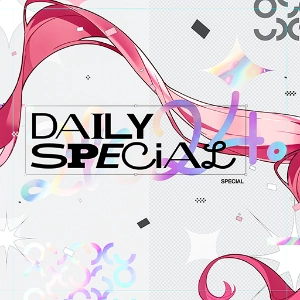{ width="162" }
        </td><td colspan = "2" width="160" display="inline-block">**等级**</td><td colspan = "3" class="ez2-course-levellable-tr">
                                <!-- 是否有AC挑战 -->           
        </td></tr><tr><td minwidth="160" colspan = "2" rowspan="3" class="ez2-course-levelnum-tr">
                                <!-- 组曲等级 -->               16
        </td><td class="ez-course-stage-td">1st STAGE</td><td class="ez-course-song-title-td">
        <!-- 第一首 模式 --><code class="ez-course-judge-b">    4B
        </code></td><td class="ez-course-songname-td">
                                <!-- 第一首 歌名 -->            Night Madness
        </td></tr><tr><td>2nd STAGE</td><td class="ez-course-song-title-td">
        <!-- 第二首 模式 --><code class="ez-course-judge-b">    4B
        </code></td><td>        <!-- 第二首 歌名 -->            T-eMotion
        </td></tr><tr><td>3rd STAGE</td><td class="ez-course-song-title-td">
        <!-- 第三首 模式 --><code class="ez-course-judge-b">    4B
        </code></td><td>        <!-- 第三首 歌名 -->            The First Movement of Moonlight
        </td></tr><tr><td width="90">**总得分**</td><td width="100">
                                <!-- 总得分 -->                 1350300
        </td><td>**总物量**</td><td>
                                <!-- 总物量 -->                 4501
        </td><td>4th STAGE</td><td class="ez-course-song-title-td">
        <!-- 第四首 模式 --><code class="ez-course-judge-b">    4B
        </code></td><td>        <!-- 第四首 歌名 -->            ?
        </td></tr><tr><td>**谱师**</td><td colspan = "6">
                                <!-- 谱师名 -->                 CLOCKWORK
        </td></tr><tr><td>**所需 DLC**</td><td colspan = "6">
                                <!-- 所需 DLC -->               /
    </td></tr></table>

=== "5K"

    it just tastes good

    <table style="display: inline-block; vertical-align: middle; width:900px"><tr>
        <td colspan = "2" rowspan="4">
                                <!-- 封面图 -->                 { width="162" }
        </td><td colspan = "2" width="160" display="inline-block">**等级**</td><td colspan = "3" class="ez2-course-levellable-tr">
                                <!-- 是否有AC挑战 -->           
        </td></tr><tr><td minwidth="160" colspan = "2" rowspan="3" class="ez2-course-levelnum-tr">
                                <!-- 组曲等级 -->               16
        </td><td class="ez-course-stage-td">1st STAGE</td><td class="ez-course-song-title-td">
        <!-- 第一首 模式 --><code class="ez-course-judge-b">    5B
        </code></td><td class="ez-course-songname-td">
                                <!-- 第一首 歌名 -->            Night Madness
        </td></tr><tr><td>2nd STAGE</td><td class="ez-course-song-title-td">
        <!-- 第二首 模式 --><code class="ez-course-judge-b">    5B
        </code></td><td>        <!-- 第二首 歌名 -->            T-eMotion
        </td></tr><tr><td>3rd STAGE</td><td class="ez-course-song-title-td">
        <!-- 第三首 模式 --><code class="ez-course-judge-b">    5B
        </code></td><td>        <!-- 第三首 歌名 -->            The First Movement of Moonlight
        </td></tr><tr><td width="90">**总得分**</td><td width="100">
                                <!-- 总得分 -->                 1555500
        </td><td>**总物量**</td><td>
                                <!-- 总物量 -->                 5185
        </td><td>4th STAGE</td><td class="ez-course-song-title-td">
        <!-- 第四首 模式 --><code class="ez-course-judge-b">    5B
        </code></td><td>        <!-- 第四首 歌名 -->            ?
        </td></tr><tr><td>**谱师**</td><td colspan = "6">
                                <!-- 谱师名 -->                 Jackalope
        </td></tr><tr><td>**所需 DLC**</td><td colspan = "6">
                                <!-- 所需 DLC -->               /
    </td></tr></table>

=== "6K"

    it just tastes good

    <table style="display: inline-block; vertical-align: middle; width:900px"><tr>
        <td colspan = "2" rowspan="4">
                                <!-- 封面图 -->                 { width="162" }
        </td><td colspan = "2" width="160" display="inline-block">**等级**</td><td colspan = "3" class="ez2-course-levellable-tr">
                                <!-- 是否有AC挑战 -->           
        </td></tr><tr><td minwidth="160" colspan = "2" rowspan="3" class="ez2-course-levelnum-tr">
                                <!-- 组曲等级 -->               16
        </td><td class="ez-course-stage-td">1st STAGE</td><td class="ez-course-song-title-td">
        <!-- 第一首 模式 --><code class="ez-course-judge-b">    6B
        </code></td><td class="ez-course-songname-td">
                                <!-- 第一首 歌名 -->            Night Madness
        </td></tr><tr><td>2nd STAGE</td><td class="ez-course-song-title-td">
        <!-- 第二首 模式 --><code class="ez-course-judge-b">    6B
        </code></td><td>        <!-- 第二首 歌名 -->            T-eMotion
        </td></tr><tr><td>3rd STAGE</td><td class="ez-course-song-title-td">
        <!-- 第三首 模式 --><code class="ez-course-judge-b">    6B
        </code></td><td>        <!-- 第三首 歌名 -->            The First Movement of Moonlight
        </td></tr><tr><td width="90">**总得分**</td><td width="100">
                                <!-- 总得分 -->                 1783200
        </td><td>**总物量**</td><td>
                                <!-- 总物量 -->                 5944
        </td><td>4th STAGE</td><td class="ez-course-song-title-td">
        <!-- 第四首 模式 --><code class="ez-course-judge-b">    6B
        </code></td><td>        <!-- 第四首 歌名 -->            ?
        </td></tr><tr><td>**谱师**</td><td colspan = "6">
                                <!-- 谱师名 -->                 CLOCKWORK & YUKINARI! MELON
        </td></tr><tr><td>**所需 DLC**</td><td colspan = "6">
                                <!-- 所需 DLC -->               /
    </td></tr></table>

=== "8K"

    it just tastes good

    <table style="display: inline-block; vertical-align: middle; width:900px"><tr>
        <td colspan = "2" rowspan="4">
                                <!-- 封面图 -->                 { width="162" }
        </td><td colspan = "2" width="160" display="inline-block">**等级**</td><td colspan = "3" class="ez2-course-levellable-tr">
                                <!-- 是否有AC挑战 -->           
        </td></tr><tr><td minwidth="160" colspan = "2" rowspan="3" class="ez2-course-levelnum-tr">
                                <!-- 组曲等级 -->               16
        </td><td class="ez-course-stage-td">1st STAGE</td><td class="ez-course-song-title-td">
        <!-- 第一首 模式 --><code class="ez-course-judge-b">    8B
        </code></td><td class="ez-course-songname-td">
                                <!-- 第一首 歌名 -->            Night Madness
        </td></tr><tr><td>2nd STAGE</td><td class="ez-course-song-title-td">
        <!-- 第二首 模式 --><code class="ez-course-judge-b">    8B
        </code></td><td>        <!-- 第二首 歌名 -->            T-eMotion
        </td></tr><tr><td>3rd STAGE</td><td class="ez-course-song-title-td">
        <!-- 第三首 模式 --><code class="ez-course-judge-b">    8B
        </code></td><td>        <!-- 第三首 歌名 -->            The First Movement of Moonlight
        </td></tr><tr><td width="90">**总得分**</td><td width="100">
                                <!-- 总得分 -->                 1870500
        </td><td>**总物量**</td><td>
                                <!-- 总物量 -->                 6235
        </td><td>4th STAGE</td><td class="ez-course-song-title-td">
        <!-- 第四首 模式 --><code class="ez-course-judge-b">    8B
        </code></td><td>        <!-- 第四首 歌名 -->            ?
        </td></tr><tr><td>**谱师**</td><td colspan = "6">
                                <!-- 谱师名 -->                 YUKINARI! MELON
        </td></tr><tr><td>**所需 DLC**</td><td colspan = "6">
                                <!-- 所需 DLC -->               /
    </td></tr></table>
    
=== "SP"

    it just tastes good

    <table style="display: inline-block; vertical-align: middle; width:900px"><tr>
        <td colspan = "2" rowspan="4">
                                <!-- 封面图 -->                 { width="162" }
        </td><td colspan = "2" width="160" display="inline-block">**等级**</td><td colspan = "3" class="ez2-course-levellable-tr">
                                <!-- 是否有AC挑战 -->           
        </td></tr><tr><td minwidth="160" colspan = "2" rowspan="3" class="ez2-course-levelnum-tr">
                                <!-- 组曲等级 -->               ?
        </td><td class="ez-course-stage-td">1st STAGE</td><td class="ez-course-song-title-td">
        <!-- 第一首 模式 --><code class="ez-course-judge-b">    7B
        </code></td><td class="ez-course-songname-td">
                                <!-- 第一首 歌名 -->            Night Madness
        </td></tr><tr><td>2nd STAGE</td><td class="ez-course-song-title-td">
        <!-- 第二首 模式 --><code class="ez-course-judge-b">    7B
        </code></td><td>        <!-- 第二首 歌名 -->            T-eMotion
        </td></tr><tr><td>3rd STAGE</td><td class="ez-course-song-title-td">
        <!-- 第三首 模式 --><code class="ez-course-judge-b">    7B
        </code></td><td>        <!-- 第三首 歌名 -->            The First Movement of Moonlight
        </td></tr><tr><td width="90">**总得分**</td><td width="100">
                                <!-- 总得分 -->                 1495500
        </td><td>**总物量**</td><td>
                                <!-- 总物量 -->                 4985
        </td><td>4th STAGE</td><td class="ez-course-song-title-td">
        <!-- 第四首 模式 --><code class="ez-course-judge-b">    7B
        </code></td><td>        <!-- 第四首 歌名 -->            ?
        </td></tr><tr><td>**谱师**</td><td colspan = "6">
                                <!-- 谱师名 -->                 YUKINARI! MELON & CLOCKWORK
        </td></tr><tr><td>**所需 DLC**</td><td colspan = "6">
                                <!-- 所需 DLC -->               /
    </td></tr></table>

!!! warning "注意"

    该组曲 SP 的独占 `7K BASIC` 模式演奏面板、音符、判定及连击字体样式均强制使用 Jiyu 皮肤套装。

    第四首为：Rain Blossom by SHK

    通过 4K、5K、6K、8K、SP 任意一组，即可解锁 Jiyu 皮肤套装。

---

## Daily Special [EZ]

=== "SP"

    it just tastes good

    <table style="display: inline-block; vertical-align: middle; width:900px"><tr>
        <td colspan = "2" rowspan="4">
                                <!-- 封面图 -->                 { width="162" }
        </td><td colspan = "2" width="160" display="inline-block">**等级**</td><td colspan = "3" class="ez2-course-levellable-tr">
                                <!-- 是否有AC挑战 -->           
        </td></tr><tr><td minwidth="160" colspan = "2" rowspan="3" class="ez2-course-levelnum-tr">
                                <!-- 组曲等级 -->               ?
        </td><td class="ez-course-stage-td">1st STAGE</td><td class="ez-course-song-title-td">
        <!-- 第一首 模式 --><code class="ez-course-judge-b">    7B
        </code></td><td class="ez-course-songname-td">
                                <!-- 第一首 歌名 -->            Night Madness
        </td></tr><tr><td>2nd STAGE</td><td class="ez-course-song-title-td">
        <!-- 第二首 模式 --><code class="ez-course-judge-b">    7B
        </code></td><td>        <!-- 第二首 歌名 -->            T-eMotion
        </td></tr><tr><td>3rd STAGE</td><td class="ez-course-song-title-td">
        <!-- 第三首 模式 --><code class="ez-course-judge-b">    7B
        </code></td><td>        <!-- 第三首 歌名 -->            The First Movement of Moonlight
        </td></tr><tr><td width="90">**总得分**</td><td width="100">
                                <!-- 总得分 -->                 433550
        </td><td>**总物量**</td><td>
                                <!-- 总物量 -->                 1445
        </td><td>4th STAGE</td><td class="ez-course-song-title-td">
        <!-- 第四首 模式 --><code class="ez-course-judge-b">    7B
        </code></td><td>        <!-- 第四首 歌名 -->            ?
        </td></tr><tr><td>**谱师**</td><td colspan = "6">
                                <!-- 谱师名 -->                 YUKINARI! MELON & CLOCKWORK
        </td></tr><tr><td>**所需 DLC**</td><td colspan = "6">
                                <!-- 所需 DLC -->               /
    </td></tr></table>

!!! warning "注意"

    该组曲为简单版，仅有 SP 的独占 `7K BASIC` 模式，演奏面板、音符、判定及连击字体样式均强制使用 Jiyu 皮肤套装。

    第四首为：Rain Blossom by SHK

    通过后，即可解锁 Jiyu 皮肤套装。
