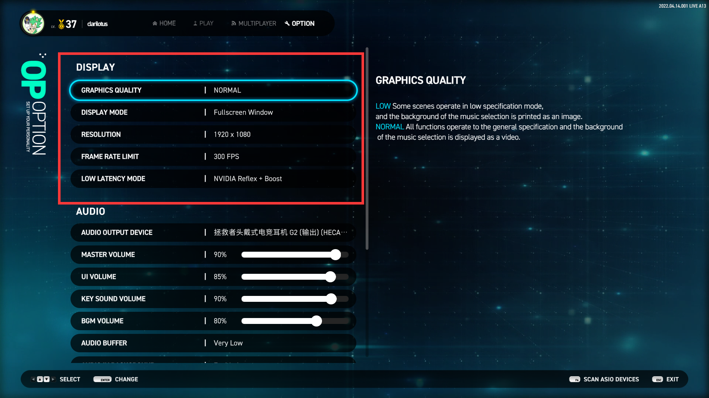
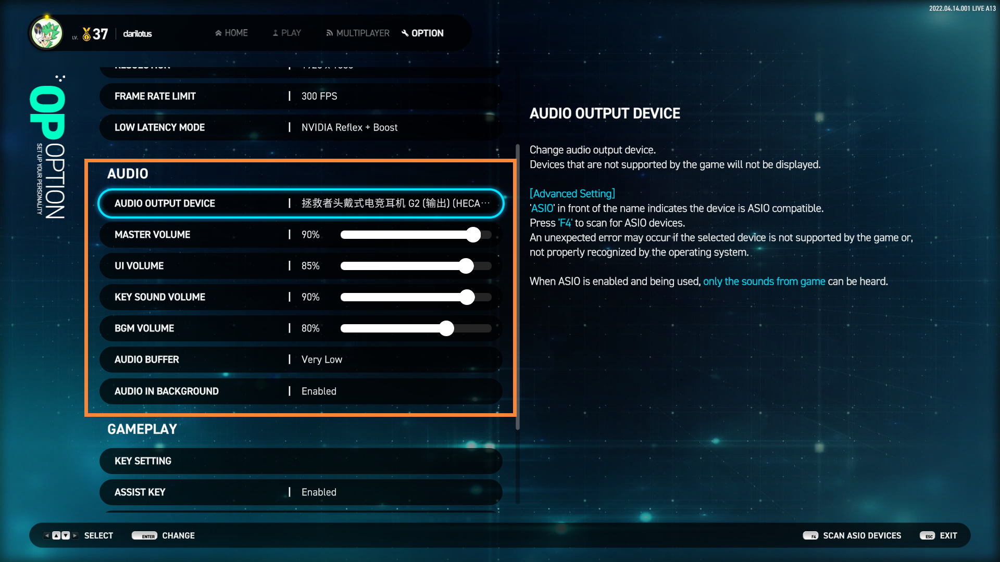
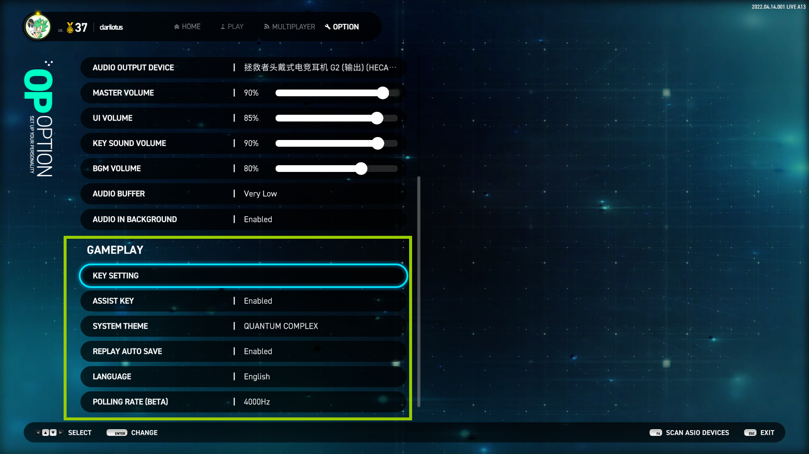
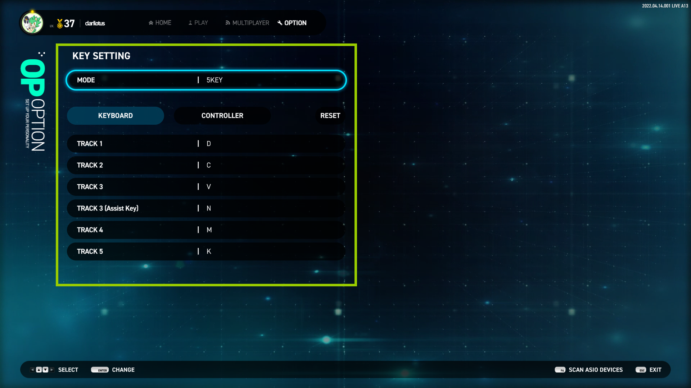

# 游戏详细指引 :id=guide-title-top

## 一、主菜单 & 各模式的介绍 :id=guide-menumode

### 1. BASIC 自由演奏：入门 :id=guide-menumode-ba
> 可自由演奏 `4~6键` 的任何谱面，判定非常宽松，官方数据为 `Kool 40ms`； 
> BASIC 模式的成绩排行榜单独统计，`与 STANDARD 模式不共享`； 
> BASIC 模式下，部分歌曲的 EZ 难度谱面比 STANDARD 模式下的要简单； 
> BASIC 模式下演奏的成绩 `不会累计 Rating 值`。

### 2. STANDARD 自由演奏：标准 :id=guide-menumode-std
> 可自由演奏 `4~8键` 的任何谱面，判定为正常判定，官方数据为 `Kool 22ms`； 
> 累计 Rating 值将在后文 Rating 部分中会讲解。

### 3. MULTIPLAYER 多人演奏 :id=guide-menumode-mp
> 最高支持同时`9`人游戏，可选 `派对模式 (Party Mode)` 或 `对战模式 (Battle Mode)`； 
> 相关详细在后文 MULTIPLAYER 部分中会讲解。

### 4. COURSE 组曲挑战 :id=guide-menumode-cs
> 提供多组已编组的组曲，区分 `4~8键` 以及混合键数的特殊类别 `SP`； 
> 每个组曲固定有 `4首` 歌曲，通关条件为 `存活即可`，演奏过程中 `不可暂停`； 
> 相关详细在后文 COURSE 部分中会讲解。

### 5. OPTION 系统设置 :id=guide-menumode-op
> 设置游戏各种设置，包括显示、键位、声音、系统主题等； 
> 相关详细在后文 OPTION 部分中会讲解。

### 6. LOUNGE 个人中心 :id=guide-menumode-lg
> 展示个人`演奏数据仪表板`、`总得分和 Rating 的排行榜`，以及`观赏歌曲动画 (BGA)`； 
> 相关详细在后文 LOUNGE 部分中会讲解。

## 二、OPTION 系统设置 :id=guide-options

### 1. DISPLAY 显示设置 :id=guide-options-display

#### GRAPHICS QUALITY 图像质量
- LOW 低质量：`少部分动画特效以降低 GPU 资源的占用，背景动画将以静态图片展示`
- NORMAL 标准质量：`显示所有动画特效`

#### DISPLAY MODE 显示模式
- Fullscreen 独占全屏显示：`直播姬等屏幕置顶的程序将不可见`
- Fullscreen Window 无边框窗口：`将画面拉伸成全屏显示，本质上还是窗口化`
- Windowed 普通窗口显示：`带标题栏和边框，可根据分辨率缩放`

#### RESOLUTION 分辨率
- `调整全局画面的大小`

#### FRAME RATE LIMIT 限制渲染帧率

- V-SYNC 垂直同步：`降与显示器刷新率绝对同步，但会显著增加延迟！`
- NO LIMIT 不限制帧率：`交由操作系统调度合理的 GPU 资源，但一般会占用较大`	\
> 注意： 
> 设置越高越流畅，但越消耗 GPU 性能！ 
> 开启 Nvidia Reflex 后，V-SYNC 设置将无效化。

#### LOW LATENCY MODE 低延迟模式			

- Disable 不启用：`不启用低延迟选项，系统默认选项`
- Enable：`启用常规低延迟，所有显卡都支持的低延迟选项，能有效降低显示延迟`
- HIGH：`大幅度降低帧延迟，大部分显卡都支持的低延迟选项，能进一步降低显示延迟`
- Nvidia Reflex：`启用英伟达的降低延迟技术，需要特定显卡才支持，GTX960 以上`
- Nvidia Reflex + Boost：`启用英伟达的增强降低延迟技术，需要特定显卡才支持，并消耗更多的 GPU 资源。RTX3050 以上`

### 2. AUDIO 音频设置 :id=guide-options-audio

#### AUDIO OUTPUT DEVICE 音频输出设备
> 可以指定音频具体使用哪个设备输出，耳机或音箱等； 
> 在 OPTION 界面中按 `F4` 以扫描 ASIO 音频设备。

#### MASTER VOLUME 全局音量
> 游戏的总音量控制。

#### UI VOLUME 界面音效音量
> 界面音效音量控制，如按钮点击的音效音量等。

#### AUDIO BUFFER 音频缓存大小
> 缓存越大，音频质量越稳定，但是代价是增加输出延迟； 
> 缓存越小，输出延迟越低，但是爆音的几率会越高。

#### KEY SOUND VOLUME 按键音量
> 演奏中音符的音量控制。

#### BGM VOLUME 背景音量
> 演奏中背景音乐的音量控制。

#### AUDIO IN BACKGROUND 游戏不在前台时是否播放声音
- Enable :`游戏切换到后台时依然播放声音`
- Disable :`游戏切换到后台时会自动静音`

### 3. GAMEPLAY 游戏操作及表现设置 :id=guide-options-game

#### KEY SETTING 按键设置
> 设置 4键 ~ 8键 每个模式下的操作键位。

#### ASSIST KEY 辅助按键设置
> 对于 5键 和 8键 模式，部分轨道是否开启辅助按键设置：
- Enable : `开启后，KEY SETTING 选项中 5键 和 8键 会出现辅助按键的设置项`；
- Disable : `不使用辅助按键`。

#### SYSTEM THEME 系统主题
> 更改系统 UI 主题风格。

#### REPLAY AUTO SAVE 自动保存回放记录
> 是否开启演奏完成后自动保存回放记录。

#### LANGUAGE 系统显示语言
> 目前只支持英、韩、日，未来会添加包括中文在内的多国语言。

#### POLLING RATE 输入敏感度设置
> 设置每秒对键盘输入的感知的敏感度，即每秒感应的次数； 
> 值设置得越高，判定越精准，但代价是消耗 CPU 资源会增加！ 
> 该设置主要影响判定的临界值，比如 KOOL 和 COOL 的临界。

#### KEY SETTING+ 按键设置：进阶

- Mode : `切换 4键~8键 各个模式的按键设置`；
- KEYBOARD : `物理键盘的映射`；
- CONTROLLER : `控制器（手台）的映射，如果没有连接控制器，则不可用`；
- RESET : `重置当前键数模式的映射为默认值`；
- ASSIST KEY : `对于 5键 和 8键 模式，可设置部分轨道的辅助按键`：
    - 5键 : 可设置 3号轨道 (中间) 的辅助按键；
    - 8键 : 可设置 1号轨道 (最左) 和 8号轨道 (最右) 的辅助按键。		
    + 注意：需要开启上面的 "ASSIST KEY" 选项才生效！
