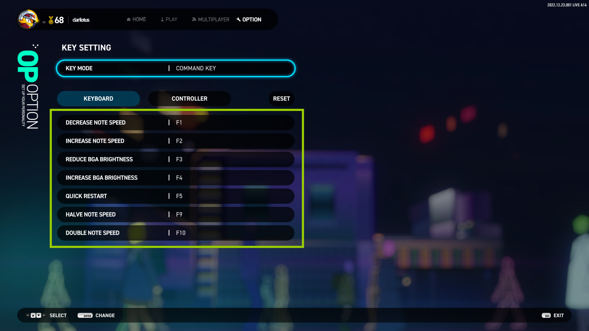
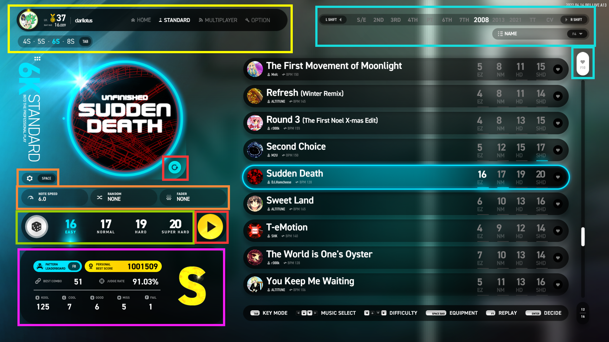
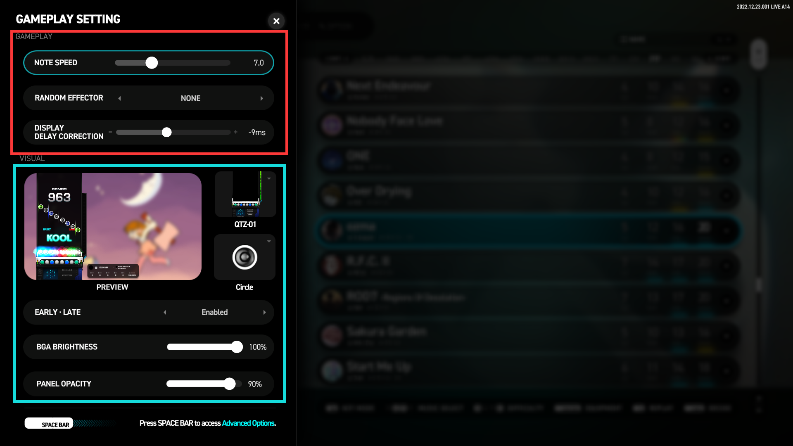

# 游戏详细指引 :id=guide-title-top

## 一、主菜单 & 各模式的介绍 :id=guide-menumode

### 1. BASIC 自由演奏：入门 :id=guide-menumode-ba
> 可自由演奏 4~6键 的任何谱面，判定非常宽松，官方数据为  Kool 40ms ； 
> BASIC 模式的成绩排行榜单独统计，与 STANDARD 模式不共享 ； 
> BASIC 模式下，部分歌曲的 EZ 难度谱面比 STANDARD 模式下的要简单； 
> BASIC 模式下演奏的成绩 不会累计 Rating 值。

### 2. STANDARD 自由演奏：标准 :id=guide-menumode-std
> 可自由演奏 4~8键 的任何谱面，判定为正常判定，官方数据为 Kool 22ms； 
> 累计 Rating 值将在后文 Rating 部分中会讲解。

### 3. MULTIPLAYER 多人演奏 :id=guide-menumode-mp
> 最高支持同时`9`人游戏，可选 派对模式 (Party Mode) 或 对战模式 (Battle Mode)； 
> 相关详细在后文 MULTIPLAYER 部分中会讲解。

### 4. COURSE 组曲挑战 :id=guide-menumode-cs
> 提供多组已编组的组曲，区分 4~8键 以及混合键数的特殊类别 SP； 
> 每个组曲固定有 `4` 首歌曲，通关条件为 存活即可，演奏过程中 不可暂停； 
> 相关详细在后文 COURSE 部分中会讲解。

### 5. OPTION 系统设置 :id=guide-menumode-op
> 设置游戏各种设置，包括显示、键位、声音、系统主题等； 
> 相关详细在后文 OPTION 部分中会讲解。

### 6. LOUNGE 个人中心 :id=guide-menumode-lg
> 展示个人`演奏数据仪表板`、`总得分和 Rating 的排行榜`，以及`观赏歌曲动画 (BGA)`； 
> 相关详细在后文 LOUNGE 部分中会讲解。

## 二、OPTION 系统设置 :id=guide-options

### 1. DISPLAY 显示设置 :id=guide-options-display

#### GRAPHICS QUALITY 图像质量
- LOW **低质量**：少部分动画特效以降低 GPU 资源的占用，背景动画将以静态图片展示；
- NORMAL **标准质量**：显示所有动画特效。

#### DISPLAY MODE 显示模式
- Fullscreen **独占全屏显示**：直播姬等屏幕置顶的程序将不可见；
- Fullscreen Window **无边框窗口**：将画面拉伸成全屏显示，本质上还是窗口化；
- Windowed **普通窗口显示**：带标题栏和边框，可根据分辨率缩放。

#### RESOLUTION 分辨率
- 调整全局画面的大小。

#### FRAME RATE LIMIT 限制渲染帧率

- V-SYNC **垂直同步**：降与显示器刷新率绝对同步，但会显著增加延迟！
- NO LIMIT **不限制帧率**：交由操作系统调度合理的 GPU 资源，但一般会占用较大。
> 注意： 
> **设置越高越流畅，但越消耗 GPU 性能！** 
> **开启 Nvidia Reflex 后，V-SYNC 设置将无效化**。

#### LOW LATENCY MODE 低延迟模式			

- Disable：不启用低延迟选项，系统默认选项；
- Enable： 启用常规低延迟，所有显卡都支持的低延迟选项，能有效降低显示延迟；
- HIGH：大幅度降低帧延迟，大部分显卡都支持的低延迟选项，能进一步降低显示延迟；
- Nvidia Reflex：启用英伟达的降低延迟技术，**需要特定显卡才支持**，**GTX960 以上**；
- Nvidia Reflex + Boost：启用英伟达的增强降低延迟技术，**需要特定显卡才支持**，**并消耗更多的 GPU 资源**，**RTX3050 以上**。

### 2. AUDIO 音频设置 :id=guide-options-audio

#### AUDIO OUTPUT DEVICE 音频输出设备
- 可以指定音频具体使用哪个设备输出，耳机或音箱等；
- 在 OPTION 界面中按 `F4` 以扫描 ASIO 音频设备。

#### SYNC SAMPLING RATE 同步采样率
- 是否强制让音频输出设备的采样率与游戏的同步，**修改此设置需要重启游戏才能生效**；
- Enable：强制让音频输出设备的采样率与游戏的同步；
- Disable：无需同步（默认）。

#### MASTER VOLUME 全局音量
- 游戏的总音量控制。

#### UI VOLUME 界面音效音量
- 界面音效音量控制，如按钮点击的音效音量等。

#### AUDIO BUFFER 音频缓存大小
- **缓存越大，音频质量越稳定，但是代价是增加输出延迟；**
- **缓存越小，输出延迟越低，但是爆音的几率会越高。**

#### KEY SOUND VOLUME 按键音量
- 演奏中音符的音量控制。

#### BGM VOLUME 背景音量
- 演奏中背景音乐的音量控制。

#### AUDIO IN BACKGROUND 游戏不在前台时是否播放声音
- Enable：游戏切换到后台时依然播放声音；
- Disable：游戏切换到后台时会自动静音。

### 3. GAMEPLAY 游戏操作及表现设置 :id=guide-options-game

#### KEY SETTING 按键设置
- 设置 4键 ~ 8键 每个模式下的操作键位。

#### ASSIST KEY 辅助按键设置
- 对于 5键 和 8键 模式，部分轨道是否开启辅助按键设置：
    - Enable：开启后，KEY SETTING 选项中 5键 和 8键 会出现辅助按键的设置项；
    - Disable：不使用辅助按键。

#### SYSTEM THEME 系统主题
- 更改系统 UI 主题风格。

#### REPLAY AUTO SAVE 自动保存回放记录
- 是否开启演奏完成后自动保存回放记录。

#### LANGUAGE 系统显示语言
- 目前只支持`英`、`韩`、`日`，未来会添加包括中文在内的多国语言。

#### POLLING RATE 输入敏感度设置
- 设置每秒对键盘输入的感知的敏感度，即每秒感应的次数；
- 值设置得越高，判定精度越细致，但代价是消耗 CPU 资源会增加！
- 该设置主要影响多键同时押的判定。

#### KEY SETTING+ 按键设置：进阶

- MODE：切换 **4键~8键** 各个模式以及 **命令操作** 的按键设置；
- KEYBOARD：物理键盘的映射；
- CONTROLLER：控制器（手台）的映射，如果没有连接控制器，则不可用；
- RESET：重置当前键数模式的映射为默认值；
- ASSIST KEY：对于 5键 和 8键 模式，可设置部分轨道的辅助按键：
    - 5键 : 可设置 3号轨道 (中间) 的辅助按键；
    - 8键 : 可设置 1号轨道 (最左) 和 8号轨道 (最右) 的辅助按键。		
    + **注意：需要开启上面的 "ASSIST KEY" 选项才生效！**

#### COMMAND KEY 按键设置：命令操作键

- DECREASE NOTE SPEED：演奏过程中，**减少流速** 的快捷键；
- INCREASE NOTE SPEED：演奏过程中，**增加流速** 的快捷键；
- REDUCE BGA BRIGHTNESS：演奏过程中，**降低背景动画亮度** 的快捷键；
- INCREASE BGA BRIGHTNESS：演奏过程中，**提升背景动画亮度** 的快捷键；
- QUICK RESTART：演奏过程中，**立即重开** 的快捷键；
- HALVE NOTE SPEED：演奏过程中，**将当前流速减半** 的快捷键；
- DOUBLE NOTE SPEED：演奏过程中，**将当前流速翻倍** 的快捷键；

## 二、BASIC & STANDARD 自由模式 :id=guide-bastd

### 1. 主要功能区 :id=guide-bastd-main

- 个人资料、导航栏、键数模式切换：
    - 个人资料：显示 Steam 用户名和头像、游戏等级、Rating；
    - 导航栏：可快速切换到不同功能模式，只能用鼠标操作；
    - 键数模式切换：用于切换不同的键数模式，快捷键是 `TAB`；

- 代数目录切换、歌单排列方式、显示已收藏按钮：
    - 代数目录切换：切换不同目录 (代数、DLC) 的歌单，快捷键是 `左右 SHIFT`；
    - 歌单排序方式：切换歌单歌曲的排序 (如按名称、按等级分离等)，快捷键是 `F4`；
    - 显示已收藏歌曲：仅显示已添加收藏的歌曲，快捷键是 `F10`；
        - 歌曲列表中最右方的 ♥ 按钮用于收藏或取消收藏对应歌曲。

- 参数设置、音符下落速度、轨道随机设置、视觉遮掩效果设置：
    - 参数设置面板开关：设置面板音符皮肤等参数（下文介绍），快捷键是 `SPACE`；
    - NOTE SPEED：调节音符下落速度，快捷键是 `鼠标左右键（左加右减）`；
    - RANDOM：设置多种轨道随机效果（下文介绍），快捷键是 `鼠标左右键`；

- 随机选曲、难度切换：
    - 随机选曲：随机抽选当前目录任意曲目；
    - 难度切换：手动选择档当前曲目的四个难度 (Easy、Normal、Hard、SHD)。

- 开始演奏、查看回放：
    - 黄色图标开始演奏：开始当前选中歌曲及对应谱面的演奏；
    - 蓝色图标查看回放：查看当前谱面自己演奏的回放记录列表，快捷键是 `F7`。

- 成绩数据显示区：
   - 显示当前谱面自己最佳成绩时的详细数据（以总分最高的一次）。
   - 查看排行榜：打开当前谱面的全球排行榜，快捷键是 F8。

### 2. 参数设置面板 - 简要设置面板 :id=guide-bastd-gslite

