# COURSE 课题组曲

## 主要功能区

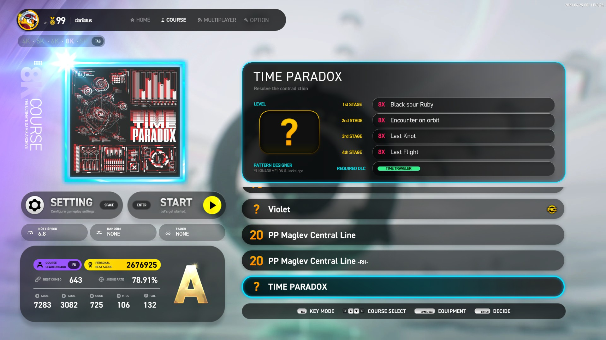

### 1. 导航栏

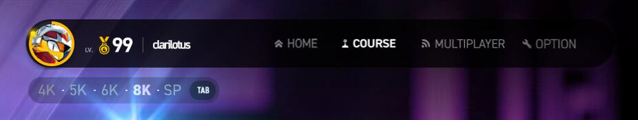

#### 个人资料

显示 **Steam 用户名和头像**、**游戏等级**。

#### 导航栏

可快速切换到不同功能模式，只能用鼠标操作，功能目录分布如下：

 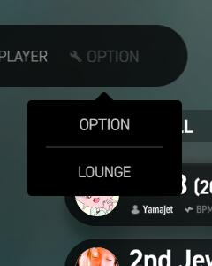

- HOME - 主菜单
- (PLAY - 演奏)
	- BASIC - 自由模式：入门
	- STANDARD - 自由模式：标准
	- COURSE - 课题组曲
- MULTIPLAY - 多人演奏
- (OTHER - 其它)
	- OPTION - 系统选项
	- LOUNGE - 数据中心

#### 键数模式切换

用于切换不同的键数模式组曲分类，快捷键是 ++tabulator++。

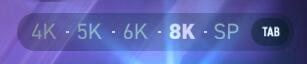

---

### 2. 组曲内容区

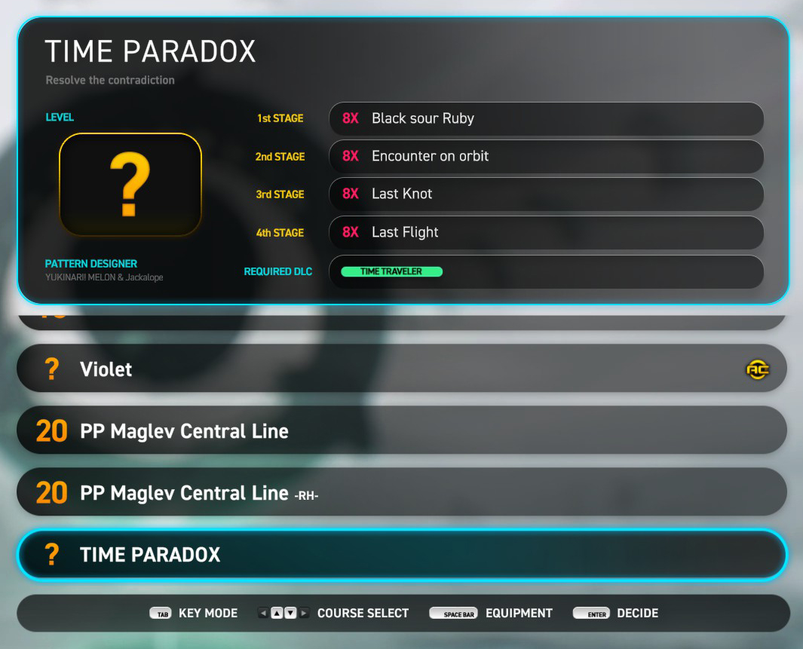

#### 组曲详情

显示当前选中课题组曲的详情，包括：

- 组曲标题

- 副标题

- 是否 AC 挑战

- 组曲等级 (LEVEL)

- 谱面设计师名称 (PATTERN DESIGNER)

- 四首歌曲的清单及其对应的键数、判定模式

- 所需 DLC (REQUIRED DLC)

#### 组曲列表

用于选择不同的课题组曲。

---

### 3. 演奏参数设置

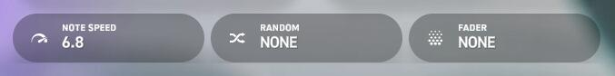

#### 参数设置面板开关

打开简要参数设置面板 (下文介绍)，快捷键是 ++spc++。

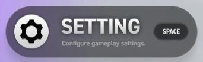

#### NOTE SPEED

调节音符下落速度，可通过 <kbd>:material-mouse: 鼠标左/右键点击</kbd> 调节。

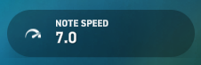

#### **RANDOM**

设置多种轨道随机效果 (下文介绍)，可通过 <kbd>:material-mouse: 鼠标左/右键点击</kbd> 调节 调节。

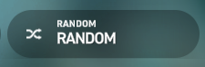

#### **FADER**

设置多种视觉遮掩效果选项 (下文介绍)，可通过点击 <kbd>:material-mouse: 鼠标左/右键点击</kbd> 调节 调节。

---

### 4. 开始挑战

开始当前选中组曲的挑战演奏。

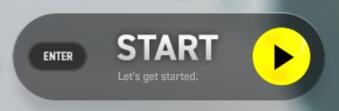

---

### 5. 成绩数据区

显示当前组曲自己最佳成绩时的详细数据（以总分最高的一次）

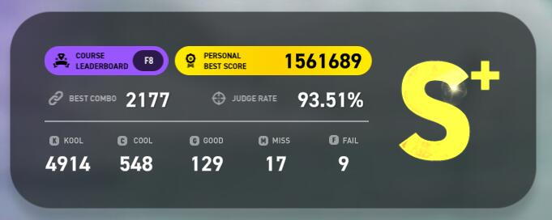

---

### 6. 排行榜

打开当前组曲的全球排行榜，快捷键是 ++f8++。

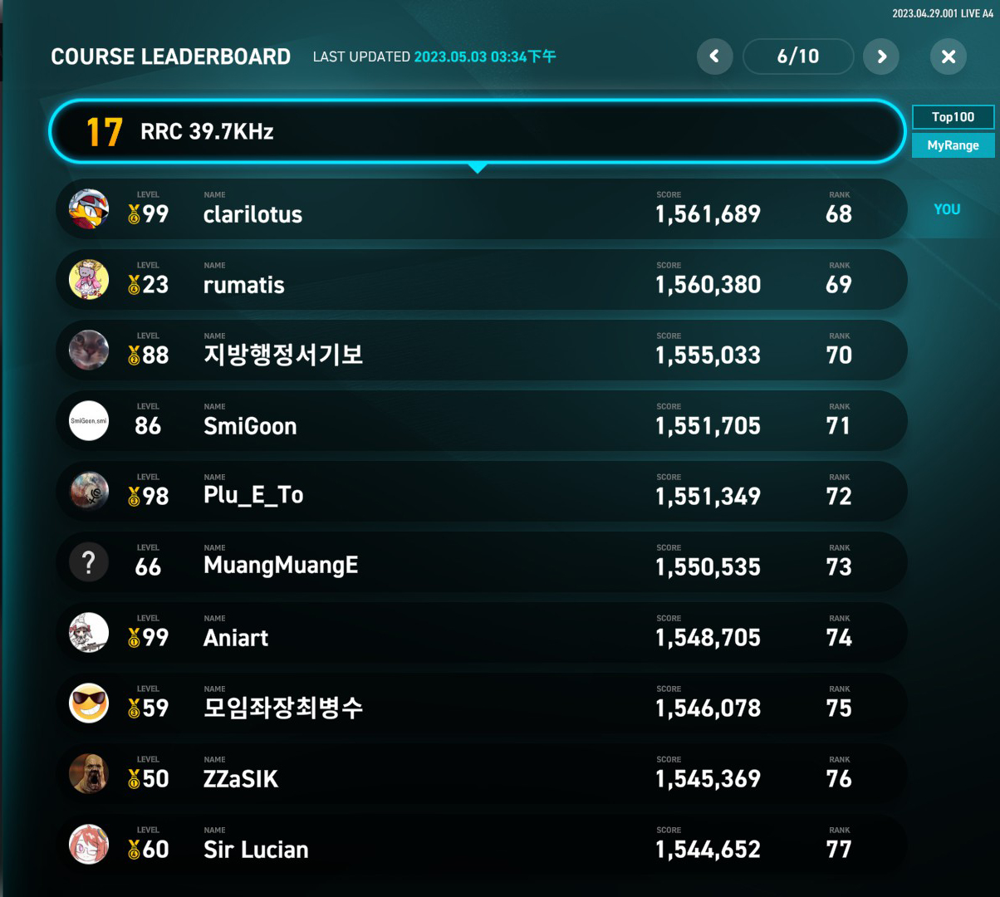

- `Top100`

	查看前 100 名以内的榜单。

- `MyRange`

	查看自己所在位置前 50、后 49 名内 100 位的榜单。

	> 举例：若当前自己排名为 101，则显示范围为 51 ~ 150。

---

## 参数设置面板

### 1. 简要设置面板

可使用快捷键 ++spc++ 以打开简要参数设置面板。

#### NOTE SPEED

调节音符下落速度。

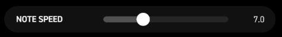

> 在演奏中通过快捷键 ++f1++、++f2++ 调节，也可通过 ++f9++、++f10++ 将当前速度减半或翻倍。

#### RANDOM EFFECTOR

轨道随机效果选项。

- `NONE`

	不使用轨道随机效果，以原谱演奏。

- `RANDOM`

	将各个轨道随机排序。

- `MIRROR`
  
	镜像，将所有轨道左右对称交换。

- `FLIP-RANDOM`

	左右两半的轨道各自随机排序，即左半边的轨道只在左半边随机排序，右半边的轨道只在右半边随机排序。

- `SUPER-RANDOM`

	将所有音符全部都打乱，不再根据原轨道位置。

- `ANTI-ROLL-RANDOM`

	智能优化谱面，**但不会记录成绩**。	

- `MIRROR-FLIP-RANDOM`
  
	镜像对称后再左右两边各自随机，即 MIRROR + FLIP-RANDOM。

    !!! tip "提示"

        **MIRROR**、**FLIP-RANDOM**、**MIRROR-FLIP-RANDOM** 用于 5键 模式时，中间的轨道不会发生变化。

#### DISPLAY DELAY CORRECTION

校正显示延迟偏差

!!! tip "提示"

    如果演奏偏差的 `LATE` 偏多，则往 `+正` 方向调节，反之 `EARLY` 偏多，则往 `-负` 方向调节。

#### PREVIEW

显示设定预览图。

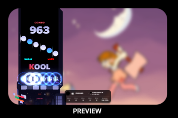

#### 演奏面板套装

更改演奏面板套装，将同时修改配套的判定字体和连击字体。

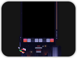

#### 演奏音符

更改演奏音符。

#### EARLY · LATE

是否显示打击偏移 EARLY / LATE 的指示。

- `Enabled`

	显示打击偏移 EARLY / LATE 的指示。

- `Disabled`

	不显示打击偏移 EARLY / LATE 的指示。

#### BGA BRIGHTNESS

调节背景动画亮度。

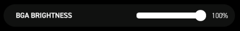

> 在演奏中通过快捷键 ++f3++、++f4++ 调节，幅度为 10%。

#### PANEL OPACITY

调节演奏面板背景透明度。

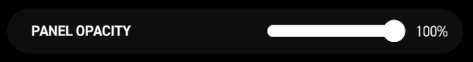

#### Advanced Options

再次按下 `Space` 打开高级参数设置面板。

---

### 2. 高级参数设置 - PLAY

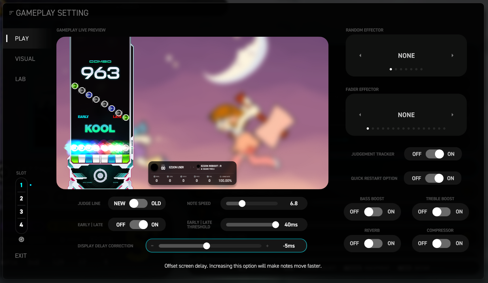

#### 分类切换标签

切换 PLAY、VISUAL、LAB、LIVE CTRL 四个分类的参数设置。

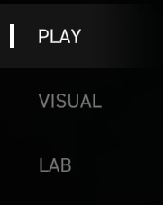

#### JUDGE LINE

判定线位置。

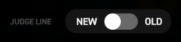

- `NEW`
  
	判定线位置靠上。

- `OLD`
  
	判定线位置靠下。

#### EARLY | LATE

判定偏移显示开关。(与 [上文](#early-%C2%B7-late) 一致)

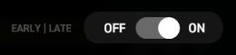

- `ON`

	显示打击偏移 EARLY / LATE 的指示。

- `OFF`

	不显示打击偏移 EARLY / LATE 的指示。

#### NOTE SPEED

调节音符下落速度。(与 [上文](#note-speed-1) 一致)

#### EARLY | LATE THRESHOLD

调节打击偏移 EARLY / LATE 的显示精度范围。

!!! tip "用途"

    1. 实际打击偏移超过此选项中的时间精度设置才显示；
   
    2. `BASIC` 模式可调最大值为 `40 ms`；
        
    3. `STANDARD`、`COURSE` 模式可调最大值为 `22 ms`。

#### DISPLAY DELAY CORRECTION

校正显示延迟偏差。(与 [上文](#display-delay-correction) 一致)

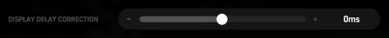

#### RANDOM EFFECT

轨道随机效果选项，见 [上文](#random-effector)。

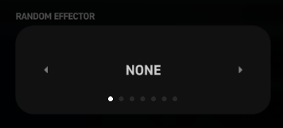

#### FADER EFFECTOR

视觉遮掩效果选项。

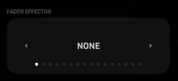

- `NONE`
  
	不使用视觉遮掩效果。

- `FADE IN 1~10`
  
	1 到 10 档厚度的 **上隐**。
  
- `LEGACY FADE IN`

	旧式 **上隐**，从上到下渐变出现。

- `FADE OUT 1~3`

	1 到 3 档厚度的 **下隐**。

- `LEGACY FADE OUT`
  
	旧式 **下隐**，从上到下渐变消失。

#### JUDGEMENT TRACKER

演奏中是否显示判定数据详细面板。

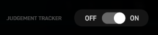

- `ON`

	演奏中显示判定数据详细面板。

- `OFF`

	演奏中不显示判定数据详细面板。

#### QUICK RESTART OPTION

是否在游戏演奏中允许按快捷键 ++f5++ 快速重新开始演奏。

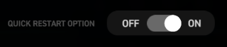

- `ON`

	允许在游戏演奏中按快捷键 ++f5++ 快速重新开始演奏。

- `OFF`

	不允许在游戏演奏中按快捷键 ++f5++ 快速重新开始演奏。

#### BASS BOOST

低音增强效果。

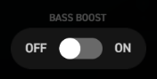

- `ON`

	开启低音增强效果。

- `OFF`

	不使用低音增强效果。

#### TREBLE BOOST

高音增强效果。

- `ON`

	开启高音增强效果。

- `OFF`

	不使用高音增强效果。

#### REVERB

左右声道混响效果。

- `ON`

	开启混响效果。

- `OFF`

	不使用混响效果。

	> 将左右声道混合，若遇到声音异常问题时，则不建议开启。

#### COMPRESSOR

音频动态缩放效果。

- `ON`

	开启音频动态缩放效果。

- `OFF`

	不使用音频动态缩放效果。

	> 动态将过低的音量提升，将过大的音量降低，若遇到声音异常问题时，则不建议开启。

---

### 3. 高级参数设置 - VISUAL

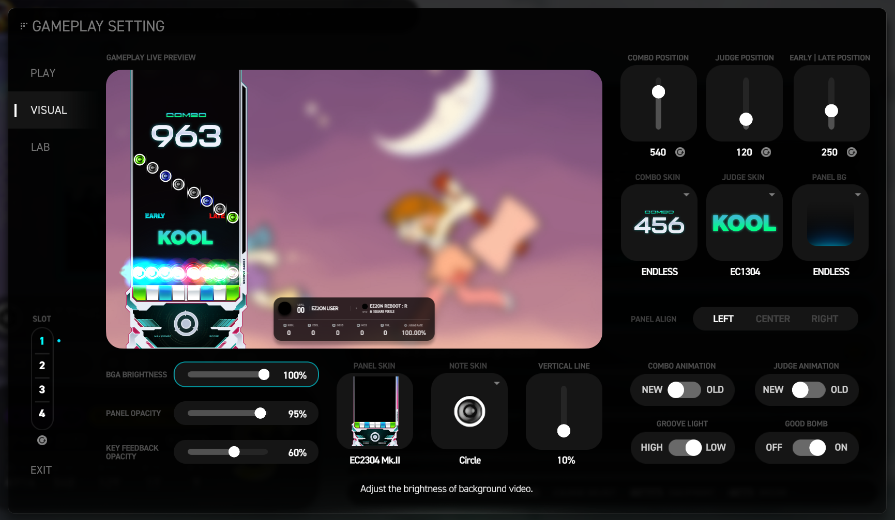

#### 分类切换标签

切换 PLAY、VISUAL、LAB、LIVE CTRL 四个分类的参数设置。

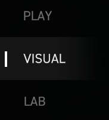

#### BGA BRIGHTNESS

背景动画亮度调节。

#### PANEL OPACITY

面板背景透明度调节。

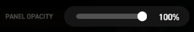

#### KEY FEEDBACK OPACITY

轨道打击光亮度调节。

> 即按下演奏按键时，演奏面板里对应轨道的光柱。

#### PANEL SKIN

更换演奏面板皮肤，所有可用演奏面板可见 [演奏面板]() 部分。 

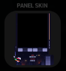

#### NOTE SKIN

更换演奏音符皮肤，所有可用演奏音符可见 [演奏音符]() 部分。 

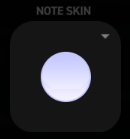

#### VETICAL LINE

调节音符辅助线长度，即音符两侧的辅助线。

#### COMBO POSITION

调节连击字体在面板中的垂直位置。

#### JUDGE POSITION

调节判定字体在面板中的垂直位置。

#### EARLY | LATE POSITION

调节EARLY、LATE 指示在面板中的垂直位置。

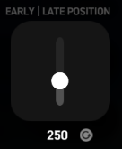

#### COMBO SKIN

更换连击字体样式，所有可用连击字体可见 [连击字体]() 部分。 

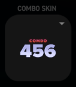

#### JUDGE SKIN

更换判定字体样式，所有可用判定字体可见 [判定字体]() 部分。 

#### PANEL BG

更换判定面板背景底图，所有可用面板背景可见 [面板背景]() 部分。 

#### PANEL ALIGN

更改演奏面板位置。

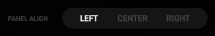

- `LEFT`

	演奏面板居左。

- `CENTER`

	演奏面板居中。

- `RIGHT`

	演奏面板居右。

#### COMBO ANIMATION

更改连击字体的动画特效形式。

- `NEW`

	较柔和。

- `OLD`

	较激烈。

#### JUDGE ANIMATION

更改判定字体的动画特效形式。

- `NEW`

	较柔和。

- `OLD`

	较激烈。

#### GROOVE LIGHT

更改能量槽闪动灯效的形式。

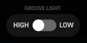

- `HIGH`

	较明亮。

- `LOW`

	较暗淡。

#### GOOD BOMB

打击出现 GOOD 判定时是否也显示爆炸特效。

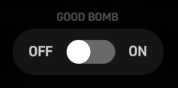

- `ON`

	打击出现 GOOD 判定时显示爆炸特效。

- `OFF`

	打击出现 GOOD 判定时不显示爆炸特效。

---

### 4. 高级参数设置 - LAB

用来存放用于实验性功能。

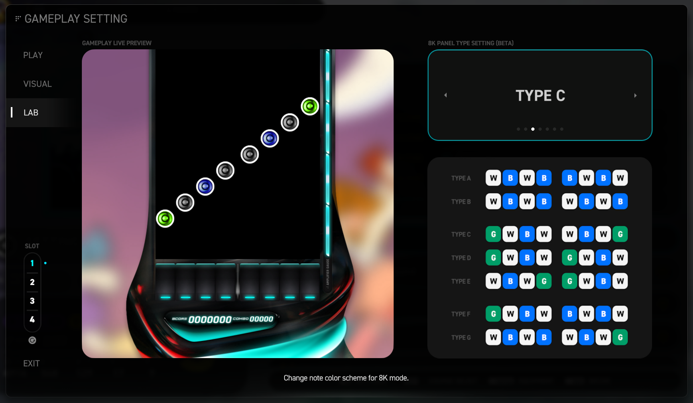

#### 分类切换标签

切换 PLAY、VISUAL、LAB、LIVE CTRL 四个分类的参数设置。

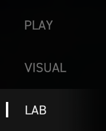

#### 8K PANEL TYPE SETTING

`8键` 模式各轨道音符配色设置，可更改 8键 模式个轨道音符的配色方案。

- `TYPE A` ~ `TYPE G`

	分别是七种可选的配色预设。

	> 暂不支持自定义配色，也不支持 4键、5键、6键 模式的配色更改。

---

### 5. SLOT 预置档位功能

提供四个预置档位，用于记录 PLAY、VISUAL、LAB、MULTIPLAY 这四组参数设置；

可通过点击下方的重置按钮将四个预设档位的所有参数重制为默认值。

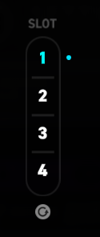
