# BASIC & STANDARD 自由模式

## 主要功能区

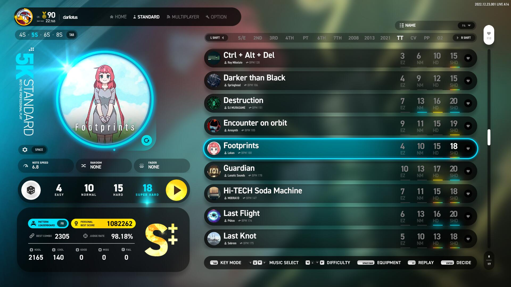

### 1. 导航栏

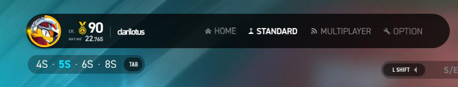

#### 个人资料

显示 **Steam 用户名和头像**、**游戏等级**、**Rating**。

#### 导航栏

可快速切换到不同功能模式，只能用鼠标操作，功能目录分布如下：

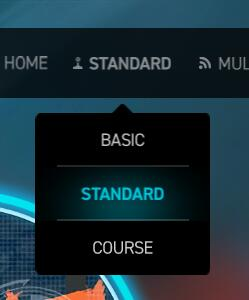 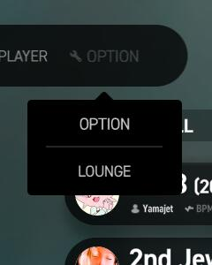

- HOME - 主菜单
- (PLAY - 演奏)
	- BASIC - 自由模式：入门
	- STANDARD - 自由模式：标准
	- COURSE - 课题组曲
- MULTIPLAY - 多人演奏
- (OTHER - 其它)
	- OPTION - 系统选项
	- LOUNGE - 数据中心

#### 键数模式切换

用于切换不同的键数模式，快捷键是 ++tabulator++。

---

### 2. 目录栏

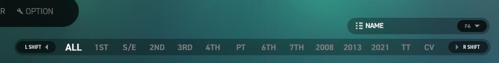

#### 代数目录切换

切换不同目录 (代数、DLC) 的歌单，快捷键是 ++lshift++、++rshift++。

#### 歌单排序方式

切换歌单歌曲的排序 (如按名称、按等级分离等)，快捷键是 ++f4++，可选排序方式如下：

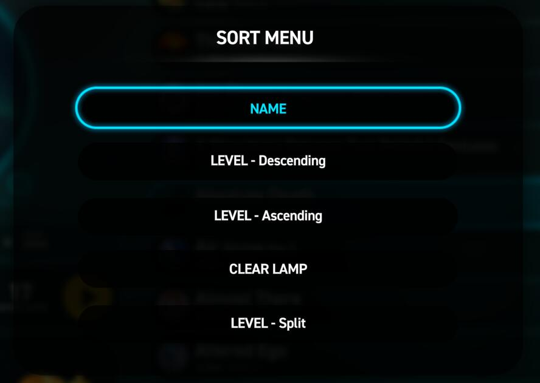

- `NAME`

    按名称排序。

- `LEVEL - Descending`

    按等级排序 (由高到低)。

- `LEVEL - Ascending`

    按等级排序 (由低到高)。

- `CLEAR LAMP`

    按通关灯级别排序 (由低到高：未演奏 - Fail - Clear - No Miss - All Cool)。

- `LEVEL - Split`

	按等级排序 (拆分成单独的谱面，由低到高)。

#### 显示已收藏歌曲

仅显示已添加收藏的歌曲，快捷键是 ++f10++。

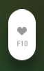

!!! tip "提示"

	歌曲列表中最右方的 ++"♥"++ 按钮用于收藏或取消收藏对应歌曲。 

---

### 3. 演奏参数设置

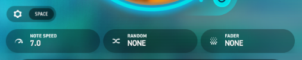

#### 参数设置面板开关

打开简要参数设置面板 (下文介绍)，快捷键是 ++spc++。

#### NOTE SPEED

调节音符下落速度，可通过 <kbd>:material-mouse: 鼠标左/右键点击</kbd> 调节。

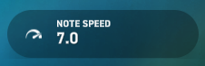

#### **RANDOM**

设置多种轨道随机效果 (下文介绍)，可通过 <kbd>:material-mouse: 鼠标左/右键点击</kbd> 调节 调节。

#### **FADER**

设置多种视觉遮掩效果选项 (下文介绍)，可通过点击 <kbd>:material-mouse: 鼠标左/右键点击</kbd> 调节 调节。

---

### 4. 难度选择栏

#### 随机选曲

随机抽选当前目录任意曲目。

#### 难度切换

手动选择档当前曲目的四个难度 (Easy、Normal、Hard、SHD)。

#### 开始演奏

开始当前选中歌曲及对应谱面的演奏。

---

### 5. 演奏记录回放

查看并管理当前谱面的演奏回放记录列表，快捷键是 ++f7++。

#### 回放列表

::: tip 注意
需要在 OPTION 中打开 **REPLAY AUTO SAVE** 才会在演奏结束的结算界面中自动保存回放记录。
:::

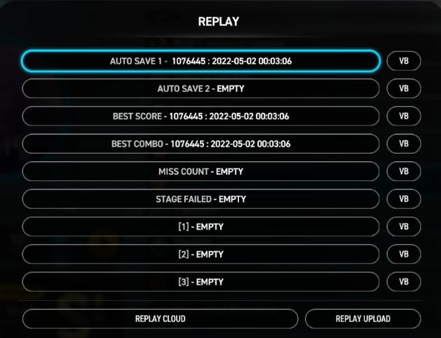

- `AUTOSAVE 1`、`AUTOSAVE 2`

	存放最近两次演奏的回放记录。

- `BEST SCORE`

	存放得分最高的一次演奏的回放记录。

- `BEST COMBO`

	存放最大连击最高的一次演奏的回放记录。

  	!!! tip "提示"

		BEST COMBO 的匹配逻辑如下：

		1. 若没有达成 `NO MISS`，则记录 MAX COMBO 最高的一次演奏；
   
		2. 若达成了 `NO MISS` 但没有达成 `ALL COOL`，则记录达成 `NO MISS` 前提下得分最高的一次演奏；  

		3. 若达成了 `ALL COOL`，则记录达成 `ALL COOL` 前提下得分最高的一次演奏；
   
		4. 若达成了 `ALL COOL` 但得分没有仅 `NO MISS` 时高的情况下，优先记录 `ALL COOL` 的演奏。

- `MISS COUNT`

	存放 MISS + FAIL 数量最低的一次演奏的回放记录。

	!!! tip "提示"
		
		至少需要有一次没有达成 `NO MISS` 的演奏才会记录。

- `STAGE FAILED`

	存放最近一次演奏失败的回放记录。

	!!! tip "提示"

		演奏失败时需要选择进入结算界面才会记录。

- `[1]`、`[2]`、`[3]`

	三个手动保存的回放记录挡位。

	!!! tip "提示"
		
		在结算界面中按 ++f7++ 以选择该三个手动挡位用以保存当前回放记录。

- `VB` (Virtual Battle)

	开始与当前选中的回访记录进行模拟对战。

	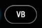

#### REPLAY CLOUD

查看当前谱面在服务器中所有玩家已上传的云端演奏回放记录。

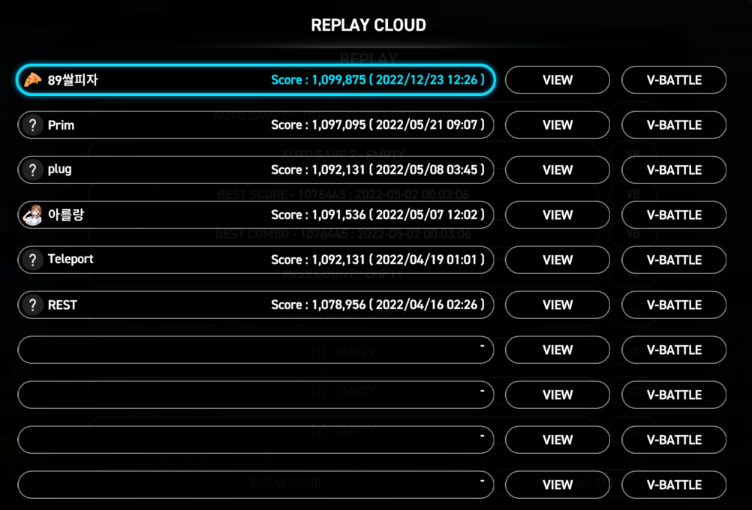

- `VIEW`

	开始播放当前选中的云端回放记录。

- `V-Battle`

	开始与当前选中的回放记录进行模拟对战。

#### REPLAY UPLOAD

将自己当前谱面的演奏谱面上传至云端服务器。

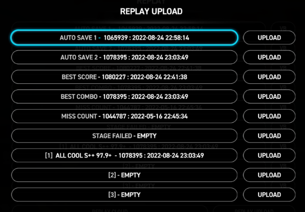

!!! warning "注意"

	注意：只有当前谱面存在最高得分在排行榜前 `300` 名以内的回放记录才允许上传！

- `UPLOAD`

	将当前选中的回放记录上传至云端。

	!!! note "另注"
	
		暂未确定已上传的回放记录若得分被踢出前 300 名后是否会被删除。

---

### 6. 成绩数据区

显示当前谱面自己最佳成绩时的详细数据（以总分最高的一次）

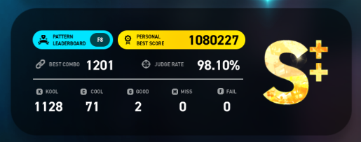

---

### 7. 排行榜

打开当前谱面的全球排行榜，快捷键是 ++f8++。

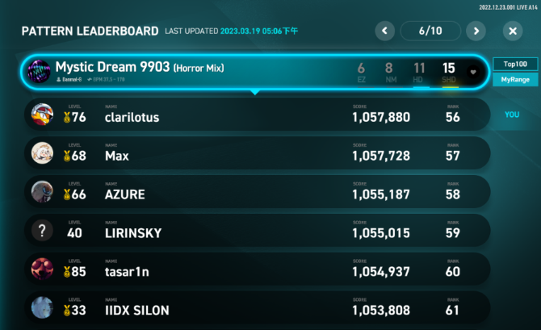

- `Top100`

	查看前 100 名以内的榜单。

- `MyRange`

	查看自己所在位置前 50、后 49 名内 100 位的榜单。

	> 举例：若当前自己排名为 101，则显示范围为 51 ~ 150。

---

## 参数设置面板

### 1. 简要设置面板

可使用快捷键 ++spc++ 以打开简要参数设置面板。

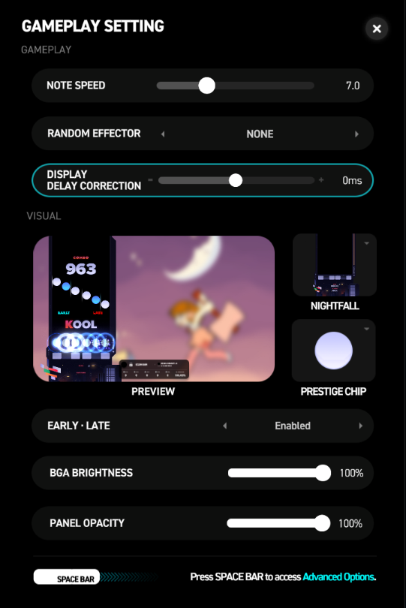

#### NOTE SPEED

调节音符下落速度。

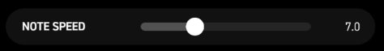

> 在演奏中通过快捷键 ++f1++、++f2++ 调节，也可通过 ++f9++、++f10++ 将当前速度减半或翻倍。

#### RANDOM EFFECTOR

轨道随机效果选项。

- `NONE`

	不使用轨道随机效果，以原谱演奏。

- `RANDOM`

	将各个轨道随机排序。

- `MIRROR`
  
	镜像，将所有轨道左右对称交换。

- `FLIP-RANDOM`

	左右两半的轨道各自随机排序，即左半边的轨道只在左半边随机排序，右半边的轨道只在右半边随机排序。

- `SUPER-RANDOM`

	将所有音符全部都打乱，不再根据原轨道位置。

- `ANTI-ROLL-RANDOM`

	智能优化谱面，**但不会记录成绩**。	

- `MIRROR-FLIP-RANDOM`
  
	镜像对称后再左右两边各自随机，即 MIRROR + FLIP-RANDOM。

    !!! tip "提示"

        **MIRROR**、**FLIP-RANDOM**、**MIRROR-FLIP-RANDOM** 用于 5键 模式时，中间的轨道不会发生变化。

#### DISPLAY DELAY CORRECTION

校正显示延迟偏差

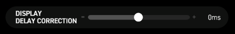

!!! tip "提示"

    如果演奏偏差的 `LATE` 偏多，则往 `+正` 方向调节，反之 `EARLY` 偏多，则往 `-负` 方向调节。

#### PREVIEW

显示设定预览图。

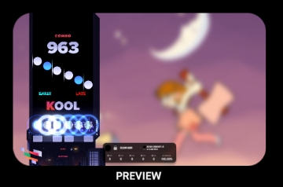

#### 演奏面板套装

更改演奏面板套装，将同时修改配套的判定字体和连击字体。

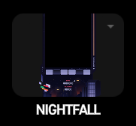

#### 演奏音符

更改演奏音符。

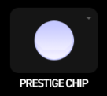

#### EARLY · LATE

是否显示打击偏移 EARLY / LATE 的指示。

- `Enabled`

	显示打击偏移 EARLY / LATE 的指示。

- `Disabled`

	不显示打击偏移 EARLY / LATE 的指示。

#### BGA BRIGHTNESS

调节背景动画亮度。

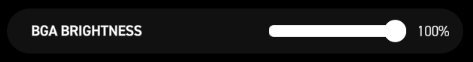

> 在演奏中通过快捷键 ++f3++、++f4++ 调节，幅度为 10%。

#### PANEL OPACITY

调节演奏面板背景透明度。

#### Advanced Options

再次按下 `Space` 打开高级参数设置面板。

---

### 2. 高级参数设置 - PLAY

#### 分类切换标签

切换 PLAY、VISUAL、LAB、LIVE CTRL 四个分类的参数设置。

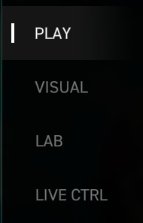

#### JUDGE LINE

判定线位置。

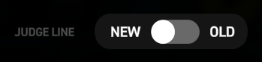

- `NEW`
  
	判定线位置靠上。

- `OLD`
  
	判定线位置靠下。

#### EARLY | LATE

判定偏移显示开关。(与 [上文](#early-%C2%B7-late) 一致)

- `ON`

	显示打击偏移 EARLY / LATE 的指示。

- `OFF`

	不显示打击偏移 EARLY / LATE 的指示。

#### NOTE SPEED

调节音符下落速度。(与 [上文](#note-speed-1) 一致)

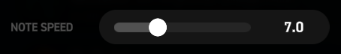

#### EARLY | LATE THRESHOLD

调节打击偏移 EARLY / LATE 的显示精度范围。

!!! tip "用途"

    1. 实际打击偏移超过此选项中的时间精度设置才显示；
   
    2. `BASIC` 模式可调最大值为 `40 ms`；
        
    3. `STANDARD`、`COURSE` 模式可调最大值为 `22 ms`。

#### DISPLAY DELAY CORRECTION

校正显示延迟偏差。(与 [上文](#display-delay-correction) 一致)

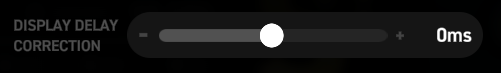

#### RANDOM EFFECT

轨道随机效果选项，见 [上文](#random-effector)。

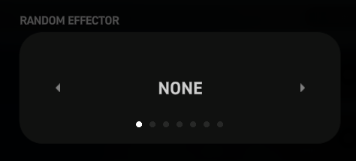

#### FADER EFFECTOR

视觉遮掩效果选项。

- `NONE`
  
	不使用视觉遮掩效果。

- `FADE IN 1~10`
  
	1 到 10 档厚度的 **上隐**。
  
- `LEGACY FADE IN`

	旧式 **上隐**，从上到下渐变出现。

- `FADE OUT 1~3`

	1 到 3 档厚度的 **下隐**。

- `LEGACY FADE OUT`
  
	旧式 **下隐**，从上到下渐变消失。

#### JUDGEMENT TRACKER

演奏中是否显示判定数据详细面板。

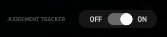

- `ON`

	演奏中显示判定数据详细面板。

- `OFF`

	演奏中不显示判定数据详细面板。

#### QUICK RESTART OPTION

是否在游戏演奏中允许按快捷键 ++f5++ 快速重新开始演奏。

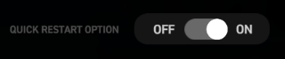

- `ON`

	允许在游戏演奏中按快捷键 ++f5++ 快速重新开始演奏。

- `OFF`

	不允许在游戏演奏中按快捷键 ++f5++ 快速重新开始演奏。

#### BASS BOOST

低音增强效果。

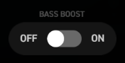

- `ON`

	开启低音增强效果。

- `OFF`

	不使用低音增强效果。

#### TREBLE BOOST

高音增强效果。

- `ON`

	开启高音增强效果。

- `OFF`

	不使用高音增强效果。

#### REVERB

左右声道混响效果。

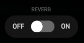

- `ON`

	开启混响效果。

- `OFF`

	不使用混响效果。

	> 将左右声道混合，若遇到声音异常问题时，则不建议开启。

#### COMPRESSOR

音频动态缩放效果。

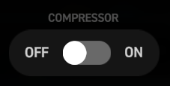

- `ON`

	开启音频动态缩放效果。

- `OFF`

	不使用音频动态缩放效果。

	> 动态将过低的音量提升，将过大的音量降低，若遇到声音异常问题时，则不建议开启。

---

### 3. 高级参数设置 - VISUAL

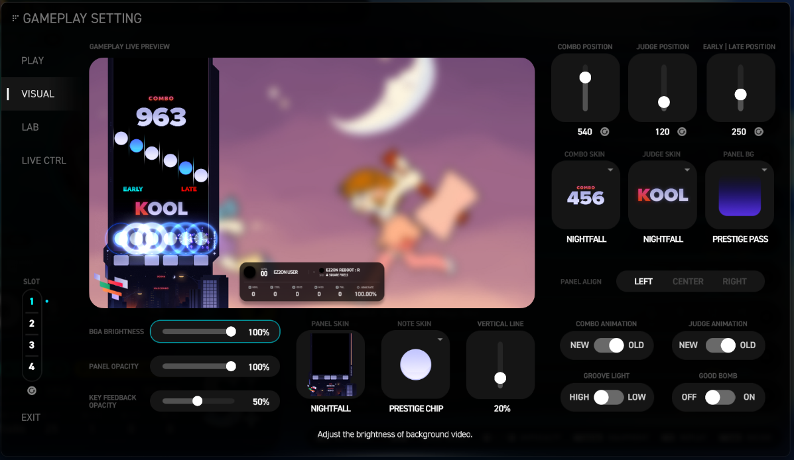

#### 分类切换标签

切换 PLAY、VISUAL、LAB、LIVE CTRL 四个分类的参数设置。

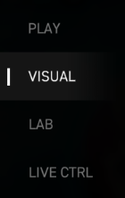

#### BGA BRIGHTNESS

背景动画亮度调节。

#### PANEL OPACITY

面板背景透明度调节。

#### KEY FEEDBACK OPACITY

轨道打击光亮度调节。

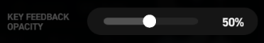

> 即按下演奏按键时，演奏面板里对应轨道的光柱。

#### PANEL SKIN

更换演奏面板皮肤，所有可用演奏面板可见 [演奏面板]() 部分。 

#### NOTE SKIN

更换演奏音符皮肤，所有可用演奏音符可见 [演奏音符]() 部分。 

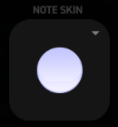

#### VETICAL LINE

调节音符辅助线长度，即音符两侧的辅助线。

#### COMBO POSITION

调节连击字体在面板中的垂直位置。

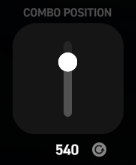

#### JUDGE POSITION

调节判定字体在面板中的垂直位置。

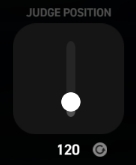

#### EARLY | LATE POSITION

调节EARLY、LATE 指示在面板中的垂直位置。

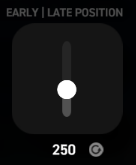

#### COMBO SKIN

更换连击字体样式，所有可用连击字体可见 [连击字体]() 部分。 

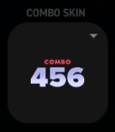

#### JUDGE SKIN

更换判定字体样式，所有可用判定字体可见 [判定字体]() 部分。 

#### PANEL BG

更换判定面板背景底图，所有可用面板背景可见 [面板背景]() 部分。 

#### PANEL ALIGN

更改演奏面板位置。

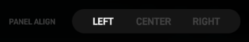

- `LEFT`

	演奏面板居左。

- `CENTER`

	演奏面板居中。

- `RIGHT`

	演奏面板居右。

#### COMBO ANIMATION

更改连击字体的动画特效形式。

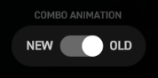

- `NEW`

	较柔和。

- `OLD`

	较激烈。

#### JUDGE ANIMATION

更改判定字体的动画特效形式。

- `NEW`

	较柔和。

- `OLD`

	较激烈。

#### GROOVE LIGHT

更改能量槽闪动灯效的形式。

- `HIGH`

	较明亮。

- `LOW`

	较暗淡。

#### GOOD BOMB

打击出现 GOOD 判定时是否也显示爆炸特效。

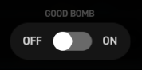

- `ON`

	打击出现 GOOD 判定时显示爆炸特效。

- `OFF`

	打击出现 GOOD 判定时不显示爆炸特效。

---

### 4. 高级参数设置 - LAB

用来存放用于实验性功能。

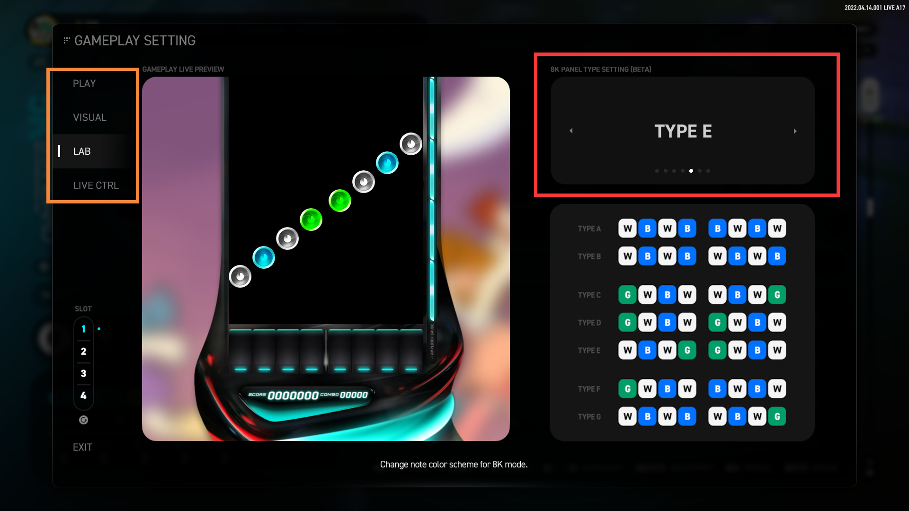

#### 分类切换标签

切换 PLAY、VISUAL、LAB、LIVE CTRL 四个分类的参数设置。

#### 8K PANEL TYPE SETTING

`8键` 模式各轨道音符配色设置，可更改 8键 模式个轨道音符的配色方案。

- `TYPE A` ~ `TYPE G`

	分别是七种可选的配色预设。

	> 暂不支持自定义配色，也不支持 4键、5键、6键 模式的配色更改。

---

### 5. 高级参数设置 - LIVE CTRL

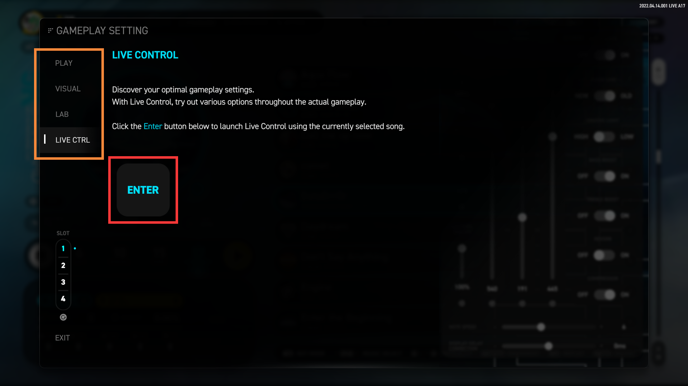

该功能用于进入实时调试演奏模式，让玩家调节并测试上文中的所有参数选项的效果。

> 在 LIVE CTRL 模式下的演奏结果 **不会记录成绩**，也 **不会扣能量值**。

#### 分类切换标签

切换 PLAY、VISUAL、LAB、LIVE CTRL 四个分类的参数设置。

#### ENTER

开始当前选中谱面的调试模式演奏	

#### 显示测试延迟校准区

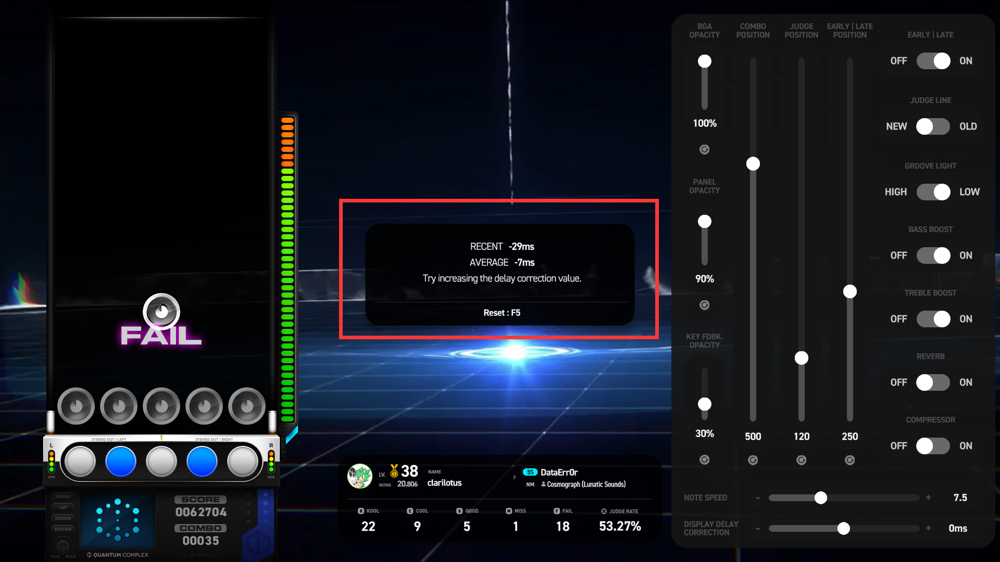

> 以下显示的数值，**-负** 为 **LATE** 偏多，**+正** 为 **EARLY** 偏多；

- `RECENT` : 上一个音符击中的偏移值

- `AVERAGE` : 平均偏移值

	!!! tip "提示"

		如果演奏偏差的 `LATE` 偏多，则往 `+正` 方向调节，反之 `EARLY` 偏多，则往 `-负` 方向调节；

		可按快捷键 ++f5++ 重置 RECENT 和 AVERAGE 的值。

---

### 6. SLOT 预置档位功能

提供四个预置档位，用于记录 PLAY、VISUAL、LAB、MULTIPLAY 这四组参数设置；

可通过点击下方的重置按钮将四个预设档位的所有参数重制为默认值。

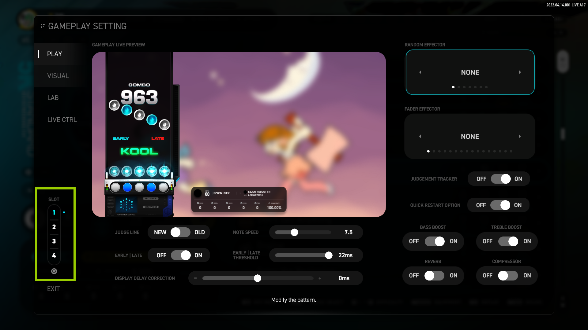

