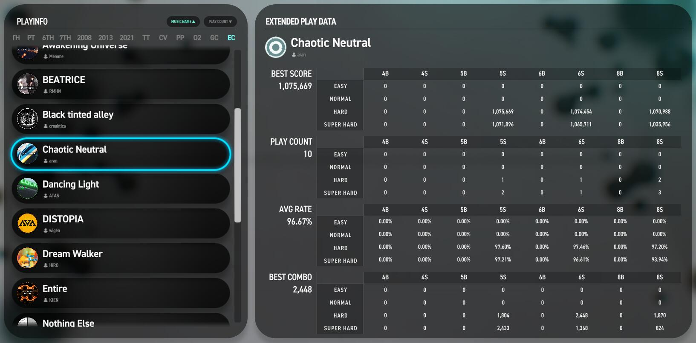

# LOUNGE 个人中心

展示个人 `演奏数据仪表板`、`总得分和 Rating 的排行榜`，以及 `观赏歌曲动画 (BGA)`。

可通过快捷键 ++tabulator++ 切换 `PROFILE`、`PLAYINFO`、`RECENT`、`RANKING`、`MUSIC VIDEO` 分类标签页。

---

## PROFILE

个人数据仪表板

### PLAYER INFO

玩家个人数据

#### 基础信息

显示个人等级及 Steam 用户名。

#### RATING

显示 4S、5S、6S、8S 的个人水平评定 RATING 值。

#### TOTAL SCORED

显示所有 BASIC 及 STANDARD 模式下演奏的谱面总分之和及占比。

#### TOP PLAYED SONG

显示自己演奏次数最多的前 50 首清单，并从上到下降序排列。

点击 ++"OPEN"++ 按钮以展开更高的显示框范围。

!!! tip "提示"

    更详细的歌曲演奏次数等信息可切换至 **PLAYINFO** 分类标签查看。

---

### EXTENDED PLAYER INFO

显示图形化的玩家个人仪表数据。

#### TOTAL PLAY COUNT

显示所有 BASIC 及 STANDARD 模式下每个键数模式的演奏总次数。

#### BATTLE DATA

显示在 MULTIPLAY 多人演奏时，**PARTY MODE (派对模式)** 的总演奏次数及 **BATTLE MODE (对战模式)** 的获胜次数。

#### TOTAL AVERAGE RATE

显示自己的个人平均演奏准确率 (不包含 COURSE 课程组曲中的记录)

#### RANK PERCENTAGE

以环形图的形式显示 STANDARD 和 BASIC 模式各自不同演奏评级 (从 E 到 S+++) 的占比率。

#### KEY RANK PERCENTAGE

以条形图的形式显示 STANDARD 和 BASIC 模式及每个键数模式各自不同演奏评级 (从 E 到 S+++) 的占比率。

!!! tip "提示"

    仅统计已有演奏成绩的数据，为演奏过的谱面则不会统计。

---

## PLAYINFO

展示所有歌曲各自的详细演奏数据

可通过快捷键 ++lshift++、++rshift++ 切换不同目录。

可通过 ++"MUSIC NAME"++、++"PLAY COUNT"++ 切换以分别采用歌曲名、演奏次数的顺序或倒序排列。

在左侧 PLAYINFO 清单中选中某一歌曲后，在右侧的 EXTENDED PLAY DATA 会展示改歌曲的详细数据，包括：

- `BEST SCORE`
    
    歌曲的最高得分，取所有谱面中的最高得分，以及所有按键模式、难度谱面各自的最高分二维表格。

- `PLAY COUNT`

    歌曲的总演奏次数，以及所有按键模式、难度谱面各自的演奏次数二维表格。

- `AVG RATE`
    
    歌曲的平均准确率，以及所有按键模式、难度谱面各自的最高准确率二维表格。

- `BEST COMBO`
    
    歌曲的最高连击数，取所有谱面中的最高连击数，以及所有按键模式、难度谱面各自的最高连击二维表格。

---

## RECENT

显示 30 次以内的演奏数据详情，包括 COURSE 组曲。

---

## RANKING

显示 STANDARD 模式的 RATING、TOTAL SCORE 排行榜，以及 BASIC 模式的 TOTAL SCORE 排行榜。

- `RATING RANKING`

    切换至仅 STANDARD 模式下的 RATING、TOTAL 排行榜分类。

- `TOTAL RANKING`

    切换至 TOTAL SCORE 总得分排行榜分类。

- `Top100`

	查看前 100 名以内的榜单。

- `MyRange`

	查看自己所在位置前 50、后 49 名内 100 位的榜单。

	> 举例：若当前自己排名为 101，则显示范围为 51 ~ 150。

---

## MUSIC VIDEO

欣赏任意已解锁的歌曲背景动画。

可通过快捷键 ++lshift++、++rshift++ 切换不同目录。

!!! tip "提示"

    至少需要成功演奏过歌曲的任意谱面，方可解锁对应歌曲的背景动画播放。 (不包括 COURSE 组曲模式下的演奏)