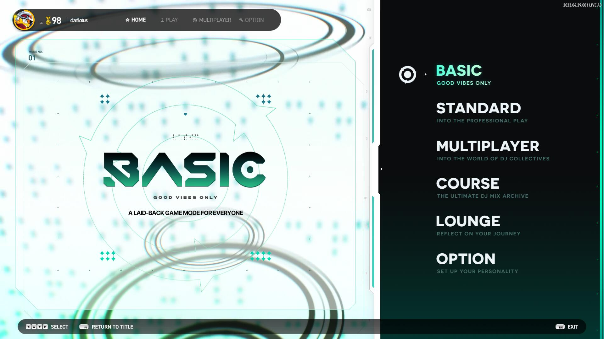

# 主菜单 & 模式介绍

## 1. BASIC 自由演奏：入门

- 可自由演奏任何谱面，判定非常宽松，官方数据为 `KOOL 40ms`；
- BASIC 模式的成绩排行榜单独统计，`与 STANDARD 模式不共享`；
- BASIC 模式下，部分歌曲的 EZ 难度谱面比 STANDARD 模式下的要简单；
- BASIC 模式下演奏的成绩 `不会累计 Rating 值`。

## 2. STANDARD 自由演奏：标准

- 可自由演奏任何谱面，判定为标准判定，官方数据为 `KOOL 22ms`、`COOL 60ms`；
<!-- - 累计 Rating 值将在后文 Rating 部分中会讲解。 -->

## 3. MULTIPLAYER 多人演奏

- 最高支持同时 `9` 人游戏，可选 `派对模式 (Party Mode)` 或 `对战模式 (Battle Mode)`；
- 相关详细在后文 MULTIPLAYER 部分中会讲解。

## 4. COURSE 课题组曲

- 提供多组已编组的组曲，区分 `4键`、`5键`、`6键`、`8键` 以及混合键数的特殊类别 `SP`；
- 每个组曲固定有 `4` 首歌曲，通关条件为 `存活即可`，演奏过程中 `不可暂停`；
- 包含 `B判定 (BASIC)`、`S判定 (STANDARD)` 以及独占的 `X判定 (EXTREME)`，视不同的组曲而异；
- 相关详细在后文 COURSE 部分中会讲解。

## 5. LOUNGE 个人中心

- 展示个人 `演奏数据仪表板`、`总得分和 Rating 的排行榜`，以及 `观赏歌曲动画 (BGA)`；
- 相关详细在后文 LOUNGE 部分中会讲解。

## 6. OPTION 系统设置

- 设置游戏各种设置，包括显示、键位、声音、系统主题等；
- 相关详细在后文 OPTION 部分中会讲解。
