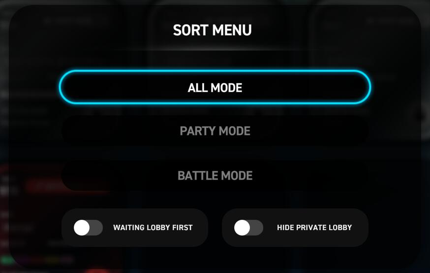

# MULTIPLAY 多人演奏

## 大厅 (房间列表)

### 1. 导航栏

#### **个人资料**

显示 **Steam 用户名和头像**、**游戏等级**、**Rating**。

#### **导航栏**

可快速切换到不同功能模式，只能用鼠标操作，功能目录分布如下：

- HOME - 主菜单
- (PLAY - 演奏)
  - BASIC - 自由模式：入门
  - STANDARD - 自由模式：标准
  - COURSE - 课题组曲
- MULTIPLAY - 多人演奏
- (OTHER - 其它)
  - OPTION - 系统选项
  - LOUNGE - 数据中心

---

### 2. 房间筛选、排列方式

切换房间的筛选显示、排序方式，快捷键是 ++f10++。

- `ALL MODE`

    显示所有房间。

- `PARTY MODE`

    仅显示排队模式的房间。

- `BATTLE MODE`

    仅显示对战模式的房间。

- `WAITING LOBBY FIRST`

    优先将等待中的闲置房间排列到前面。

- `HIDE PRIVATE LOBBY`

    隐藏需要密码的私密房间，仅显示公开的房间。

---

### 3. 房间列表

点击房间方块，可进入对应的房间，如果是私密房间，则需要输入正确的密码才可进入。

!!! tip "提示"

    对于当前正在演奏中的房间，如果房间未满人数上限，且输入了正确的密码，也可以直接进入房间，以旁观的方式查看当前正在演奏的歌曲，待其它成员都演奏结束后，将自动进入房间。

---

- `NAME`
  
    房间名称。

- `HOSTED BY`
  
    当前房间房主玩家的 id。

- 房间模式

    显示当前房间的演奏模式，目前可选两种模式 **PARTY MODE (派对模式)**、**BATTLE MODE (对战模式)**。

    - `PARTY MODE`

        派对模式，由房主选择歌曲，其它玩家各自选择自己想要演奏的按键模式及难度谱面，方块颜色为蓝绿色。
  
    - `BATTLE MODE`

        对战模式，歌曲、按键模式及难度谱面均由房主决定，以最终得分为竞技目标，方块颜色为红色，且会显示当前演奏的判定模式为 **BASIC** 或 **STANDARD**。

- 房主拥有的 DLC 表示
  
    显示当前房主玩家所有拥有的 DLC。

- 房间人数显示
  
    显示当前房间人数及房主设定的最大人数。

- 房间状态

    显示当前房间人数、房主设定的最大人数，以及当前游戏状态。

    - `WAITING`
  
        待机中的房间，且房间方块以彩色显示 (具体颜色视房间模式而定)。
        
    - `IN-GAME`
    
        演奏中的房间，且房间方块以灰色显示。
        
- 当前歌曲

    显示当前房主选中或正在演奏中的歌曲名称。

- 房间私密性显示

    方块右下角显示房间为公开房间或私密房间。

---

### 4. QUICK START 快速加入

快速加入正在等待且尚未满人数上限的公开房间。

---

### 5. CREATE ROOM 创建房间

创建一个多人房间。

- `ROOM NAME`

    房间名称。

- `PASSWORD`

    房间密码。

    !!! tip "提示"

        输入了密码后，"ROOM TYPE" 房间类型将会自动设置为 "PRIVATE" 私密房间。

- `MAX PLAYER`

    设置房间的人员上限，可设置 **2 ~ 9** 人。

- `ROOM TYPE`

    房间类型：

    - `PUBLIC`
  
        公开房间，允许所有人加入。
  
    - `PRIVATE`

        私密房间，其它玩家需要输入正确的密码才可加入。

- 房间模式：

    设置房间的演奏模式，目前可选两种模式 **PARTY MODE (派对模式)**、**BATTLE MODE (对战模式)**，可通过快捷键 ++shift++ 切换。

    - `PARTY MODE`

        派对模式，由房主选择歌曲，其它玩家各自选择自己想要演奏的按键模式及难度谱面。
  
    - `BATTLE MODE`

        对战模式，歌曲、按键模式及难度谱面均由房主决定，以最终得分为竞技目标。

---

## 房间主要功能区

### 1. 导航栏

#### 个人资料

显示 **Steam 用户名和头像**、**游戏等级**、**Rating**。

#### 导航栏

可快速切换到不同功能模式，只能用鼠标操作，功能目录分布如下：

- HOME - 主菜单
- (PLAY - 演奏)
  - BASIC - 自由模式：入门
  - STANDARD - 自由模式：标准
  - COURSE - 课题组曲
- MULTIPLAY - 多人演奏
- (OTHER - 其它)
  - OPTION - 系统选项
  - LOUNGE - 数据中心

#### 键数模式切换

用于切换不同的键数模式，快捷键是 ++tabulator++。

---

### 2. 目录栏

#### 代数目录切换

切换不同目录 (代数、DLC) 的歌单，快捷键是 ++lshift++、++rshift++。

#### 歌单排序方式

切换歌单歌曲的排序 (如按名称、按等级分离等)，快捷键是 ++f4++，可选排序方式如下：

- `NAME`

    按名称排序。

- `LEVEL - Descending`

    按等级排序 (由高到低)。

- `LEVEL - Ascending`

    按等级排序 (由低到高)。

- `CLEAR LAMP`

    按通关灯级别排序 (由低到高：未演奏 - Fail - Clear - No Miss - All Cool)。

- `LEVEL - Split`

	按等级排序 (拆分成单独的谱面，由低到高)。

#### 显示已收藏歌曲

仅显示已添加收藏的歌曲，快捷键是 ++f10++。

---

### 3. 演奏参数设置

#### NOTE SPEED

调节音符下落速度，可通过 <kbd>:material-mouse: 鼠标左/右键点击</kbd> 调节。

#### **RANDOM**

设置多种轨道随机效果 (下文介绍)，可通过 <kbd>:material-mouse: 鼠标左/右键点击</kbd> 调节 调节。

#### **FADER**

设置多种视觉遮掩效果选项 (下文介绍)，可通过点击 <kbd>:material-mouse: 鼠标左/右键点击</kbd> 调节 调节。

---

### 4. 难度选择栏

#### 难度切换

手动选择档当前曲目的四个难度 (Easy、Normal、Hard、SHD)。

#### 随机选曲

随机抽选当前目录任意曲目。

---

### 5. 成绩数据区

显示当前谱面自己最佳成绩时的详细数据（以总分最高的一次）

---

### 6. 准备、开始、旁观

#### READY

作为房间宾客成员时，表示准备就绪，快捷键为 ++f5++。

#### START

作为房间房主时，若其它成员玩家全部都已经进入 READY 状态，则开始进入演奏模式，快捷键也为 ++f5++。

#### OBSERVE

本次自己的演奏设置为旁观状态，并表示准备就绪，快捷键为 ++f6++。

!!! tip "提示"

    若房间内仅有房主一人时，房主自己可以直接开始演奏，但不可选择 OBSERVE 旁观状态。

---

---

## 参数设置面板

### 1. 简要设置面板

可使用快捷键 ++spc++ 以打开简要参数设置面板。

#### NOTE SPEED

调节音符下落速度。

> 在演奏中通过快捷键 ++f1++、++f2++ 调节，也可通过 ++f9++、++f10++ 将当前速度减半或翻倍。

#### RANDOM EFFECTOR

轨道随机效果选项。

- `NONE`

    不使用轨道随机效果，以原谱演奏。

- `RANDOM`

    将各个轨道随机排序。

- `MIRROR`
  
    镜像，将所有轨道左右对称交换。

- `FLIP-RANDOM`

    左右两半的轨道各自随机排序，即左半边的轨道只在左半边随机排序，右半边的轨道只在右半边随机排序。

- `SUPER-RANDOM`

    将所有音符全部都打乱，不再根据原轨道位置。

- `ANTI-ROLL-RANDOM`

    智能优化谱面，**但不会记录成绩**。	

- `MIRROR-FLIP-RANDOM`
  
    镜像对称后再左右两边各自随机，即 MIRROR + FLIP-RANDOM。

    !!! tip "提示"

        **MIRROR**、**FLIP-RANDOM**、**MIRROR-FLIP-RANDOM** 用于 5键 模式时，中间的轨道不会发生变化。

#### DISPLAY DELAY CORRECTION

校正显示延迟偏差

!!! tip "提示"

    如果演奏偏差的 `LATE` 偏多，则往 `+正` 方向调节，反之 `EARLY` 偏多，则往 `-负` 方向调节。

#### PREVIEW

显示设定预览图。

#### 演奏面板套装

更改演奏面板套装，将同时修改配套的判定字体和连击字体。

#### 演奏音符

更改演奏音符。

#### EARLY · LATE

是否显示打击偏移 EARLY / LATE 的指示。

- `Enabled`

    显示打击偏移 EARLY / LATE 的指示。

- `Disabled`

    不显示打击偏移 EARLY / LATE 的指示。

#### BGA BRIGHTNESS

调节背景动画亮度。

> 在演奏中通过快捷键 ++f3++、++f4++ 调节，幅度为 10%。

#### PANEL OPACITY

调节演奏面板背景透明度。

#### Advanced Options

再次按下 ++spc++ 打开高级参数设置面板。

---

### 2. 高级参数设置 - PLAY

#### 分类切换标签

切换 PLAY、VISUAL、LAB、MULTIPLAY 四个分类的参数设置。

#### JUDGE LINE

判定线位置。

- `NEW`
  
    判定线位置靠上。

- `OLD`
  
    判定线位置靠下。

#### EARLY | LATE

判定偏移显示开关。(与 [上文](#early-%C2%B7-late) 一致)

- `ON`

    显示打击偏移 EARLY / LATE 的指示。

- `OFF`

    不显示打击偏移 EARLY / LATE 的指示。

#### NOTE SPEED

调节音符下落速度。(与 [上文](#note-speed-1) 一致)

#### EARLY | LATE THRESHOLD

调节打击偏移 EARLY / LATE 的显示精度范围。

!!! tip "用途

    1. 实际打击偏移超过此选项中的时间精度设置才显示；
   
    2. `BASIC` 模式可调最大值为 `40 ms`；
        
    3. `STANDARD`、`COURSE` 模式可调最大值为 `22 ms`。

#### DISPLAY DELAY CORRECTION

校正显示延迟偏差。(与 [上文](#display-delay-correction) 一致)

#### RANDOM EFFECT

轨道随机效果选项，见 [上文](#random-effector)。

#### FADER EFFECTOR

视觉遮掩效果选项。

- `NONE`
  
    不使用视觉遮掩效果。

- `FADE IN 1~10`
  
    1 到 10 档厚度的 **上隐**。
  
- `LEGACY FADE IN`

    旧式 **上隐**，从上到下渐变出现。

- `FADE OUT 1~3`

    1 到 3 档厚度的 **下隐**。

- `LEGACY FADE OUT`
  
    旧式 **下隐**，从上到下渐变消失。

#### JUDGEMENT TRACKER

演奏中是否显示判定数据详细面板。

- `ON`

    演奏中显示判定数据详细面板。

- `OFF`

    演奏中不显示判定数据详细面板。

#### QUICK RESTART OPTION

是否在游戏演奏中允许按快捷键 ++f5++ 快速重新开始演奏。

- `ON`

    允许在游戏演奏中按快捷键 ++f5++ 快速重新开始演奏。

- `OFF`

    不允许在游戏演奏中按快捷键 ++f5++ 快速重新开始演奏。

#### BASS BOOST

低音增强效果。

- `ON`

    开启低音增强效果。

- `OFF`

    不使用低音增强效果。

#### TREBLE BOOST

高音增强效果。

- `ON`

    开启高音增强效果。

- `OFF`

    不使用高音增强效果。

#### REVERB

左右声道混响效果。

- `ON`

    开启混响效果。

- `OFF`

    不使用混响效果。

    > 将左右声道混合，若遇到声音异常问题时，则不建议开启。

#### COMPRESSOR

音频动态缩放效果。

- `ON`

    开启音频动态缩放效果。

- `OFF`

    不使用音频动态缩放效果。

    > 动态将过低的音量提升，将过大的音量降低，若遇到声音异常问题时，则不建议开启。

---

### 3. 高级参数设置 - VISUAL

#### 分类切换标签

切换 PLAY、VISUAL、LAB、MULTIPLAY 四个分类的参数设置。

#### BGA BRIGHTNESS

背景动画亮度调节。

#### PANEL OPACITY

面板背景透明度调节。

#### KEY FEEDBACK OPACITY

轨道打击光亮度调节。

> 即按下演奏按键时，演奏面板里对应轨道的光柱。

#### PANEL SKIN

更换演奏面板皮肤，所有可用演奏面板可见 [演奏面板]() 部分。 

#### NOTE SKIN

更换演奏音符皮肤，所有可用演奏音符可见 [演奏音符]() 部分。 

#### VETICAL LINE

调节音符辅助线长度，即音符两侧的辅助线。

#### COMBO POSITION

调节连击字体在面板中的垂直位置。

#### JUDGE POSITION

调节判定字体在面板中的垂直位置。

#### EARLY | LATE POSITION

调节EARLY、LATE 指示在面板中的垂直位置。

#### COMBO SKIN

更换连击字体样式，所有可用连击字体可见 [连击字体]() 部分。 

#### JUDGE SKIN

更换判定字体样式，所有可用判定字体可见 [判定字体]() 部分。 

#### PANEL BG

更换判定面板背景底图，所有可用面板背景可见 [面板背景]() 部分。 

#### PANEL ALIGN

更改演奏面板位置。

- `LEFT`

    演奏面板居左。

- `CENTER`

    演奏面板居中。

- `RIGHT`

    演奏面板居右。

#### COMBO ANIMATION

更改连击字体的动画特效形式。

- `NEW`

    较柔和。

- `OLD`

  较激烈。

#### JUDGE ANIMATION

更改判定字体的动画特效形式。

- `NEW`

    较柔和。

- `OLD`

    较激烈。

#### GROOVE LIGHT

更改能量槽闪动灯效的形式。

- `HIGH`

    较明亮。

- `LOW`

    较暗淡。

#### GOOD BOMB

打击出现 GOOD 判定时是否也显示爆炸特效。

- `ON`

    打击出现 GOOD 判定时显示爆炸特效。

- `OFF`

    打击出现 GOOD 判定时不显示爆炸特效。

---
   

### 4. 高级参数设置 - LAB

用来存放用于实验性功能。

#### 分类切换标签

切换 PLAY、VISUAL、LAB、MULTIPLAY 四个分类的参数设置。

#### 8K PANEL TYPE SETTING

`8键` 模式各轨道音符配色设置，可更改 8键 模式个轨道音符的配色方案。

- `TYPE A` ~ `TYPE G`

    分别是七种可选的配色预设。

    > 暂不支持自定义配色，也不支持 4键、5键、6键 模式的配色更改。

---

### 5. 高级参数设置 - MULTIPLAY

#### MULTIPLAY PREVIEW

多人 (>= 3人) 时的偏好预览。

#### PANEL ALIGN

更改演奏面板位置，与上文一致。

- `LEFT`

    演奏面板居左。

- `CENTER`

    演奏面板居中。

- `RIGHT`

    演奏面板居右。

    !!! tip "提示"

        将会同步修改 [VISUAL](#3-visual) 分类中的 [PANEL ALIGN](#panel-align) 选项。

#### COMBO

是否显示其它玩家的连击数字。

- `ON`

    显示其它玩家的连击数字。

- `OFF`

    不显示其它玩家的连击数字。

#### COOL BOOM

是否显示其它玩家的击中特效。

- `ON`

  显示其它玩家的击中特效。

- `OFF`

  不显示其它玩家的击中特效。

#### MULTIPLAY PREVIEW (1:1)

房间内仅两人时的偏好预览。

#### PANEL ALIGN (1:1)

更改房间内仅两人时的演奏面板位置。

- `LEFT`

    演奏面板居左。

- `CENTER`

    演奏面板居中。

- `RIGHT`

    演奏面板居右。

#### COMBO (1:1)

是否显示对手的连击数字。

- `ON`

    显示对手的连击数字。

- `OFF`

    不显示对手的连击数字。

#### COOL BOOM (1:1)

是否显示对手的击中特效。

- `ON`

    显示对手的击中特效。

- `OFF`

    不显示对手的击中特效。

#### MISS INDICATOR LIGHT

是否显示其它玩家出现 MISS 和 FAIL 时的红色闪光。

- `ON`

    其它玩家出现 MISS 和 FAIL 时，对应窗格展示红色闪光。

- `OFF`

    其它玩家出现 MISS 和 FAIL 时，对应窗格不会展示红色闪光。