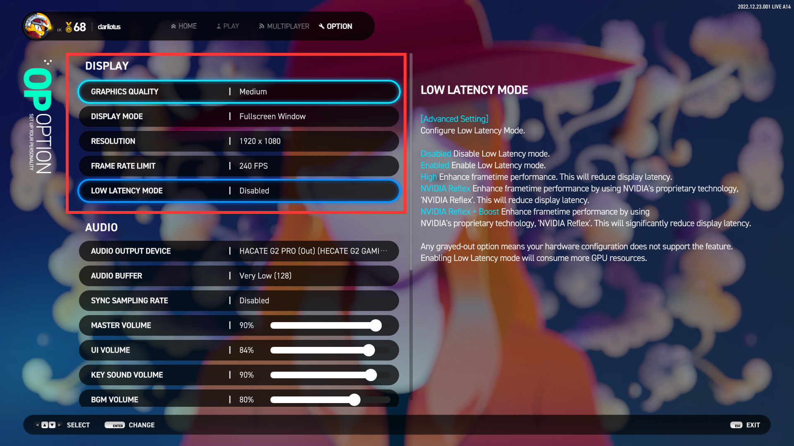
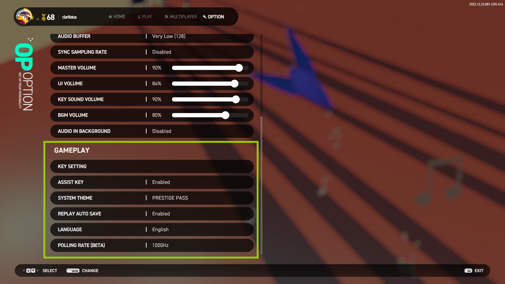

## OPTION 系统设置

### 1. DISPLAY 显示设置

#### GRAPHICS QUALITY 图像质量
- LOW **低质量**：少部分动画特效以降低 GPU 资源的占用，背景动画将以静态图片展示；
- NORMAL **标准质量**：显示所有动画特效。

#### DISPLAY MODE 显示模式
- Fullscreen **独占全屏显示**：直播姬等屏幕置顶的程序将不可见；
- Fullscreen Window **无边框窗口**：将画面拉伸成全屏显示，本质上还是窗口化；
- Windowed **普通窗口显示**：带标题栏和边框，可根据分辨率缩放。

#### RESOLUTION 分辨率
- 调整全局画面的大小。

#### FRAME RATE LIMIT 限制渲染帧率

- V-SYNC **垂直同步**：降与显示器刷新率绝对同步，但会显著增加延迟！
- NO LIMIT **不限制帧率**：交由操作系统调度合理的 GPU 资源，但一般会占用较大。
> 注意： 
> **设置越高越流畅，但越消耗 GPU 性能！** 
> **开启 Nvidia Reflex 后，V-SYNC 设置将无效化**。

#### LOW LATENCY MODE 低延迟模式			

- Disable：不启用低延迟选项，系统默认选项；
- Enable： 启用常规低延迟，所有显卡都支持的低延迟选项，能有效降低显示延迟；
- HIGH：大幅度降低帧延迟，大部分显卡都支持的低延迟选项，能进一步降低显示延迟；
- Nvidia Reflex：启用英伟达的降低延迟技术，**需要特定显卡才支持**，**GTX960 以上**；
- Nvidia Reflex + Boost：启用英伟达的增强降低延迟技术，**需要特定显卡才支持**，**并消耗更多的 GPU 资源**，**RTX3050 以上**。

### 2. AUDIO 音频设置

#### AUDIO OUTPUT DEVICE 音频输出设备
- 可以指定音频具体使用哪个设备输出，耳机或音箱等；
- 在 OPTION 界面中按 `F4` 以扫描 ASIO 音频设备。

#### SYNC SAMPLING RATE 同步采样率
- 是否强制让音频输出设备的采样率与游戏的同步，**修改此设置需要重启游戏才能生效**；
- Enable：强制让音频输出设备的采样率与游戏的同步；
- Disable：无需同步（默认）。

#### MASTER VOLUME 全局音量
- 游戏的总音量控制。

#### UI VOLUME 界面音效音量
- 界面音效音量控制，如按钮点击的音效音量等。

#### AUDIO BUFFER 音频缓存大小
- **缓存越大，音频质量越稳定，但是代价是增加输出延迟；**
- **缓存越小，输出延迟越低，但是爆音的几率会越高。**

#### KEY SOUND VOLUME 按键音量
- 演奏中音符的音量控制。

#### BGM VOLUME 背景音量
- 演奏中背景音乐的音量控制。

#### AUDIO IN BACKGROUND 游戏不在前台时是否播放声音
- Enable：游戏切换到后台时依然播放声音；
- Disable：游戏切换到后台时会自动静音。

### 3. GAMEPLAY 游戏操作及表现设置

#### KEY SETTING 按键设置
- 设置 4键 ~ 8键 每个模式下的操作键位。

#### ASSIST KEY 辅助按键设置
- 对于 5键 和 8键 模式，部分轨道是否开启辅助按键设置：
    - Enable：开启后，KEY SETTING 选项中 5键 和 8键 会出现辅助按键的设置项；
    - Disable：不使用辅助按键。

#### SYSTEM THEME 系统主题
- 更改系统 UI 主题风格。

#### REPLAY AUTO SAVE 自动保存回放记录
- 是否开启演奏完成后自动保存回放记录。

#### LANGUAGE 系统显示语言
- 目前只支持`英`、`韩`、`日`，未来会添加包括中文在内的多国语言。

#### POLLING RATE 输入敏感度设置
- 设置每秒对键盘输入的感知的敏感度，即每秒感应的次数；
- 值设置得越高，判定精度越细致，但代价是消耗 CPU 资源会增加！
- 该设置主要影响多键同时押的判定。

#### KEY SETTING+ 按键设置：进阶

- MODE：切换 **4键~8键** 各个模式以及 **命令操作** 的按键设置；
- KEYBOARD：物理键盘的映射；
- CONTROLLER：控制器（手台）的映射，如果没有连接控制器，则不可用；
- RESET：重置当前键数模式的映射为默认值；
- ASSIST KEY：对于 5键 和 8键 模式，可设置部分轨道的辅助按键：
    - 5键 : 可设置 3号轨道 (中间) 的辅助按键；
    - 8键 : 可设置 1号轨道 (最左) 和 8号轨道 (最右) 的辅助按键。		
    + **注意：需要开启上面的 "ASSIST KEY" 选项才生效！**

#### COMMAND KEY 按键设置：命令操作键

- DECREASE NOTE SPEED：演奏过程中，**减少流速** 的快捷键；
- INCREASE NOTE SPEED：演奏过程中，**增加流速** 的快捷键；
- REDUCE BGA BRIGHTNESS：演奏过程中，**降低背景动画亮度** 的快捷键；
- INCREASE BGA BRIGHTNESS：演奏过程中，**提升背景动画亮度** 的快捷键；
- QUICK RESTART：演奏过程中，**立即重开** 的快捷键；
- HALVE NOTE SPEED：演奏过程中，**将当前流速减半** 的快捷键；
- DOUBLE NOTE SPEED：演奏过程中，**将当前流速翻倍** 的快捷键；
