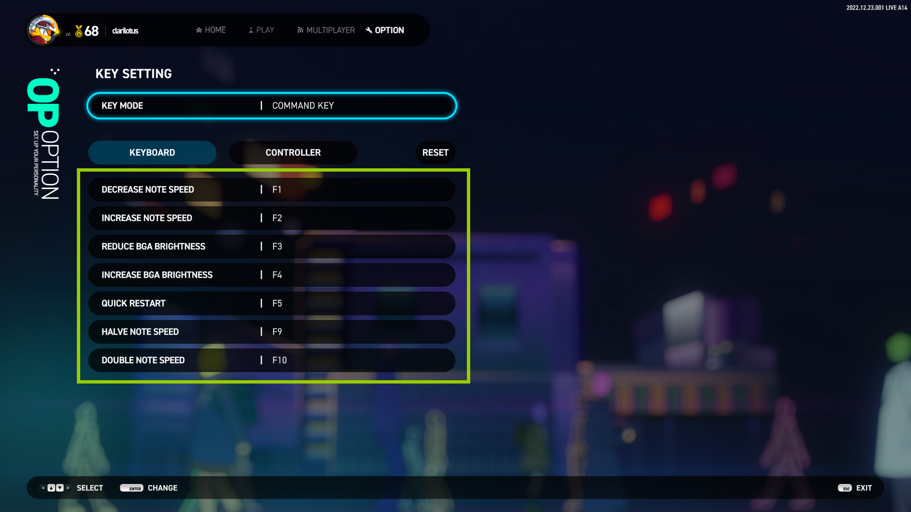

# OPTION 系统设置

## 1. DISPLAY 显示设置

显示设置

### GRAPHICS QUALITY 

图像质量

- `LOW` 
  
    低质量，减少部分动画特效以降低 GPU 资源的占用，背景动画将以静态图片展示。
  
- `NORMAL`
  
    标准质量，显示所有动画特效。

### DISPLAY MODE

显示模式

- `Fullscreen`
  
    独占全屏显示，如果有如直播姬等屏幕置顶的程序将不可见。

- `Fullscreen Window`
  
    无边框窗口，将画面拉伸成全屏显示，本质上还是窗口化。

- `Windowed`
  
    普通窗口显示，带标题栏和边框，可根据分辨率缩放。

### RESOLUTION

调整全局画面的分辨率大小。

### FRAME RATE LIMIT

限制渲染帧率

- `V-SYNC`
    
    垂直同步，降与显示器刷新率绝对同步，但会显著增加延迟！

- `NO LIMIT`
    
    不限制帧率**：交由操作系统调度合理的 GPU 资源，但一般会占用较大。

    !!! warning "注意"

        设置越高越流畅，但越消耗 GPU 性能！  
        开启 Nvidia Reflex 后，V-SYNC 设置将无效化。

### LOW LATENCY MODE

低延迟模式，用于降低显示延迟的高级选项，可根据实际效果使用。

- `Disable`

    不启用低延迟选项，系统默认选项。

- `Enable`
  
    启用常规低延迟，所有显卡都支持的低延迟选项，能有效降低显示延迟。

- `HIGH`
  
    大幅度降低帧延迟，大部分显卡都支持的低延迟选项，能进一步降低显示延迟。

- `Nvidia Reflex`
  
    启用英伟达的降低延迟技术，需要特定显卡才支持，GTX960 以上。

- `Nvidia Reflex + Boost`
  
    启用英伟达的增强降低延迟技术，需要特定显卡才支持，并消耗更多的 GPU 资源，RTX3050 以上。

---

## 2. AUDIO 音频设置

### AUDIO OUTPUT DEVICE

音频输出设备，可以指定音频具体使用哪个设备输出，耳机或音箱等。

!!! tip "提示"
    
    在 OPTION 界面中按 `F4` 以扫描 ASIO 音频设备。

### AUDIO BUFFER

调节音频缓存大小，缓存越大，音频质量越稳定，但是代价是增加输出延迟，反之缓存越小，输出延迟越低，但是爆音的几率会越高，建议根据实际情况适当调节。

### SYNC SAMPLING RATE

同步采样率，强制让音频输出设备的采样率与游戏的同步

- `Enable`
  
    强制让音频输出设备的采样率与游戏的同步。

- `Disable`
  
    无需同步（默认）。

    !!! warning "注意" 

        修改此设置需要重启游戏才能生效。

### MASTER VOLUME

游戏的总音量控制。

### UI VOLUME

界面音效音量控制，如按钮点击的音效音量等。

### KEY SOUND VOLUME

按键音量，演奏中音符的音量控制。

### BGM VOLUME

背景音量，演奏中背景音乐的音量控制。

### AUDIO IN BACKGROUND

游戏不在前台时是否播放声音。

- `Enable`
  
    游戏切换到后台时依然播放声音。

- `Disable`
  
    游戏切换到后台时会自动静音。

---

## 3. GAMEPLAY 游戏表现设置

### KEY SETTING

按键设置，设置 4键 ~ 8键 每个模式下的操作键位，详细设置项详见后文。

### ASSIST KEY

辅助按键设置，对于 *5键* 和 *8键* 模式，部分轨道是否开启辅助按键设置。

- `Enable`
  
    开启后，KEY SETTING 选项中 5键 和 8键 会出现辅助按键的设置项。

- `Disable`
  
    不使用辅助按键。

### SYSTEM THEME

系统主题，更改系统 UI 主题风格。

!!! tip "提示"

    除了默认主题 "REBOOT : R" 以外，其余主题皆需要购买对应的 DLC 内容才会解锁。

### REPLAY AUTO SAVE

是否开启演奏完成后自动保存回放记录。

- `Enable`
  
    演奏完成后自动保存回放记录。

- `Disable`
  
    演奏完成后不自动保存回放记录。

### LANGUAGE

更改系统显示语言。

!!! tip "提示"

    目前只支持`英`、`韩`、`日`，未来会添加包括中文在内的多国语言。

### POLLING RATE (beta)

输入敏感度设置，设置每秒对键盘输入的感知的敏感度，即每秒感应的次数，主要影响多键同时押的判定。

!!! warning "注意"

    该选项的设置值越高，多键同时押的判定精度越细致，但代价是消耗 CPU 资源会增加！

    该选项目前为实验性功能，若修改后游戏出现异常表现，请修改回默认值 1000Hz。

---

## KEY SETTING 按键设置

### 演奏按键设置

KEY MODE 选择 4 KEYS、5 KEYS、6 KEYS、8 KEYS 时的选项。

- `KEY MODE`
  
    切换 **4键~8键** 各个模式以及 **COMMAND KEY (命令操作)** 的按键设置。

- `KEYBOARD`

    物理键盘的映射。

- `CONTROLLER`
  
    控制器 (包括手柄、手台) 的映射，如果没有连接任何控制器，则不可用。

- `RESET`
  
    重置当前键数模式的映射为默认值。
    
- `ASSIST KEY`
  
    对于 5键 和 8键 模式，可分别设置特定轨道的辅助按键。

    !!! tip "提示"
        
        **5键** : 可设置 **3号轨道** (**中间**) 的辅助按键；

        **8键** : 可设置 **1号轨道** (**最左**) 和 **8号轨道** (**最右**) 的辅助按键；

        此外，需要开启上文的 ["**ASSIST KEY**"](#assist-key) 选项才生效！

### COMMAND KEY

KEY MODE 选择 COMMAND KEY 时的命令操作键设置。

- `DECREASE NOTE SPEED`
  
    演奏过程中，**减少流速** 的快捷键。

- `INCREASE NOTE SPEED`

    演奏过程中，**增加流速** 的快捷键。

- `REDUCE BGA BRIGHTNESS`
  
    演奏过程中，**降低背景动画亮度** 的快捷键。
  
- `INCREASE BGA BRIGHTNESS`
  
    演奏过程中，**提升背景动画亮度** 的快捷键。
  
- `QUICK RESTART`
  
    演奏过程中，**立即重开** 的快捷键。
  
- `HALVE NOTE SPEED`
  
    演奏过程中，**将当前流速减半** 的快捷键。
  
- `DOUBLE NOTE SPEED`
  
    演奏过程中，**将当前流速翻倍** 的快捷键。
  
