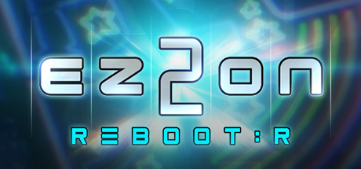
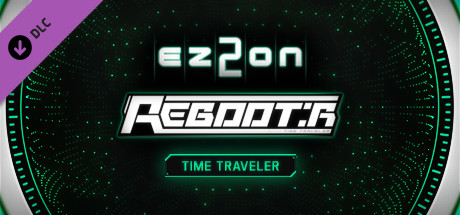
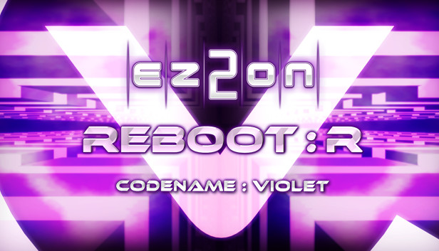
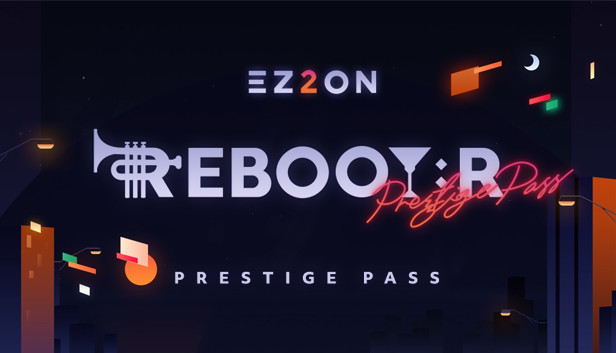
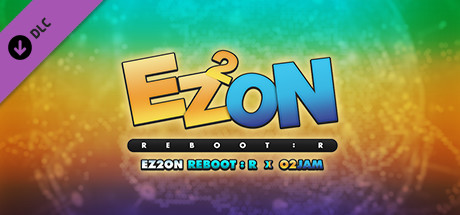
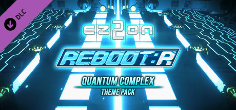

# 游戏购买指南 :id=title-guide

## 一、EZ2ON REBOOT : R 游戏本体 :id=dlc-base

> 游戏本体，收录旧时代 EZ2DJ 街机 1~7 代、EZ2ON 2008 旧网络版、2013 版 REBOOT、以及 2021 本作新增的歌曲，曲目数量250+。

- `购买链接：` **[https://store.steampowered.com/app/1477590 🔗](https://store.steampowered.com/app/1477590)**
- `国区原价：` ￥126.00
- `历史最低：` ￥88.20 (20% Off)
- `歌曲数量：` 250+

## 二、歌曲包 DLC :id=dlc-song

### 1. TIME TRAVELER - 时间旅行者 :id=dlc-song-tt

> 歌曲扩充包，收录街机版 EZ2AC : TIME TRAVELER 当作及附加曲目共计 17 首歌，歌曲风格比较偏科幻的电子风，整体难度较难，捆绑目前全游戏最难的课题组曲。

- `购买链接：` **[https://store.steampowered.com/app/1758560 🔗](https://store.steampowered.com/app/1758560)**
- `推荐程度：` ⭐⭐⭐⭐⭐
- `国区原价：` ￥78.00 (永久涨过价)
- `历史最低：` ￥36.55 (涨价前首发折扣)
- `歌曲数量：` 17
- `曲风偏向：` 科幻电子
- `难度趋向：` 较难
- `捆绑内容：`
    + `系统主题：` TIME TRAVELER
    + `演奏面板：` TIME TRAVELER
    + `演奏音符：` TIME ORBIT
    + `判定字体：` TIME TRAVELER
    + `连击字体：` TIME TRAVELER
    + `面板背景：` TIME STREAM
    + `课题组曲：` TIME PARADOX

### 2. CODENAME VIOLET - 代号：紫罗兰 :id=dlc-song-cv

> 歌曲扩充包，收录街机版 EZ2DJ 7th 特别版 CODENAME : VIOLET 和 BONUS EDITION 的 10 首歌曲，整体难度中等偏难。

- `购买链接：` **[https://store.steampowered.com/app/1926200 🔗](https://store.steampowered.com/app/1926200)**
- `推荐程度：` ⭐⭐⭐⭐
- `国区原价：` ￥37.00 (Early Access 内测期间购买了游戏本体的玩家已免费赠送该 DLC)
- `历史最低：` ￥29.60
- `歌曲数量：` 10
- `曲风偏向：` 复古、电子、钢琴曲
- `难度趋向：` 中等偏难
- `捆绑内容：`
    + `系统主题：` CODENAME : VIOLET
    + `演奏面板：` 两套：CV Craft、CV Station
    + `演奏音符：` |/10[_37
    + `判定字体：` CV
    + `连击字体：` CV
    + `课题组曲：` Violet

### 3. ENDLESS CIRCULATION - 无尽循环 (暂未推出) :id=dlc-song-ec

> 歌曲扩充包，收录街机版 EZ2AC : ENDLESS CIRCULATION 中的歌曲，已宣布 2023 年内会推出，但暂未公布具体信息。

### 4. PRESTIGE PASS - 声望之证 :id=dlc-song-pp

> 歌曲扩充包，完全原创的新歌，曲师阵营有 Cosmograph、RiraN、M2U、Memme 等出名的韩系曲师，特邀的日系曲师 Yamajet、onoken、Tatsh、NAOKI、TAG 等，以及从 DJMAX 系列出身的 Planetboom、NieN、Nauts 等，还有远古 EZ2 系列回归的老朋友 ND Lee、r300k，歌曲风格覆盖面非常广，质量非常高，极力推荐购买，共计 42 首曲目 (包含 1 首隐藏曲)。

- `购买链接：` **[https://store.steampowered.com/app/1926210 🔗](https://store.steampowered.com/app/1926210)**
- `推荐程度：` ⭐⭐⭐⭐⭐⭐
- `国区原价：` ￥108.00
- `历史最低：` ￥97.20
- `歌曲数量：` 42 (41 + 1)
- `曲风偏向：` 复古、电子、钢琴曲
- `难度趋向：` 中等偏难
- `捆绑内容：`
    + `系统主题：` PRESTIGE PASS
    + `演奏面板：` 四套：Kings、NIGHTFALL、FiND A WAY、Varvious Ways
    + `演奏音符：` 五套：DOOMS、PRESTIGE INGOT、PRESTIGE CHIP、Scarlet、BEANS
    + `判定字体：` 四套：Kings、NIGHTFALL、FiND A WAY、Varvious Ways
    + `连击字体：` 四套：Kings、NIGHTFALL、FiND A WAY、Varvious Ways

### 5. O2Jam Collaboration - 劲乐团联动 :id=dlc-song-o2

> 联动扩充包，联动《劲乐团》，包含 22 首曲目，其中 13 首经典时期的人气歌曲，2 首来自《PopStage》，7 首来自移动版《Analog》和《U》。

- `购买链接：` **[https://store.steampowered.com/app/2052630 🔗](https://store.steampowered.com/app/2052630)**
- `推荐程度：` ⭐⭐⭐⭐
- `国区原价：` ￥88.00
- `历史最低：` ￥74.80
- `歌曲数量：` 22
- `曲风偏向：` 多样化、经典
- `难度趋向：` 中等
- `捆绑内容：`
    + `系统主题：` O2Jam
    + `演奏面板：` 两套：O2Jam、O2-EA05
    + `演奏音符：` 三套：O2Jam、NX、M250
    + `判定字体：` 三套：Cricket、Aqua、M250
    + `连击字体：` 三套：Cricket、AquaWhale、M250
    + `课题组曲：` 两个 7 键专属组曲：O2Planet、Brain Stretch

### 6. GROOVE COASTER Collaboration - 节奏过山车联动 :id=dlc-song-gc

> 联动《节奏过山车》，从历代每一作各挑选一两首代表性曲目。

- `购买链接：` **[https://store.steampowered.com/app/2130530 🔗](https://store.steampowered.com/app/2130530)**
- `推荐程度：` ⭐⭐⭐
- `国区原价：` ￥78.00
- `历史最低：` ￥70.20
- `歌曲数量：` 10
- `曲风偏向：` 电子
- `难度趋向：` 较难
- `捆绑内容：`
    + `系统主题：` GROOVE COASTER
    + `演奏面板：` GROOVE COASTER
    + `演奏音符：` GROOVE COASTER
    + `判定字体：` 两套：GC-TYPE1、GC-TYPE2
    + `连击字体：` 两套：GC-TYPE1、GC-TYPE2

### 7. DJMAX Collaboration - DJMAX 联动 (暂未推出) :id=dlc-song-djmax

> 联动 DJMAX，已宣布 2023 年内会推出，但暂未公布具体信息。。

## 三、外观主题包 DLC  :id=dlc-theme
`主题包建议根据个人兴趣酌情购买。`

### 1. Quantum Complex 量子复合主题包 :id=dlc-theme-qc

> 街机版 EZ2AC : FINAL EX 的主题皮肤 DLC，主题风格非常酷炫。

- `购买链接：` **[https://store.steampowered.com/app/1926230 🔗](https://store.steampowered.com/app/1926230)**
- `推荐程度：` ⭐⭐⭐⭐⭐
- `国区原价：` ￥37.00 (Early Access 内测期间购买了游戏本体的玩家已免费赠送该 DLC)
- `历史最低：` ￥27.75
- `捆绑内容：`
    + `系统主题：` Quantum Complex
    + `演奏面板：` 两套：QTZ-01、QTZ-02
    + `演奏音符：` QT-D1A
    + `判定字体：` 两套：QTZ-01、QTZ-02
    + `连击字体：` 两套：QTZ-01、QTZ-02
