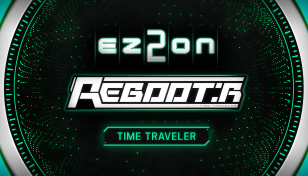
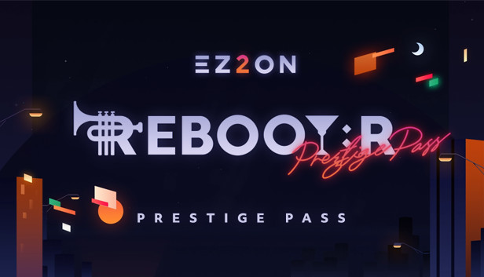
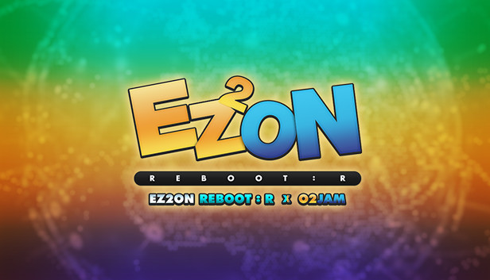
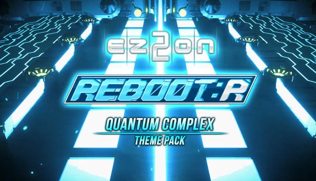

---
hide:
  - navigation
---

# 游戏与 DLC 购买指引

## EZ2ON REBOOT : R 游戏本体

{ width="368" }

> 游戏本体，收录旧时代 EZ2DJ 街机 1~7 代、EZ2ON 2008 旧网络版、2013 版 REBOOT、以及 2021 本作新增的歌曲，曲目数量250+。

- 购买链接：[https://store.steampowered.com/app/1477590](https://store.steampowered.com/app/1477590)
- 国区原价：**¥ 126.00**
- 历史最低：**¥ 88.20 (20% Off)**
- 歌曲数量：**250+**

---

## 歌曲包 DLC

### TIME TRAVELER

{ width="368" }

> 街机歌曲扩充包，收录街机 EZ2AC : TIME TRAVELER 当作及附加曲目共计 17 首歌，歌曲风格比较偏科幻的电子风，整体难度较难，捆绑目前全游戏最难的课题组曲。

- 购买链接：[https://store.steampowered.com/app/1758560](https://store.steampowered.com/app/1758560)
- 推荐程度：⭐⭐⭐⭐⭐
- 国区原价：**¥ 78.00** (永久涨过价)
- 历史最低：**¥ 36.55** (涨价前首发折扣)
- 歌曲数量：**17**
- 曲风偏向：**科幻电子**
- 难度趋向：**较难**
- 捆绑内容：
    + 系统主题： `TIME TRAVELER`
    + 演奏面板： `TIME TRAVELER`
    + 演奏音符： `TIME ORBIT`
    + 判定字体： `TIME TRAVELER`
    + 连击字体： `TIME TRAVELER`
    + 面板背景： `TIME STREAM`
    + 课题组曲： `TIME PARADOX`

---

### CODENAME VIOLET

{ width="368" }

> 街机歌曲扩充包，收录街机 EZ2DJ 7th 特别版 CODENAME : VIOLET 和 BONUS EDITION 的 10 首歌曲，整体难度中等偏难。

- 购买链接：[https://store.steampowered.com/app/1926200](https://store.steampowered.com/app/1926200)
- 推荐程度：⭐⭐⭐⭐
- 国区原价：**¥ 37.00** (Early Access 内测期间购买了游戏本体的玩家已免费赠送该 DLC)
- 历史最低：**¥ 29.60**
- 歌曲数量：**10** (未来极有可能追加额外曲目)
- 曲风偏向：**复古、电子、钢琴曲**
- 难度趋向：**中等偏难**
- 捆绑内容：
    + 系统主题：`CODENAME : VIOLET`
    + 演奏面板：`CV Craft`、`CV Station`
    + 演奏音符：`|/10[_37`
    + 判定字体：`CV`
    + 连击字体：`CV`
    + 课题组曲：`Violet`

---

### PRESTIGE PASS

{ width="368" }

> 原创歌曲扩充包，曲师阵营有 Cosmograph、RiraN、M2U、Memme 等出名的韩系曲师，特邀的日系曲师 Yamajet、onoken、Tatsh、NAOKI、TAG 等，以及从 DJMAX 系列出身的 Planetboom、NieN、Nauts 等，还有远古 EZ2 系列回归的老朋友 ND Lee、r300k，歌曲风格覆盖面非常广，质量非常高，极力推荐购买，共计 42 首曲目 (包含 1 首隐藏曲)。

- 购买链接：[https://store.steampowered.com/app/1926210 ](https://store.steampowered.com/app/1926210)
- 推荐程度：⭐⭐⭐⭐⭐⭐
- 国区原价：**¥ 108.00**
- 历史最低：**¥ 97.20**
- 歌曲数量：**42 (41 + 1)**
- 曲风偏向：**复古、电子、钢琴曲**
- 难度趋向：**中等偏难**
- 捆绑内容：
    + 系统主题：`PRESTIGE PASS`
    + 演奏面板：`Kings`、`NIGHTFALL`、`FiND A WAY`、`Varvious Ways`
    + 演奏音符：`DOOMS`、`PRESTIGE INGOT`、`PRESTIGE CHIP`、`Scarlet`、`BEANS`
    + 判定字体：`Kings`、`NIGHTFALL`、`FiND A WAY`、`Varvious Ways`
    + 连击字体：`Kings`、`NIGHTFALL`、`FiND A WAY`、`Varvious Ways`

---

### O2Jam Collaboration

{ width="368" }

> 联动《劲乐团》，包含 22 首曲目，其中 13 首经典时期的人气歌曲，2 首来自《PopStage》，7 首来自移动版《Analog》和《U》。

- 购买链接：[https://store.steampowered.com/app/2052630 ](https://store.steampowered.com/app/2052630)
- 推荐程度：⭐⭐⭐⭐
- 国区原价：**¥ 88.00**
- 历史最低：**¥ 74.80**
- 歌曲数量：**22**
- 曲风偏向：**多样化、经典**
- 难度趋向：**中等**
- 捆绑内容：
    + 系统主题：`O2Jam`
    + 演奏面板：`O2Jam`、`O2-EA05`
    + 演奏音符：`O2Jam`、`NX`、`M250`
    + 判定字体：`Cricket`、`Aqua`、`M250`
    + 连击字体：`Cricket`、`AquaWhale`、`M250`
    + 课题组曲：`O2Planet`、`Brain Stretch`

---

### GROOVE COASTER Collaboration

{ width="368" }

> 联动《节奏过山车》，从历代每一作各挑选一两首代表性曲目。

- 购买链接：[https://store.steampowered.com/app/2130530 ](https://store.steampowered.com/app/2130530)
- 推荐程度：⭐⭐⭐
- 国区原价：**¥ 78.00**
- 历史最低：**¥ 70.20**
- 歌曲数量：**10**
- 曲风偏向：**电子**
- 难度趋向：**较难**
- 捆绑内容：
    + 系统主题：`GROOVE COASTER`
    + 演奏面板：`GROOVE COASTER`
    + 演奏音符：`GROOVE COASTER`
    + 判定字体：`GC-TYPE1`、`GC-TYPE2`
    + 连击字体：`GC-TYPE1`、`GC-TYPE2`

---

## 外观主题包 DLC

!!! tip "提示"
    
    主题包 DLC 建议根据个人兴趣酌情购买。

### Quantum Complex

{ width="368" }

> 街机 EZ2AC : FINAL EX 的主题皮肤 DLC，主题风格非常酷炫。

- 购买链接：[https://store.steampowered.com/app/1926230 ](https://store.steampowered.com/app/1926230)
- 推荐程度：⭐⭐⭐⭐⭐
- 国区原价：**¥ 37.00** (Early Access 内测期间购买了游戏本体的玩家已免费赠送该 DLC)
- 历史最低：**¥ 27.75**
- 捆绑内容：
    + 系统主题：`Quantum Complex`
    + 演奏面板：`QTZ-01`、`QTZ-02`
    + 演奏音符：`QT-D1A`
    + 判定字体：`QTZ-01`、`QTZ-02`
    + 连击字体：`QTZ-01`、`QTZ-02`

---

## 暂未推出

!!! tip "提示"
    
    以下内容均已确定会推出，部分尚未公布详细信息与推出日期。

### ENDLESS CIRCULATION

{ width="368" }

> 街机歌曲扩充包，收录街机 EZ2AC : ENDLESS CIRCULATION 中的歌曲，初定共收录 38 首歌，已宣布 2023 年 4 月下旬推出 Chapter 1 共 20 首歌，下半年推出 Chapter 2 共 18 首歌。

---

### DJMAX EMOTIONAL SENSE Collaboration

> 联动 DJMAX EMOTIONAL SENSE，已宣布 2023 年内会推出，共 18 首歌，但暂未公布具体日期与售价等。

{ width="512" }

---

### HARDCORE TANO*C Collaboration

> 联动日本著名音乐团体，已宣布最快于 2023 年第四季度推出。

{ width="512" }

---

### FORTRESS Collaboration

> 联动经典游戏《疯狂坦克》，暂未公布任何详情。

{ width="512" }

---

### EVOLVE

{ width="250" }

> 街机歌曲扩充包，收录街机 EZ2AC : EVOLVE 中的歌曲，初定 2023 年底或 2024 年第一季度推出。

---

### NIGHT TRAVELER

{ width="250" }

> 街机歌曲扩充包，收录街机 EZ2AC : NIGHT TRAVELER 中的歌曲，计划在 EVOLVE 之后推出。

---

### AZURE EXPRESSION

{ width="250" }

> 街机歌曲扩充包，收录街机 EZ2DJ : AZURE EXPRESSION 中的歌曲，计划在 NIGHT TRAVELER 之后推出。
